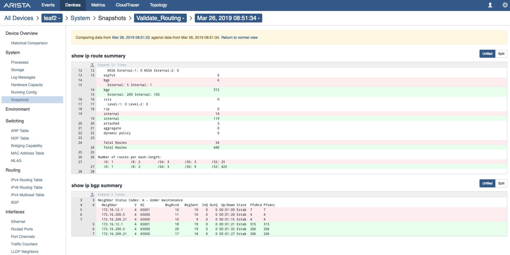
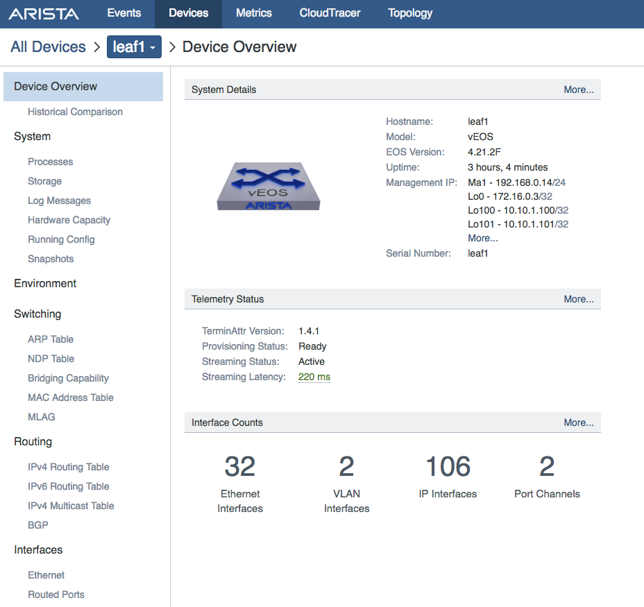
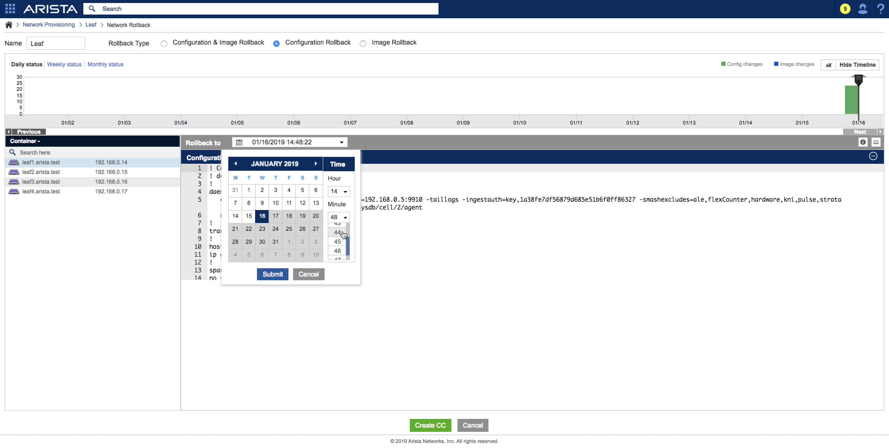
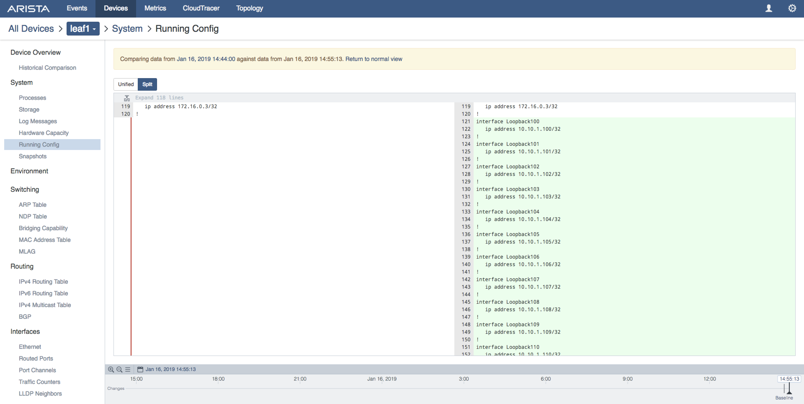

CVP Change Control, Telemetry & Rollback
==========================================

Learn how to use CloudVision’s Change Control. A Change Control (CC) can be associated with one or mores Tasks. CloudVision will take pre and post snapshots when a CC is executed to give us a state to revert back should there be any issues after the change.

Next, the lab will review Telemetry state-streaming information of the change of adding routes and how the routes propagate across the environment.

Lastly, the lab will initiate a Network Rollback to revert the changes that were implemented. The Network Rollback feature can greatly minimize downtime and gives the user the ability to restore the environment to a previous network state quickly.

**If students have not completed previous lab modules or have reset their environment:**

1. Log into the LabAccess jumpserver:
    1. If starting from this lab module, type “cvp” at the prompt. The script will configure all devices in the lab so you can complete this lab.

.. note:: Did you know → the “cvp” script is composed of python code that uses the CloudVision Portal Rest API to automate the provisioning of CVP Configlets.

TASK 1: Apply a Configlet Builder to create a group of Tasks
************************************************************

We want to add several Loopbacks to each device using a Configlet Builder at the ‘Leaf’ level.

1. Navigate to the 'Network Provisioning' page, right click on the 'Leaf' container and select 'Manage' -> 'Configlet'

2. Select the ‘Add_Loopbacks’ from the list of configlets.

3. Select 'Generate' to build a configlet for each device. View the generated configuration by expanding the Proposed Configuration on the right by selecting the + 

4. Select 'Update' to return to 'Network Provisioning' and select 'Save'. Tasks will show up in the notifications. Now that we have Tasks created we can use Change Control feature.

5. Navigate to 'Change Control' from the main CV homepage, click 'Change Control'.

6. Create a new Change Control by clicking the '+' in the top right.

7. This screen will show pending tasks that will be associated with a Change Control. Select all pending Tasks.

8. First, we need to give the Change Control a name. Name it 'Add_Loopbacks_CC'. Next we can select a Snapshot template that we want to run before and after the change. Select 'Validate_Routing' template and check 'Stop on Error'.

A few notes about Change Control:
    a. Each Task can be associated to a different template if needed.

    b. The order of Task execution can be specified if there are dependencies.

    c. Scheduling the Change Control for a later time by clicking the Schedule icon.

9. For this lab we want to push the tasks now. Select 'Execute'. From here, we can watch progress. First a Pre-Snapshot is taken, then the Tasks run, and finally, a Post-Snapshot is taken.

10. Once the Change Control is successfully completed, we can view the Pre and Post Snapshots.

11. To explore Snapshots for each task, click 'View' to see a summarized dashboard, the CLI commands that were run as part of our 'Validate_Routing' Snapshot template, pre/post configuration comparison, and images.

TASK 2: View Telemetry
**********************

1. Using Telemetry we can view the routes that were added as part of this change propagate across the environment. To reach the web portal of Telemetry, navigate to the 'Telemetry' button.

2. Upon login, the 'Events' tab is a quick view current state.

3. On the 'Device' tab, you can select a device to drill down on device specific information. Click on 'Leaf1'.

4. Navigate to 'Metrics', select 'All Devices' and 'IPv4 Route Count' metric.

TASK 3: Rollback
****************

1. Initiate a Network Rollback to revert the changes that were implemented. From CloudVision Portal go to the 'Network Provisioning' page, right click on ‘Leaf’ container, select 'Network Rollback'.

.. image:: images/cvp_cc14.png
   :align: center

2. For Rollback Type, select 'Configuration Rollback'. 

3. Select the 'Rollback to' drop down, a calendar will appear. Use the 'Time' scroll bar to 15mins prior to pushing the 'Add_Loopbacks' change control.

4. Select 'Submit' once the calendar pops up.

5. Review the configuration of 'Rollback to' vs. 'Current Status', then select 'Create CC'.

6. Name the change control 'Rollback_Add_Loopback', check 'Stop on error', then hit the 'Execute' button.

7. Progress as the Change Control is being executed. First a Pre-Snapshot is taken, then the Tasks run, and finally, a Post-Snapshot is taken.

8. Upon completion of the Change Control the configurations are back to 15mins prior to pushing the 'Add_Loopbacks' change control.

9. For further validation, navigate back to 'Telemetry' -> 'Metrics', select 'All Devices' and 'IPv4 Route Count' metric. The routes should be back to pre-CC numbers.

LAB COMPLETE
