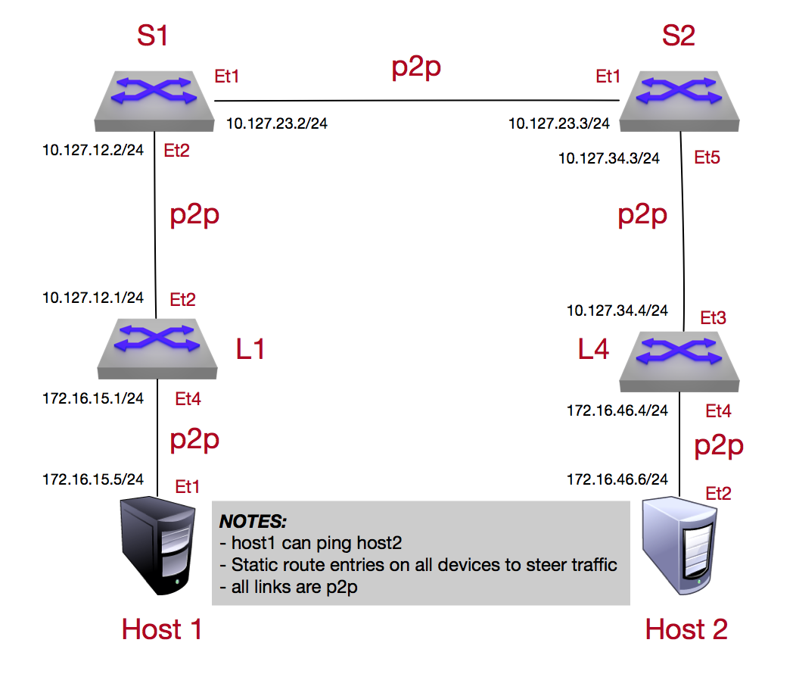

Media Intro to IP Lab
=====================

.. note:: An IP address serves two principal functions. It identifies the host, or more specifically its network interface, and it provides the location of the host in the network, and thus the capability of establishing a path to that host. Its role has been characterized as follows: "A name indicates what we seek. An address indicates where it is. A route indicates how to get there."

1. Log into the **LabAccess** jumpserver:

   1. Type ``14`` or ``media-intro`` at the prompt. The script will configure the topology with the exception of **Leaf 4**. The main task is to configure the remaining device so there is connectivity between the two hosts.

2.  Configure the proper ip address on the interfaces along with the appropriate static routes to ensure there is end-to-end connectivity for the two end hosts to reach each other.  All interfaces in this lab are designed as point-to-point  connections

   1. On **Leaf 4** assign the appropriate ip address and ensure the adjacent devices can be reached

        .. code-block:: text

            configure
            !
            interface Ethernet3
                no switchport
                ip address 10.127.34.4/24
            !
            interface Ethernet 4
                no switchport
                ip address 172.16.46.4/24
            
            Example:
            
            leaf4#configure
            leaf4(config)#interface ethernet 3
            leaf4(config-if-Et3)#no switchport
            leaf4(config-if-Et3)#ip address 10.127.34.4/24
            leaf4(config-if-Et3)#interface ethernet 4
            leaf4(config-if-Et4)#no switchport
            leaf4(config-if-Et4)#ip address 172.16.46.4/24

      .. note::
        It is worth mentioning by default all interfaces on an Arista switch is set to be a switchport (Layer 2 interface). We need to allow it to be a routed interface and thus ``no switchport`` is added (turns into Layer 3 interface).  Once the IP address has been added to the appropriate interface, ensure reachability to the adjacent device by leveraging the ``ping`` command on **Leaf 4**

        .. code-block:: text

             ping 10.127.34.3
             ping 172.16.46.6

            Example:
            
            leaf4# ping 10.127.34.3
            PING 10.127.34.3 (10.127.34.3) 72(100) bytes of data.
            80 bytes from 10.127.34.3: icmp_seq=1 ttl=64 time=17.0 ms
            80 bytes from 10.127.34.3: icmp_seq=2 ttl=64 time=18.8 ms
            80 bytes from 10.127.34.3: icmp_seq=3 ttl=64 time=14.9 ms
            80 bytes from 10.127.34.3: icmp_seq=4 ttl=64 time=12.6 ms

            --- 10.127.34.3 ping statistics ---
            5 packets transmitted, 4 received, 20% packet loss, time 62ms
            rtt min/avg/max/mdev = 12.605/15.868/18.844/2.332 ms, pipe 2, ipg/ewma 15.602/16.435 ms

            leaf4#ping 172.16.46.6
            PING 172.16.46.6 (172.16.46.6) 72(100) bytes of data.
            80 bytes from 172.16.46.6: icmp_seq=1 ttl=64 time=38.4 ms
            80 bytes from 172.16.46.6: icmp_seq=2 ttl=64 time=32.1 ms
            80 bytes from 172.16.46.6: icmp_seq=3 ttl=64 time=28.0 ms
            80 bytes from 172.16.46.6: icmp_seq=4 ttl=64 time=31.6 ms
            80 bytes from 172.16.46.6: icmp_seq=5 ttl=64 time=12.7 ms

            --- 172.16.46.6 ping statistics ---
            5 packets transmitted, 5 received, 0% packet loss, time 68ms
            rtt min/avg/max/mdev = 12.797/28.603/38.419/8.584 ms, pipe 4, ipg/ewma 17.163/32.954 ms

      At this point if the adjacent devices can be reached, you have configured the IP address correctly

   2. Once the address has been assigned to the appropriate interfaces, we can enable the routing as well as add the appropriate static routes on **Leaf 4** to allow reachability between the two host end-points.

        .. code-block:: text

            configure
            !
            ip routing
            !
            ip route 172.16.15.0/24 10.127.34.3
            !
            
            Example:
            
            leaf4(config-if-Et4)#configure
            leaf4(config)#ip routing
            leaf4(config)#ip route 172.16.15.0/24 10.127.34.3

      .. note::
         We added the entire prefix for the static route but we could of also put the specific host address.  Normally your internal security policies will dictate which approach to take

3. Validate end-to-end connectivity once IP addresses and static routes have been configured

   1. Log into **Host 2** and verify there is reachability to **Host 1**

        .. code-block:: text

            ping 172.16.15.5

            Example:
            
            host2#ping 172.16.15.5
            PING 172.16.15.5 (172.16.15.5) 72(100) bytes of data.
            80 bytes from 172.16.15.5: icmp_seq=1 ttl=60 time=307 ms
            80 bytes from 172.16.15.5: icmp_seq=2 ttl=60 time=300 ms
            80 bytes from 172.16.15.5: icmp_seq=3 ttl=60 time=296 ms
            80 bytes from 172.16.15.5: icmp_seq=4 ttl=60 time=293 ms
            80 bytes from 172.16.15.5: icmp_seq=5 ttl=60 time=289 ms

            --- 172.16.15.5 ping statistics ---
            5 packets transmitted, 5 received, 0% packet loss, time 43ms
            rtt min/avg/max/mdev = 289.129/297.583/307.932/6.497 ms, pipe 5, ipg/ewma 10.984/302.312 ms

      If all the IP address and routing settings have been completed correctly, then you should have reachability

**LAB COMPLETE!**
