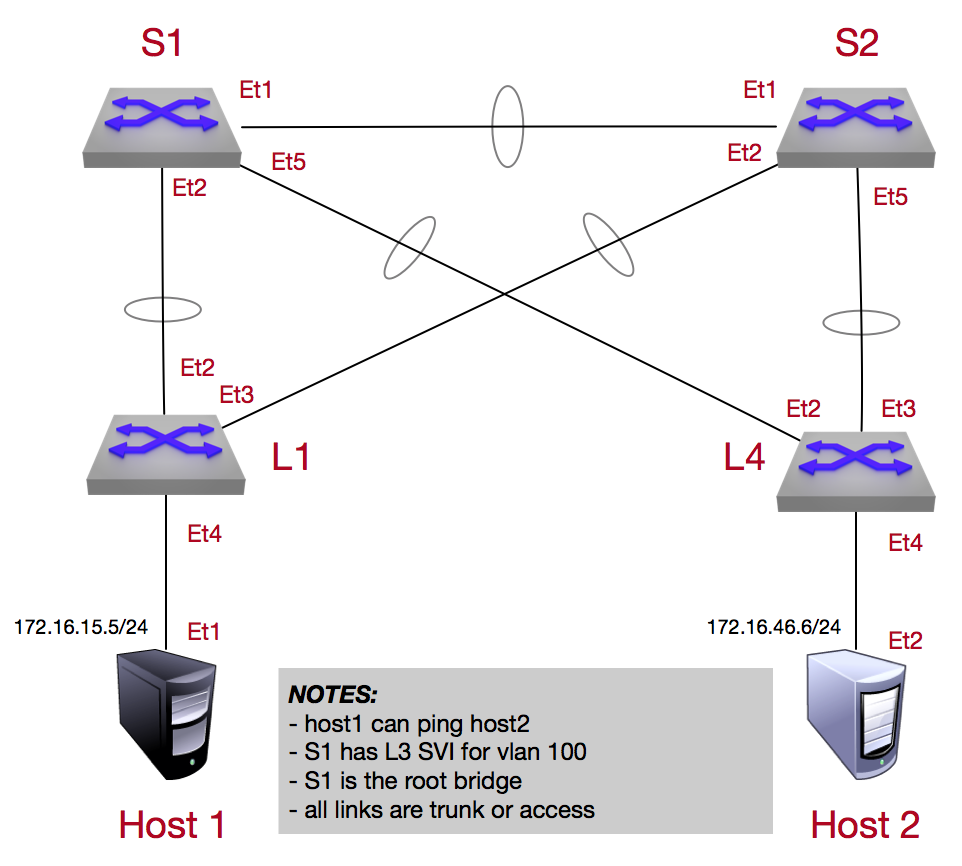

Media STP and SVI Lab
======================

.. note:: The Spanning-Tree protocol (STP) was initially invented in 1985 and is one of the oldest protocols being used in layer 2 network topologies today. STP is classified as a network protocol that builds loop-free logical topology for Ethernet (initially bridged) networks.

**1.** Log into the **LabAccess** jumpserver:

   1. Type ``media - VLAN STP`` at the prompt. The script will configure the topology with the exception of **Leaf4**.

   2. On **spine2**, verify spanning-tree operation in the enviroment, you should see **spine1** is the root bridge

        .. code-block:: text

            !
            show spanning-tree
            !

**2.** Configure the proper VLAN and interface types on **leaf4** to allow the spanning-tree protocol to operate and have reachability for **host4**

   1. on **leaf4** create the layer 2 existance of vlan 100 so it can partake in the spannig-tree process

        .. code-block:: text

            configure
            vlan 100
                name v100

      once created, we can verify as well as see that there are no physical interfaces associated to the vlan

        .. code-block:: text

            !
             show vlan
            !

   2. once th vlan is created, we can assign the uplink ports as trunk links as well as allow vlan 100 to pass

        .. code-block:: text

            configure
            interface Ethernet2
              switchport trunk allowed vlan 100
              switchport mode trunk
            !
            interface Ethernet3
              switchport trunk allowed vlan 100
              switchport mode trunk
            !

      .. note::
        By default once an interface is configured as a trunk, all vlans will be associated to it. It is good security practice to just associate the specific vlans to pass and take part in the spanning-tree process

      once the interface configuration has been completed for the trunk links, you can verify the spanning-tree topology and see the root bridge is **spine1** and the connection to **spine2** has been blocked for loop prevention

        .. code-block:: text

            !
            show spanning-tree
            !

   3. Once the layer2 topology has been setup, we can configure the connection to our host as an access port to allow **host2** to pass traffic onto the topology

        .. code-block:: text

            configure
            interface Ethernet4
              switchport access vlan 100
              switchport mode access
            !

**3.** Validate end-to-end connectivity once SVI and STP has been setup and spanning tree has converged

   1. log into **host2** and verify you can reach the SVI for vlan 100 as well as reachability to **host1**

        .. code-block:: text

            ping 10.127.45.4
            ping 10.127.15.5

      If all the SVI and STP settings have been completed correctly you should be able to ping the remote host as well as the SVI interface itself configured on **spine1** which is also the root bridge

**LAB COMPLETE!**