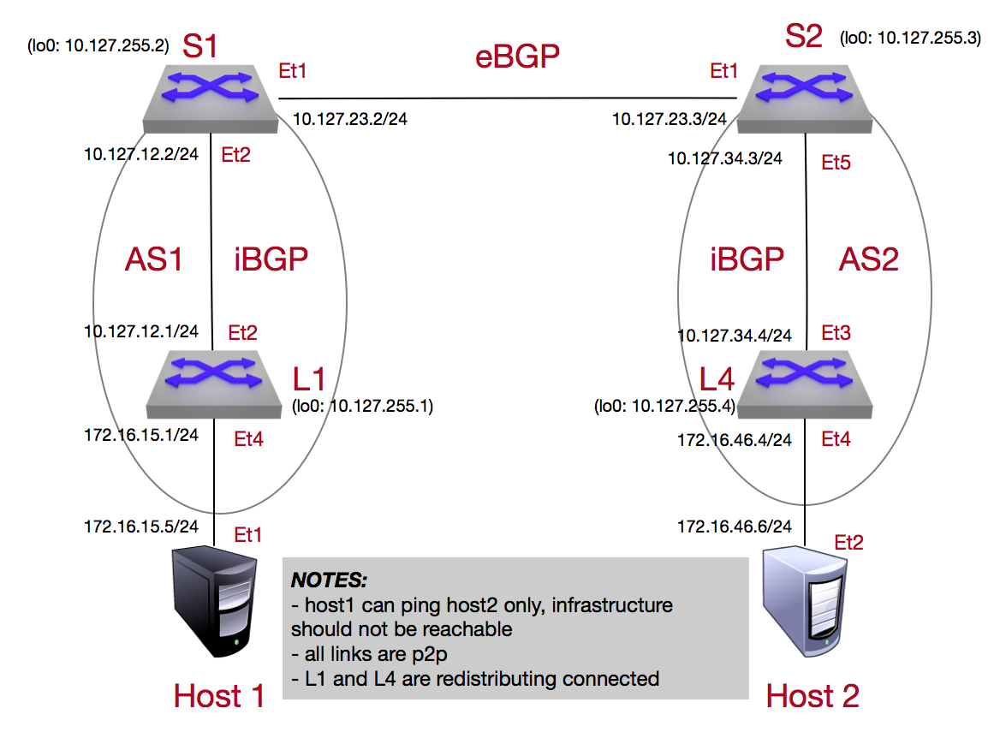

Media BGP Lab
=============

.. note:: The Border Gateway Protocol (BGP) makes routing decisions based on paths (protocol is classified as a path vector) and is widely used in the backbone of the internet to redistribute information

1. Log into the **LabAccess** jumpserver:

   1. Type ``media-bgp`` at the prompt. The script will configure the topology with the exception of **Leaf4**.

   2. On **spine2**, verify BGP operation (it should not be operating correctly) and you will see all the routes currently in the enviroment

        .. code-block:: text

            show ip bgp summery
            show ip bgp
            !
            show ip route

      All the route entries with a preceding "B" was learned by the OSPF protocol on Spine2

2. Configure BGP on the **Leaf4** switch using the following criteria

   1. Configure BGP router process (also the autonamous-system) on **Leaf4** to be used for the communication to adjacent BGP speakers (spine2 in this case).  The router-id is configured so it can be consistent and not randomly chosen (normally the peering interface if not specified)

        .. code-block:: text

            configure
            router bgp 2
              router-id 10.127.255.4

      .. note::
       The process for BGP is also the autonomous-system number the router is associated too and is globally significant.  These values should not be chosen randomly and should be part of a larger design scheme for the environment

   2. BGP neighbours are normally specified so only the desired neighbors create a session with.  A TCP connection is established between the two peers (port 179) in which the routing information can be securely transported between them

        .. code-block:: text

            configure
            router bgp 2
                neighbor 10.127.34.3 remote-as 2

      The session we are setting up on Leaf4 to Spin2 is considered a point-to-point iBGP (Internal BGP) connection because they are part of the same autonamous-system (AS).

      .. note::
        Although there are mechanisms to allow all incoming BGP sessions to be established, those are corner cases in which you will use that approach and it is best common practice to specify your desired neighbor to establish a session with along with a md5 hash password for an extral level of security

   3. By default the BGP protocol will only re-advertise what eBGP (external) prefixes it has leaned to its other iBGP / eBGP peers.  We need to tell the BGP process what to advertise by various methods.  In this session we want the router to advertise its connected (vlan) prefix

        .. code-block:: text

            configure
            router bgp 2
              redistribute connected

      once the ``redistribute connected`` has been added, we can actually see the prefixes our switch (Leaf4) is receiving and advertising

        .. code-block:: text

            show ip bgp  summary
            !
            show ip bgp neighbors 10.127.34.3 advertised-routes
            show ip bgp neighbors 10.127.34.3 received-routes

3. Validate end-to-end connectivity once OSPF neighbor relationship has been established

   1. Confirm the bgp neighbor relationship has been established and the route table on leaf4 has been populated with the appropriate entries

        .. code-block:: text

            show ip bgp summary
            show ip bgp
            !
            show ip route
            show ip route bgp

      The routing table output should all environment entries to ensure reachability between the 2 hosts

   2. log into Host-2 and

        .. code-block:: text

            ping 10.127.15.5

      If all the BGP settings have been done and the route table on leaf4 is correct then Host-1 should be reachable from Host-2

**LAB COMPLETE!**