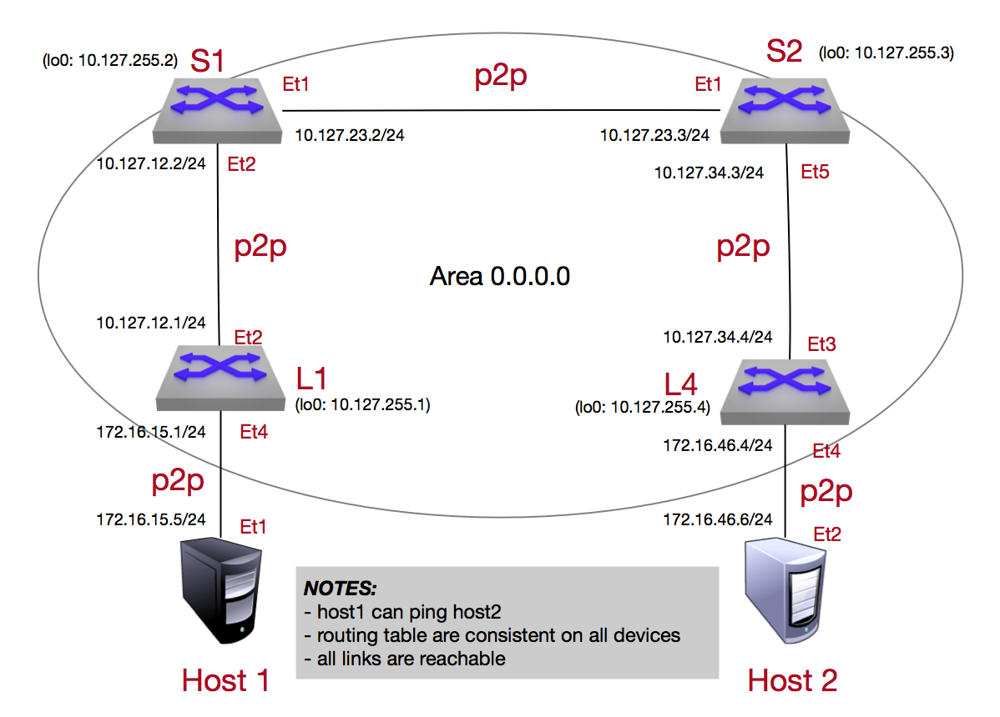

Media OSPF Lab
==============

.. **note**:: Did you know the OSPF algorithim is considered a  dykstra link-state protocol? it is a common protocol used in a number of widely deployed environments in various industries (media being one of them)

**1.** Log into the **LabAccess** jumpserver:

   1. Type ``media-ospf`` at the prompt. The script will configure the topology with the exception of **Leaf4**.

   2. On **spine2**, verify OSPF operation (it should not be operating correctly) and you will see all the routes currently in the enviroment

        .. code-block:: text

            show ip ospf neighbor
            show ip ospf interface
            show ip ospf database
            !
            show ip route

      All the route entries with a preceding "O" was learned by the OSPF protocol on Spine2

**2.** Configure OSPF on the **Leaf4** switch using the following criteria

   1. Configure OSPF router process on **Leaf4** to be used for OSPF communication to the adjacent devices (spine2 in this case)

        .. code-block:: text

            configure
            router ospf 100
              router-id 10.127.255.4

      .. note::
       A *channel-group* is a group of interfaces on a single Arista switch. A *channel-group* is associated with a *port-channel* interface immediately upon its creation. The *channel-group* command implicitly creates the matching *port-channel* with the same ID, which is *10* in this case. The *switchport mode trunk* command allows all VLANs on *port-channel 10*.

   2. specify the network statement which encompasses all the interfaces we want to take part in the OSPF process

        .. code-block:: text

            configure
            router ospf 100
               network 10.127.0.0/16 area 0.0.0.0

      .. note::
        All interfaces which fall into the range of the network statement will take part in the OSPF process and listen for and send out hello packets

   3. Certain interfaces we dont need to take part in the OSPF process but we still want the IP's to be advertised out. This is where we leverage the "passive-interface" setting to allow this.  These interfaces will still be associated in the area inwhich the network statement is associated to

        .. code-block:: text

            configure
            router ospf 100
              passive interface loopback0
              passive interface vlan 100

   4. Confirm the ospf neighbor relationship has been establised and the route table on leaf4 has been populated with the appropriate entries

        .. code-block:: text

            show ip ospf neighbor
            show ip ospf interface
            show ip ospf database
            !
            show ip route

      The routing table output should all environment entries to ensure reachability

**3.** Validate end-to-end connectivity once OSPF neighbor relationship has been established

   1. log into Host-2 and

        .. code-block:: text

            ping 10.127.15.5

      If all the ospf settings have been done and the route table on leaf4 is correct then Host-1 should be reachable from Host-2

**LAB COMPLETE!**
