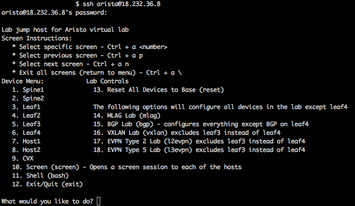
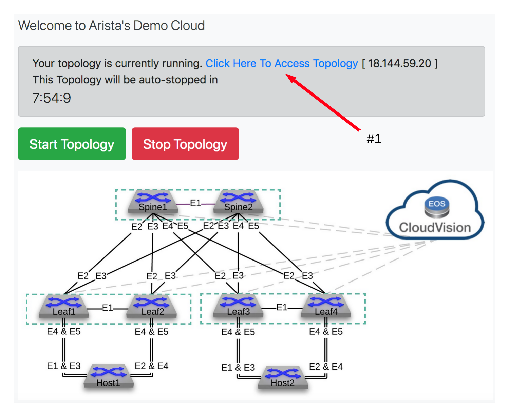
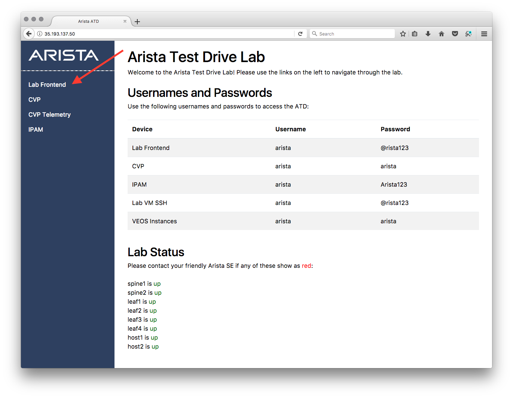
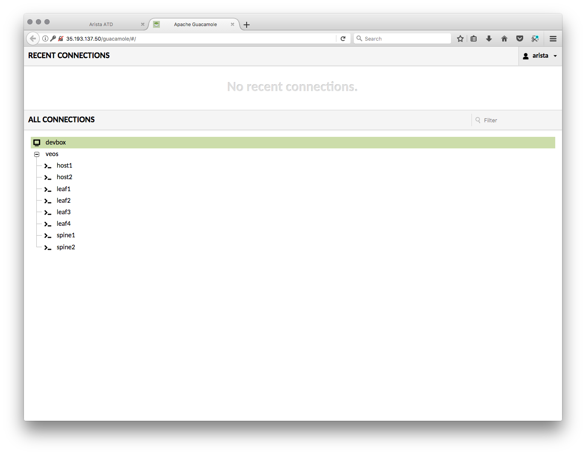

Connecting to your lab machine
==============================

1. Before we begin, let's reset the environment to clear out previous lab changes.
If the environment was brought up fresh and you are starting from this point, you can skip step #1.

SSH to the public IP address assigned to the LabAccess jumphost server (this is the IP address shown in the
"Welcome to Arista's Demo Cloud" picture further below). The username is ``arista`` and the password is ``{REPLACE_PWD}``:

    .. code-block:: text

       ssh arista@x.x.x.x

You will be greeted with the following menu:

|

|

Select option **13** (**Reset All Devices to Base**), wait til the command has completed, then log out.

|

2. Now we need to make sure that you can access your handy lab machine! You should have received your login 
information (a URL) from your friendly Arista SE already. If you have not, please reach out and ask for one.

Once you receive your token, click on the link. You will greeted with a
screen that looks like this:

Connect to the topology by clicking the link and click on **Lab Frontend**.

.. note:: If any of the devices listed under **Lab Status** are *down*, please contact your Arista SE.

You will be greeted with a screen like this:

.. image:: images/programmability_connecting_4.png
   :align: center

Login with the username **arista** and the password **@rista123**. This will bring
you to the ATD Lab Page.  

This lab uses Guacamole to front end both a Linux based desktop (**devbox**)
and the Arista vEOS virtual leaf/spine lab network. We will primarily
work out of **devbox**.

