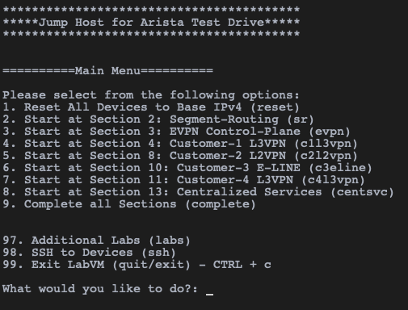

Connecting to the ATD Lab Environment
=======================================

1. Log into the Arista Demo Cloud portal with your assigned URL. If you don’t have one, please see your ATD staff.

.. image:: images/ratd_splash_page.png

2. SSH to the public IP address assigned to the LabAccess jumphost server (this is the IP address shown in the "Welcome to 
   Arista's Demo Cloud" picture above). The username is ``arista`` and the password is ``{REPLACE_PWD}``:

   .. code-block:: text

      ssh arista@x.x.x.x

|

|

3. The LabAccess menu allows users to connect to each device and specify lab topology. It is recommended to open multiple SSH 
   sessions or usethe Screen option to jump between devices rapidly.
