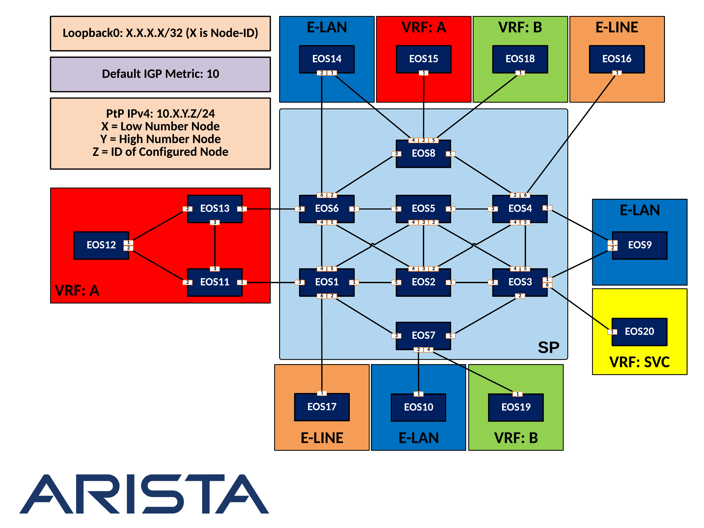

Routing ATD - Mesh Topology - Full Class Guide
=====================================================

==========================================================
Deploy IS-IS as the Service Provider Underlay IGP
==========================================================

   .. image:: ../../images/RATD-Section1+2-Image.png
      :align: center

   #. Configure IS-IS to carry underlay IPv4 prefix reachability information.
  
      - All nodes should be within the same flooding domain.
  
      - All nodes should only maintain a Level-2 database.
  
      - Ensure that there are no unnecessary Pseudonodes within the topology.
  
   #. (Optional) Only advertise reachability information for /32 loopback interfaces into the LSDB.
  
      - Once this task has been completed, all Service Provider nodes should be able to ping all other node loopback addresses.

=========================================================================
Establish MPLS transport label distribution via Segment-Routing
=========================================================================

   #. Enable Segment-Routing extensions to IS-IS, leveraging MPLS data plane encapsulation.

      - The Segment Routing Global Block (SRGB) label range should be 900,000 – 965,535 on all Service Provider nodes.
   
   #. Configure each node should with a globally unique Node SID equal to 900,000 + NodeID.
 
      - For example, EOS1 should have a Node SID of 900,001.
   
   #. Review IS-IS adjacency SIDs on EOS2 and EOS5.
 
      :Question:
         Is there overlap? If so, will this present an issue? Why or Why not?
   
   #. Validate that all Service Provider nodes have a globally unique Node SID.
   
   #. To protect against black holes, and reduce convergence time, enable the equivalent of IGP Sync and Session-Protection within the Segment-Routing domain.
   
   #. Once this task has been completed, all Service Provider nodes should have an LSP established for reachability between loopbacks.

      .. code-block:: text

       ping mpls segment-routing ip x.x.x.x/32 source y.y.y.y

      .. code-block:: text

       traceroute mpls segment-routing ip x.x.x.x/32 source y.y.y.y

==================================================================================
Prepare to offer VPN services to customers via MP-BGP EVPN control-plane
==================================================================================

   .. image:: ../../images/RATD-Section3-Image.png
      :align: center

   #. BGP Autonomous System 100 is leveraged by the Service Provider.
 
      :Question:
         Do all nodes within the Service Provider Network need to run BGP? Why or Why not?
   
   #. Enable BGP EVPN peering within the service provider.

      - BGP Router-ID should be Loopback0 with a 32-bit value.

      - Loopback0 IP address should be used for all BGP peerings.

      - All PE nodes must be capable of advertising and receiving reachability information to/from all other PE nodes.

      - A full mesh of peerings must not be used to accomplish this task.

      - EOS5 should act as the peering point for all PE nodes.

      - Disable any unnecessary BGP AFI/SAFI peerings.

      - Use MPLS as the data-plane encapsulation / VPN label distribution.

===================================================================================
Prepare for Customer-1 Layer3 VPN Services
===================================================================================

   .. image:: ../../images/RATD-Section4+5+6+7-Image.png
      :align: center
   
   #. On all PE nodes that are connected to Customer-1 CE nodes, define VRF “A”.
   
      - Ensure IPv4 Unicast Forwarding is enabled.
   
      - Route-Target for import and export should be 1:1.
   
      - Route-Distinguisher should be X.X.X.X:1 (X = Node-ID).
   
   #. Place the appropriate interfaces on the PE nodes into VRF “A”.

=========================================================================
Configure Customer-1 CE devices
=========================================================================
   
   #. Configure EOS11, EOS12 and EOS13 to run OSPF process 100 in area 0.
   
   #. Advertise all connected interfaces into OSPF using a network statement.
   
      - Once this task is complete; EOS11, EOS12, and EOS13 should be able to ping each other’s loopbacks and directly connected interfaces

=========================================================================
Establish PE-CE peering with Customer-1
=========================================================================
   
   #. Configure EOS11 and EOS12 for BGP AS 123.

      - EOS11 and EOS12 should originate the following networks via BGP (any method of network origination is acceptable):

         - 11.11.11.11/32

         - 12.12.12.12/32

         - 13.13.13.13/32
   
   #. Configure EOS15 for BGP AS 15.
   
      - EOS15 should originate the following networks via BGP (any method of network origination is acceptable):
   
         - 15.15.15.15/32
   
   #. Establish eBGP IPv4 Unicast peering between Customer-1 CE and Service Provider PE devices. These peerings should be within the Customer-1 VPN (VRF).
   
   #. Ensure EOS12 should has the following output from a ‘show ip route ospf’ command:

      .. image:: ../../images/RATD_Section6_Task_D.png
         :align: center   
   
   #. Ensure EOS15 should has the following output from a ‘show ip route bgp’ command:

      .. image:: ../../images/RATD_Section6_Task_E.png
         :align: center   
 
   #. Verify reachability between all Customer-1 CE devices by pinging each other’s Loopback0 interface while sourcing the pings from their own Loopback0 interface.

=========================================================================
Enable L3VPN Multi-Pathing
=========================================================================
  
   #.	Ensure that traffic from EOS15 to EOS12 uses multiple paths across the Service Provider network, distributing the load between EOS1 and EOS6.
  
      - It is ok to adjust the isis metric on the link between EOS6 and EOS8 in order to force multi-pathing to occur.
  
   #. EOS8 should have the following output from a ‘show ip route vrf A 12.12.12.12’ command (label may vary, this is ok):
  
      .. image:: ../../images/RATD_Section7_Task_C.png
         :align: center   

=========================================================================
Prepare for Customer-2 Layer2 VPN E-LAN Services
=========================================================================

   .. image:: ../../images/RATD-Section8+9.png
      :align: center
   
   a.	Customer-2 CE Nodes: EOS9, EOS10, EOS14
   
   b.	On all PE nodes that are connected to Customer-2 CE nodes:
   
      i.	Create VLAN 20
   
      ii.	Define the ‘VLAN 20’ MAC VRF
   
         1.	Route-Target for import and export should be 2:20
   
         2.	Route-Distinguisher should be X.X.X.X:20 (X = Node-ID)
   
      iii.	Configure the appropriate interfaces on the PE Nodes as access interfaces in VLAN 20
   
      iv.	Ensure that all known MAC addresses in VLAN 20 are originated/advertised via BGP to other PE Nodes
   
   c.	EOS14 and EOS9 will be dual-homed to their PE nodes via an LACP port-channel
   
      i.	Both links should be active for egress, as well as ingress traffic
   
      ii.	MLAG must not be used to accomplish this task

=========================================================================
Configure the Customer-2 CE Nodes
=========================================================================
 
   a.	EOS9, EOS10 and EOS14 should all run OSPF process 200 in area 0
 
   b.	Advertise all connected interfaces into OSPF using a network statement
 
   c.	All traffic to/from multi-homed L2VPN locations should be load balanced across all PE-CE links into that location
 
   d.	EOS3 and EOS6 should have the following output from a ‘show l2rib input bgp vlan 20’ command:	
 
      i.	Note: MAC addresses and Labels may differ in your output, this is ok. The key output is 2-way load balancing to MAC addresses that exist at remote dual-homed sites
 
      ii.	EOS3:
 
         .. image:: ../../images/RATD_Section9_Task_D_EOS3.png
            :align: center   
      
      iii.	EOS6:
      
         .. image:: ../../images/RATD_Section9_Task_D_EOS6.png
            :align: center

   e.	Once this task is complete; EOS9, EOS10 and EOS14 should all form OSPF adjacencies with each other. These devices should all be able to ping each other’s Loopback0 interfaces when sourcing the ping from their Loopback0 interface

=========================================================================
Configure Customer-3 E-LINE Service
=========================================================================

   .. image:: ../../images/RATD-Section10-Image.png
      :align: center

   a.	Customer-3 requires that EOS16 and EOS17 appear as directly Layer2 adjacent to each other
   
   b.	Configure a P2P E-LINE service enabling this functionality
   
   c.	This solution should not require any VLAN tagging from the CE devices
   
   d.	When this task is complete EOS16 and EOS17 should form an OSPF adjacency with each other, and be able to ping each other’s loopbacks

=========================================================================
Prepare for Customer-4 Layer3 VPN Services
=========================================================================

   .. image:: ../../images/RATD-Section11+12-Image.png
      :align: center
  
   a.	Customer-4 CE Nodes: EOS18, EOS19
  
   b.	On all PE nodes that are connected to Customer-4 CE nodes:
  
      i.	Define VRF “B”
  
         1.	IPv4 Unicast Forwarding
  
         2.	Route-Target for import and export should be 2:2
  
         3.	Route-Distinguisher should be X.X.X.X:2 (X = Node-ID)
  
      ii.	Place the appropriate interfaces on the PE nodes into VRF “B”

=========================================================================
Establish PE-CE peering with Customer-4
=========================================================================
 
   a.	EOS18 and EOS19 should be in BGP AS 200
   
      i.	EOS18 should originate the following network via BGP (any method of network origination is acceptable)
   
         1.	18.18.18.18/32
   
      ii.	EOS19 should originate the following network via BGP (any method of network origination is acceptable)
   
         1.	19.19.19.19/32
   
   b.	Establish eBGP IPv4 Unicast peering between Customer-4 CE and Service Provider PE devices.
   
   c.	Once this task is complete, Customer-4 CE devices should be able to ping each other’s Loopback0 interface when sourcing the pings from their own Loopback0 interface

=========================================================================
Offer Centralized Services to L3VPN Customers
=========================================================================

   .. image:: ../../images/RATD-Section13-Image.png
      :align: center
  
   a.	EOS20 is providing a centralized service to L3VPN customers
   
   b.	This service is accessible via 20.20.20.20/32
   
   c.	The service should only be accessible from EOS12 and EOS19
   
   d.	Create a centralized service offering, utilizing the VRF “SVC” on the necessary PE nodes
   
   e.	When this task is complete, EOS12 and EOS19 should all be able to ping 20.20.20.20
   
   f.	EOS11, EOS13, EOS15 and EOS18 must not be able to ping 20.20.20.20
   
   g.	Customer-1 (VRF A) and Customer-4 (VRF B) CE devices must not see each other’s routes, and must not be able to ping each other
   
   h.	ACLs must not be used to accomplish any part of this task