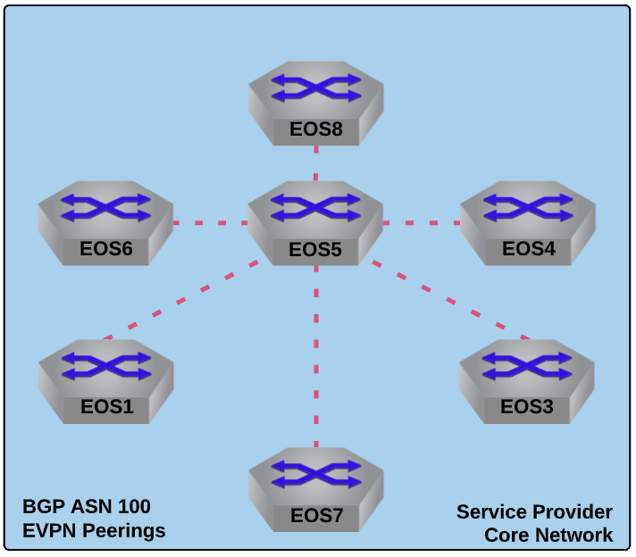

Prepare to Offer VPN Services to Customers via MP-BGP EVPN Control-Plane
==================================================================================

|

#. Log into the **LabAccess** jumpserver to prepare the lab environment.

   #. From the Main Menu, type ``labs`` or Option 97 for ``Additional Labs``.

   #. Type ``mesh-topology-evpn-base-labs`` to access the Base Setup Labs.

   #. Type ``evpn`` at the Labs Selection Menu. The script will configure the topology 
      with the necessary prerequisites.

#. We will now leverage BGP as the control-plane for our VPNs in the Service Provider network. 
   Specifically, we will use iBGP with a Route Reflector to ease the configuration load and 
   not require us to setup a full mesh of BGP peerings.  Configure **EOS5** as the Route Reflector 
   in the Service Provider Network.

   #. On **EOS5**, enable BGP with ASN 100.  Also set a router-id and disable the IPv4 
      Unicast Address-Family within BGP.

      .. note::

         By default, all BGP neighbors in EOS will try to peer in the IPv4 Unicast AF.  Since 
         we are only leveraging BGP for VPNs and IS-IS is providing our IPv4 underlay, there is 
         no need for this additional overhead. We can change the default state of BGP to **not** 
         attempt to peer using the IPv4 Unicast AF.

      .. code-block:: text

         router bgp 100
            router-id 5.5.5.5
            no bgp default ipv4-unicast

   #. Allow BGP to utilize ECMP when available by increasing the Maximum Paths allowed for a route.

      .. note::

         By default, BGP will only install a single best-path. In a network with multiple equal paths 
         available, this setting will allow BGP to load balance across the available paths. This is 
         covered further in a later lab.

      .. code-block:: text

         router bgp 100
            maximum-paths 2

   #. Activate the EVPN address-family within BGP and set the data-plane encapsulation type 
      to MPLS.

      .. note::

         EVPN will provide a signaling mechanism for all our L2, L3 and wire services in the 
         Service Provider network. By default, EOS will leverage VXLAN as a data-plane encapsulation 
         for EVPN. We can again change the default behavior according to our desired architecture.

      .. code-block:: text

         router bgp 100
            !
            address-family evpn
               neighbor default encapsulation mpls

   #. To simplify BGP configuration, create a **peer group** to apply common BGP attributes 
      to the other EOS nodes in the Service Provider network that will act as Route Reflector 
      Clients. We will peer using iBGP as mentioned and use the router Loopback0 interfaces 
      as the source. Ensure that standard and extended BGP communities and the EVPN address-family 
      are enabled for this peer-group as well.

      .. note::

         In EOS, the ``send-community`` command alone will send all communities.  You can selectively 
         enable them if you would prefer to send only extended. EVPN requires the use of extended communities. Also 
         note that EOS by default includes a ``maximum-routes`` setting of 12,000 for all BGP peers to prevent 
         a peer from sending more routes than expected.  This value can be changed per network requirements.

      .. code-block:: text

         router bgp 100
            neighbor PE-RRCLIENTS peer group
            neighbor PE-RRCLIENTS remote-as 100
            neighbor PE-RRCLIENTS update-source Loopback0
            neighbor PE-RRCLIENTS route-reflector-client
            neighbor PE-RRCLIENTS send-community
            neighbor PE-RRCLIENTS maximum-routes 12000 
            !
            address-family evpn
               neighbor PE-RRCLIENTS activate

   #. Finally, apply the peer group to the necessary routers in the Service Provider network.

      .. note::

         Since BGP EVPN is only providing our VPN control-plane, only Provider Edge (or **PE**) nodes, which are nodes 
         attached to customer devices, will require the BGP peering. This is in contrast to Provider (or **P**) nodes, 
         which only connect to other Service Provider nodes.  In this topology **EOS2** is not a PE but a P router and as 
         such will not have any BGP configuration. It only needs to know about the MPLS transport labels to label switch 
         from one node to the other and will not terminate any customer VPNs.

      .. code-block:: text

         router bgp 100
            neighbor 1.1.1.1 peer group PE-RRCLIENTS
            neighbor 3.3.3.3 peer group PE-RRCLIENTS
            neighbor 4.4.4.4 peer group PE-RRCLIENTS
            neighbor 6.6.6.6 peer group PE-RRCLIENTS
            neighbor 7.7.7.7 peer group PE-RRCLIENTS
            neighbor 8.8.8.8 peer group PE-RRCLIENTS

   #. Verify configuration on **EOS5**.  Since the other routers are not yet configured, there will 
      be no peerings to check as of yet.

      .. code-block:: text

         show run section bgp

#. Now configure the PE nodes in the Service Provider network as the Route Reflector clients.

   #. Again, this will be iBGP and the peerings will look very similar to the setup on **EOS5**. 
      However, we will not need to leverage a peer group as all PE nodes will only peer with the 
      route-reflector.  The below example is for **EOS1**.  Repeat this for all other Service Provider 
      nodes with the **exception** of **EOS2**, changing the router-id to match Loopback0.

      .. note::

         On PE nodes, you will see a slightly different EVPN configuration when enabling MPLS as the 
         data-plane.  Since these routers are originating VPNs, we want to ensure they set themselves 
         as the next-hop in BGP when advertising them.

      .. code-block:: text

         router bgp 100
            router-id 1.1.1.1
            no bgp default ipv4-unicast
            maximum-paths 2
            neighbor 5.5.5.5 remote-as 100
            neighbor 5.5.5.5 update-source Loopback0
            neighbor 5.5.5.5 send-community
            neighbor 5.5.5.5 maximum-routes 12000 
            !
            address-family evpn
               neighbor default encapsulation mpls next-hop-self source-interface Loopback0
               neighbor 5.5.5.5 activate

#. Once all other PE nodes are configured, verify BGP peerings are in place.

   #. All PE nodes will only have one BGP peer, while the **EOS5** as the route-reflector will 
      peer with all other PE nodes. You will see the peerings as ``Established`` but no routes 
      should be exchanged as no VPNs are configured. Also note that the standard ``show ip bgp 
      summary`` command should have no output since the IPv4 unicast AF is not activated.

      .. code-block:: text

         show bgp evpn summary
         show bgp neighbors

**LAB COMPLETE!**