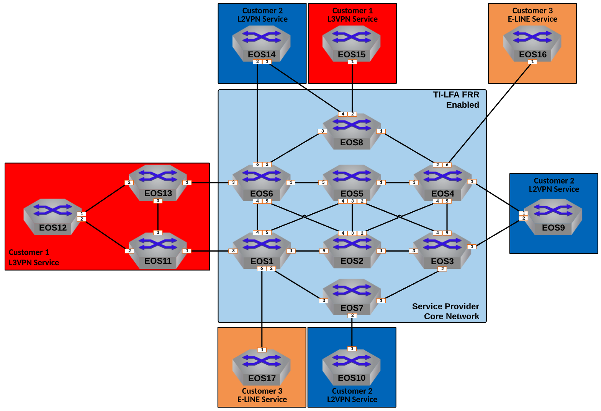

Enable TI-LFA Fast Reroute for ISIS-SR
==================================================================

  
|

#. Log into the **LabAccess** jumpserver to prepare the lab environment.

   #. From the Main Menu, type ``labs`` or Option 97 for ``Additional Labs``.

   #. Type ``mesh-topology-evpn-supplemental-labs`` to access the Supplemental Labs.

   #. Type ``tilfa`` at the Labs Selection Menu. The script will configure the topology 
      with the necessary prerequisites.

#. Enable Topology Independent Loop Free Alternate, or **TI-LFA**, calculation to occur on **EOS1**.

   #. First, enable TI-LFA to protect against link failures in the Level-2 IS-IS topology.

      .. note::

         TI-LFA will calculate backup paths between the IS-IS enabled nodes assuming that the 
         primary best path has failed. In the event of an actual failure, hardware forwarding would 
         switch to this backup path in 50 ms. This would normally be paired with BFD monitoring. In the 
         virtual ATD labs, it is not possible to simulate actual failures, but the TI-LFA control-plane 
         can still be validated.

      .. code-block:: text

         router isis 100
            !
            address-family ipv4 unicast
               fast-reroute ti-lfa mode link-protection level-2

   #. Set a delay so that traffic will transition to the post-failure path only after the network has fully 
      converged.

      .. note::

         Normally, IS-IS would use the TI-LFA calculated path only until the local router has reconverged 
         after the failure. To prevent micro-loops during failure events, we introduce a delay for the 
         router to switch from the TI-LFA calculated backup path to give the network time to converge 
         globally.

      .. code-block:: text

         router isis 100
            timers local-convergence-delay protected-prefixes

#. Repeat the above configuration steps on all other Service Provider nodes.

   #. Configure **EOS2 - EOS8** for TI-LFA calculation.

      .. code-block:: text

         router isis 100
            timers local-convergence-delay protected-prefixes
            !
            address-family ipv4 unicast
               fast-reroute ti-lfa mode link-protection level-2

#. Verify local ISIS-SR TI-LFA status and forwarding on **EOS1**.

   #. Display the Node SIDs of the topology and observe that some are now have ``Protection``.

      .. note::

         You will notice some prefix-segments are not protected. This is due to that fact 
         that an ECMP route for those Nodes is already present, so there is no need to further 
         calculate a backup path. If a link fails in the ECMP group, it will automatically use 
         the other. Once a single link is the best path, it would then calculate a TI-LFA backup 
         path. You can observe which nodes have an ECMP route with ``show ip route`` and verifying 
         which prefixes have more than one next-hop listed.

      .. code-block:: text

         show isis segment-routing prefix-segments
   
   #. Display the logic **EOS1** uses to calculate the backup path to the other nodes in the topology.
   
      .. note::

         The ``Constraint`` is how EOS displays what would happen in the event of a given failure; basically 
         following the format "If ``Constraint`` is true, then use ``Path`` to reach ``Destination``."

      .. code-block:: text

         show isis ti-lfa path

   #. Display primary and backup path information from **EOS1** to **EOS8**.
   
      .. note::

         We can check how **EOS1** will reach **EOS8** by first looking up the SR tunnel for the **EOS8** node prefix 
         ``8.8.8.8/32``. Then we can check the ``TI-LFA tunnel index``, which in the below example happened to be ``7`` 
         though this may vary in your lab. Lastly, we can verify that the MPLS hardware table has programmed the label 
         corresponding to the **EOS8** Node-SID to use the TI-LFA Tunnel.

      .. code-block:: text

         show isis segment-routing tunnel 8.8.8.8/32
         show isis ti-lfa tunnel 7
         show mpls lfib route 900008

   #. Verify L2VPN routes towards **EOS7** are using the TI-LFA tunnel from **EOS3**.

      .. note::

         We will trace the MAC of **EOS10**, which in this example is ``1426.0c23.74e4``. You should replace this in the 
         commands below with the MAC of Et1 on **EOS10** which can be found in the command ``show interface Ethernet1``. 
         Likewise the tunnel index of ``3`` should be replaced with the index found in parantheses from the l2rib output.

      .. code-block:: text

         show l2rib output mac 1426.0c23.74e4
         show tunnel fib isis segment-routing 3

**LAB COMPLETE!**
