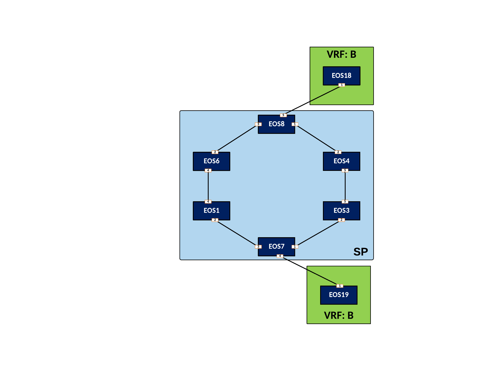

Deploy L3VPN Service for Customer-4
=====================================================

|

#. Log into the **LabAccess** jumpserver to prepare the lab environment.

   #. From the Main Menu, type ``labs`` or Option 97 for ``Additional Labs``.

   #. Type ``ring-topology-ipvpn-labs`` to access the LDP and IPVPN Labs.

   #. Type ``c4l3vpn`` at the Labs Selection Menu. The script will configure the topology with the necessary prerequisites.
   
#. Customer-4 is attached to two Service Provider nodes, **EOS7** and **EOS8**. These will be our **PE** nodes. 
   Since this customer will require a Layer 3 VPN Service, create an isolated VRF for their traffic and use IP-VPN 
   to advertise the customer networks to other interested PEs.

   #. Create a VRF Instance called ``CUSTOMER-4`` on **EOS7** and **EOS8**.

      .. note::

         The steps in this lab will be similar to the Customer-1 L3VPN lab, demonstrating the repeatable nature of 
         an IP-VPN deployment, which can easily be automated with CloudVision once the concepts are understood.

      .. code-block:: text

         vrf instance CUSTOMER-4
         !
         ip routing vrf CUSTOMER-4
         !
         ipv6 unicast-routing vrf CUSTOMER-4

   #. Place the interface attached to the **CE** node for Customer-4 into VRF ``CUSTOMER-4`` on **EOS7** to ensure their 
      traffic remains isolated.

      .. code-block:: text

         interface Ethernet4
            vrf CUSTOMER-4
            ip address 10.7.19.7/24
            ipv6 address fd00:7:19::7/64

   #. Repeat the above step for the interface on **EOS8** attached to Customer-4 CE device.

      .. code-block:: text

         interface Ethernet5
            vrf CUSTOMER-4
            ip address 10.8.18.8/24
            ipv6 address fd00:8:18::8/64

   #. Now leverage BGP to advertise VPN reachability of any routes learned in VRF ``CUSTOMER-4`` from the customer by 
      setting an **RD** and an **RT**, within BGP on **EOS7** and **EOS8**. It should have a unique **RD** following the 
      format of **<Loopback0 IP>** ``:4`` and the **RT** on all routers in the VPN should match as ``4:4``.

      **EOS7**

      .. code-block:: text

         router bgp 100
            !
            vrf CUSTOMER-4
               rd 7.7.7.7:4
               route-target import vpn-ipv4 4:4
               route-target import vpn-ipv6 4:4
               route-target export vpn-ipv4 4:4
               route-target export vpn-ipv6 4:4

      **EOS8**

      .. code-block:: text

         router bgp 100
            !
            vrf CUSTOMER-4
               rd 8.8.8.8:4
               route-target import vpn-ipv4 4:4
               route-target import vpn-ipv6 4:4
               route-target export vpn-ipv4 4:4
               route-target export vpn-ipv6 4:4

   #. Finally, define the BGP peers facing the CE devices for route exchange into the customer VRF on **EOS7** and **EOS8**. 
      The CE nodes (**EOS19** and **EOS18**) will use BGP ASN 200.

      **EOS7**

      .. code-block:: text

         router bgp 100
            !
            vrf CUSTOMER-4
               neighbor 10.7.19.19 remote-as 200
               neighbor 10.7.19.19 maximum-routes 12000 
               neighbor fd00:7:19::19 remote-as 200
               neighbor fd00:7:19::19 maximum-routes 12000 
               !
               address-family ipv4
                  neighbor 10.7.19.19 activate
               !
               address-family ipv6
                  neighbor fd00:7:19::19 activate

      **EOS8**

      .. code-block:: text

         router bgp 100
            !
            vrf CUSTOMER-4
               neighbor 10.8.18.18 remote-as 123
               neighbor 10.8.18.18 maximum-routes 12000 
               neighbor fd00:8:18::18 remote-as 200
               neighbor fd00:8:18::18 maximum-routes 12000 
               !
               address-family ipv4
                  neighbor 10.8.18.18 activate
               !
               address-family ipv6
                  neighbor fd00:8:18::18 activate

   #. Verify configurations and VRF status. There will be no routes or BGP peers in our VRF as of yet since we have not 
      peered with the CE devices.

      .. code-block:: text

         show running-config section CUSTOMER-4
         show vrf

#. Now that the PE nodes are configured, configure CE nodes **EOS18** and **EOS19** for Layer 3 attachment to the 
   Service Provider network.

   #. Configure the BGP peerings to the PE devices on **EOS18** and **EOS19** ensuring that each router's Loopback0 
      address is advertised to the attached PE.

      .. note::

         Since both CE devices are using BGP ASN ``200``, we need to ensure BGP allows the router's own ASN in the 
         AS-PATH, which normally is marked as an invalid route, with the ``allowas-in`` option.

      **EOS18**

      .. code-block:: text

         router bgp 200
            router-id 18.18.18.18
            neighbor 10.8.18.8 remote-as 100
            neighbor 10.8.18.8 allowas-in 1
            neighbor 10.8.18.8 maximum-routes 12000 
            neighbor fd00:8:18::8 remote-as 100
            neighbor fd00:8:18::8 allowas-in 1
            neighbor fd00:8:18::8 maximum-routes 12000
            !
            address-family ipv4
               network 18.18.18.18/32
            !
            address-family ipv6
               neighbor fd00:8:18::8 activate
               network 18:18:18::18/128

      **EOS19**

      .. code-block:: text

         router bgp 200
            router-id 19.19.19.19
            neighbor 10.7.19.7 remote-as 100
            neighbor 10.7.19.7 allowas-in 1
            neighbor 10.7.19.7 maximum-routes 12000 
            neighbor fd00:7:19::7 remote-as 100
            neighbor fd00:7:19::7 allowas-in 1
            neighbor fd00:7:19::7 maximum-routes 12000
            !
            address-family ipv4
               network 19.19.19.19/32
            !
            address-family ipv6
               neighbor fd00:7:19::7 activate
               network 19:19:19::19/128

#. With the peerings fully established, verify and test connectivity between the Customer-4 locations.

   #. Verify BGP status and route exchange with the Service Provider network on **EOS18**

      .. code-block:: text

         show ip bgp summary
         show ip bgp detail
         show ip route
         show ipv6 bgp summary
         show ipv6 bgp detail
         show ipv6 route

   #. Test connectivity from **EOS18** to **EOS19** using Loopback0 IP addressing.

      .. note::

         As seen previously, MPLS tunneling of IPv6 traffic does not function in vEOS-lab. The control-plane should form 
         correctly and can be verified using show commands.

      .. code-block:: text

         ping 19.19.19.19 source 18.18.18.18

#. From the Service Provider nodes, verify route exchange and MPLS control-plane status.

   #. Display the peering status and routes being advertised by **EOS18** on **EOS8**.

      .. code-block:: text

         show ip bgp summary vrf CUSTOMER-4
         show ip bgp neighbor 10.8.18.18 routes vrf CUSTOMER-4
         show ipv6 bgp summary vrf CUSTOMER-4
         show ipv6 bgp peers 10.8.18.18 routes vrf CUSTOMER-4
   
   #. Now validate the IP-VPN routes are exchanged between the PE nodes **EOS7** and **EOS8** via the Route 
      Relector.

      .. code-block:: text

         show bgp vpn-ipv4 summary
         show bgp vpn-ipv4 detail
         show bgp vpn-ipv6 summary
         show bgp vpn-ipv6 detail

   #. Finally, validate the forwarding path traffic will take for each destination in the customer VRF on the Service 
      Provider network PEs **EOS7** and **EOS8**.

      .. code-block:: text

         show ip route vrf CUSTOMER-1
         show ipv6 route vrf CUSTOMER-1
         show mpls route

**LAB COMPLETE!**