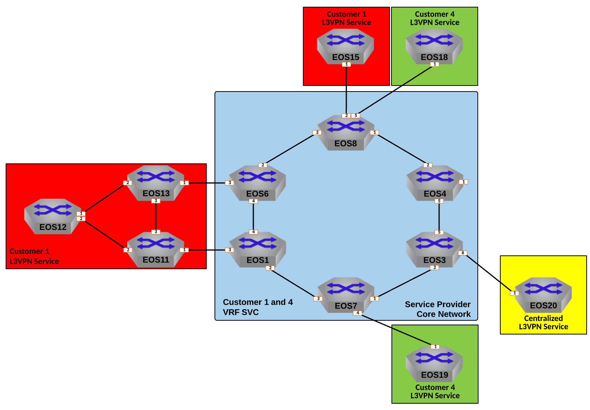

Offer Centralized Services to L3VPN Customers
=========================================================================

|

#. Log into the **LabAccess** jumpserver to prepare the lab environment.

   #. From the Main Menu, type ``labs`` or Option 97 for ``Additional Labs``.

   #. Type ``ring-topology-supplemental-labs`` to access the Supplemental Labs.

   #. Type ``centsvc`` at the Labs Selection Menu. The script will configure the topology 
      with the necessary prerequisites.

#. The Centralized Service is attached to Service Provider node **EOS3**. These will be our **PE** node. Since this 
   Centralized Service will be accessed via a Layer 3 VPN Service, create an isolated VRF for its traffic and use EVPN 
   to advertise the customer networks to other interested PEs.

   #. Create a VRF Instance called ``SVC`` on **EOS3**.

      .. note::

         While this service will be accessed by Customers attached to other PEs, we will leverage EVPN to allow for 
         inter-VRF communication and only require the ``SVC`` VRF where the node attaches to the Service Provider network.

      .. code-block:: text

         vrf instance SVC
         !
         ip routing vrf SVC

   #. Place the interface attached to the **CE** node for the Centralized Service into VRF ``SVC`` on **EOS3** to ensure its 
      traffic remains isolated.

      .. code-block:: text

         interface Ethernet6
            vrf SVC
            ip address 10.3.20.3/24

   #. Now leverage BGP EVPN to advertise reachability of any routes learned in VRF ``SVC`` from the Centralized Service by 
      setting an **RD** and an **RT** within BGP on **EOS3**. It should have a unique **RD** following the format of 
      **<Loopback0 IP>** ``:5`` and the **RT** on all routers in the VPN should be ``5:5``.

      .. note::

         Unlike our previous L3VPN setups, for the Centralized Service model, we will only need to ``export`` the routes 
         learned in the ``SVC`` VRF with this **RT**. In a later step, we will see how inter-VRF route-leaking can be 
         controlled using a separate **RT** for import.

      .. code-block:: text

         router bgp 100
            !
            vrf SVC
               rd 3.3.3.3:5
               route-target export evpn 5:5

   #. Finally, define the BGP peer facing the Centralized Service node for route exchange into the VRF on **EOS3**. The CE 
      node (**EOS20**) will use BGP ASN 500.

      .. code-block:: text

         router bgp 100
            !
            vrf SVC
               neighbor 10.3.20.20 remote-as 500
               neighbor 10.3.20.20 maximum-routes 12000 
               !
               address-family ipv4
                  neighbor 10.3.20.20 activate

#. Now that the PE node is configured, configure CE node **EOS20** for Layer 3 attachment to the Service Provider network.

   #. Configure the BGP peerings to the PE devices on **EOS20**  ensuring that the router's Loopback0 address is advertised 
      to the attached PE.

      .. code-block:: text

         router bgp 500
            router-id 20.20.20.20
            neighbor 10.3.20.3 remote-as 100
            neighbor 10.3.20.3 maximum-routes 12000 
            network 20.20.20.20/32

   #. Verify the BGP peering is active but that no routes have been learned from the PE.

      .. code-block:: text

         show ip bgp summary
         show ip bgp detail
         show ip route

#. With the Centralized Service attached to the Service Provider network, configure restricted access to the service IP 
   of ``20.20.20.20`` without using ACLs, allowing only **EOS12** and **EOS19** to access the Service.

   #. First, define a new **RT** of ``500:500`` that will be used for importing routes from **EOS12** and **EOS19** into the 
      ``SVC`` VRF on **EOS3**

      .. note::

         The PE Nodes attached to Customer-1 and Customer-2 will handle the ``export`` of the routes for **EOS12** and 
         **EOS19** with the proper **RT**, so on **EOS3** we only need to worry about importing EVPN Type-5 routes with 
         ``500:500`` into the Centralized Services VRF.

      .. code-block:: text

         router bgp 100
            !
            vrf SVC
               route-target import evpn 500:500

   #. Now, export the route for ``12.12.12.12/32`` from the Customer-1 VRF on PE nodes **EOS1** and **EOS6** using the 
      **RT** of ``500:500``. To ensure only the route for **EOS12** is exported on the PEs, use a Route-Map and Prefix-List 
      to control application of the **RT**.

      .. note::

         Applying the route-map to the EVPN ``export`` statement will allow ``500:500`` to be tagged onto the EVPN Type-5 
         route in addition to the Customer-1 default **RT** of ``1:1``.

      .. code-block:: text

         ip prefix-list SVC-ACCESS seq 10 permit 12.12.12.12/32
         !
         route-map EXPORT-TO-SVC permit 10
            match ip address prefix-list SVC-ACCESS
            set extcommunity rt 500:500 additive
         !
         route-map EXPORT-TO-SVC permit 20
         !
         router bgp 100
            !
            vrf CUSTOMER-1
               route-target export evpn route-map EXPORT-TO-SVC

   #. Similarly, on **EOS7**, configure a Route-Map and Prefix-List to export the route for **EOS19**, ``19.19.19.19/32``, 
      with the **RT** of ``500:500``.

      .. code-block:: text

         ip prefix-list SVC-ACCESS seq 10 permit 19.19.19.19/32
         !
         route-map EXPORT-TO-SVC permit 10
            match ip address prefix-list SVC-ACCESS
            set extcommunity rt 500:500 additive
         !
         route-map EXPORT-TO-SVC permit 20
         !
         router bgp 100
            !
            vrf CUSTOMER-4
               route-target export evpn route-map EXPORT-TO-SVC

   #. Now, allow PEs **EOS1** and **EOS6** to import the route for the Centralized Service with the **RT** of ``5:5`` into 
      the VRF for Customer-1.

      .. note::

         This will allow the PEs to advertise the route for the Centralized Service, ``20.20.20.20/32``, to the attached CE 
         nodes.

      .. code-block:: text

         router bgp 100
            !
            vrf CUSTOMER-1
               route-target import evpn 5:5

   #. Finally, repeat the above step on **EOS7** to import the Centralized Service route into the VRF for Customer-4.

      .. code-block:: text

         router bgp 100
            !
            vrf CUSTOMER-4
               route-target import evpn 5:5

#. With the necessary inter-VRF route leaking configuration in place, validate the **EOS12** and **EOS19** can reach the 
   Centralized Service while other CE nodes for the Customers cannot.

   #. View the routing tables of **EOS12** and **EOS19** to ensure the route for the Centralized Service, ``20.20.20.20/32`` 
      is present.

      .. note::

         **EOS19** will receive the route directly via the BGP peering to the adjacent PE node. **EOS12** will have the route 
         received via OSPF where it was redistributed by the Customer-1 CE nodes **EOS11** and **EOS13**.

      .. code-block:: text

         show ip route 20.20.20.20

   #. Verify connectivity from **EOS12** and **EOS19** to the Centralized Service at ``20.20.20.20`` from each router's 
      Loopback0 IP.

      **EOS12**

      .. code-block:: text

         ping 20.20.20.20 source 12.12.12.12

      **EOS19**

      .. code-block:: text

         ping 20.20.20.20 source 19.19.19.19

   #. Display the routing table of **EOS20** to ensure only the routes for the allowed Customer nodes are present.

      .. note::

         Only routes for the Loopback0 interfaces of **EOS12** and **EOS19** should be learned from the Service Provider 
         network.   

      .. code-block:: text

         show ip route bgp

   #. Confirm that other Customer-1 and Customer-2 nodes cannot access the Centralized Service.

      .. note::

         **EOS11** and **EOS13** will have the route for the Centralized Service, but since the Centralized Service does not 
         have a return route, no connections can be completed. Other customer nodes will not have the route at all.

      .. code-block:: text

         show ip route bgp
         ping 20.20.20.20 source **<Loopback0 IP>**

#. On the Service Provider network, verify that the Centralized Service routes and approved Customer node routes are being 
   exchanged with the proper EVPN and MPLS information.

   #. On **EOS3**, verify the incoming routes for forwarding path for **EOS12** and **EOS19** from the ``SVC`` VRF.

      .. note::

         The EVPN routes have two RTs attached to them; one from the standard L3VPN export and one from the Route-Map to 
         ensure it is imported properly into the ``SVC`` VRF. Since the Route-Map has the ``additive`` keyword, it will allow 
         both to be present and not overwrite.

      .. code-block:: text

         show bgp evpn route-type ip-prefix ipv4 detail | section 500:500
         show ip route vrf SVC

   #. On **EOS6**, verify the incoming routes for forwarding path for **EOS20**  from the ``CUSTOMER-1`` VRF.

      .. code-block:: text

         show bgp evpn route-type ip-prefix ipv4 detail | section 5:5
         show ip route vrf CUSTOMER-1

**LAB COMPLETE!**