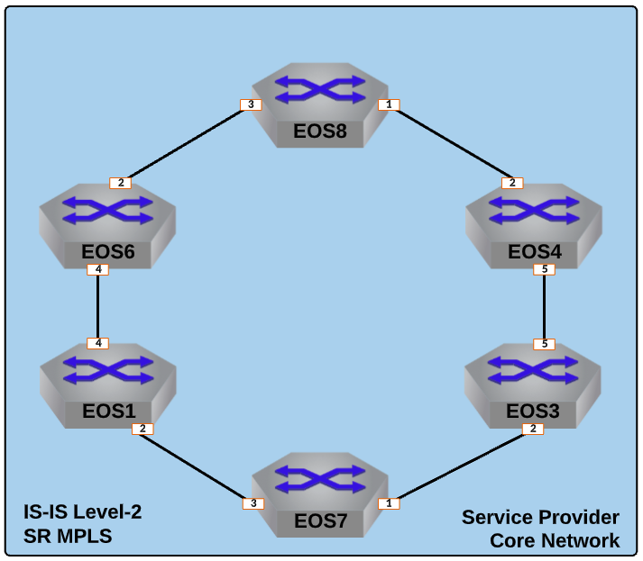

Establish MPLS Transport Label Distribution via Segment-Routing
==================================================================

  
|

#. Log into the **LabAccess** jumpserver to prepare the lab environment.

   #. From the Main Menu, type ``labs`` or Option 97 for ``Additional Labs``.

   #. Type ``ring-topology-base-labs`` to access the Base Setup Labs.

   #. Type ``sr`` at the Labs Selection Menu. The script will configure the topology 
      with the necessary prerequisites.

#. With IS-IS in place as the IGP for Loopback reachability, enable IS-IS Segment Routing on **EOS1**.

   #. First, we must enable MPLS forwarding on the router.

      .. code-block:: text

         mpls ip

   #. Enable the Segment Routing extensions with IS-IS and assign a router-id based on the router's Loopback0 address.

      .. code-block:: text

         router isis 100
         !
         segment-routing mpls
            router-id 1.1.1.1
            no shutdown

   #. Assign a Node Segment-ID, or **SID**, to the Loopback0 interface based on the EOS node ID.

      .. note::

         The Node SID is a globally unique and globally significant value, similar in nature to an IP address, that is 
         assigned to each router in the SP network. Traditionally, MPLS labels are locally signifcant to each router. With the 
         node SID, an MPLS label is advertised that has consistent meaning on each router in the topology.

      .. code-block:: text

         interface Loopback0
            node-segment ipv4 index 1

#. Verify local ISIS-SR configuration and MPLS label allocation on **EOS1**.

   #. Display the configured Node SID and other ISIS-SR information.

      .. code-block:: text

         show isis segment-routing prefix-segments self-originated
   
   #. Verify the MPLS label range assigned for use with ISIS-SR.
   
      .. note::

         EOS has a default allocation range for each type of MPLS label, which you can view. Of interest here is the 
         ``isis-sr`` label range, called the Segment Routing Global Block, or **SRGB** which must match on all routers in the 
         topology.

      .. code-block:: text

         show mpls label ranges
         show isis segment-routing global-blocks

      .. note::
      
         EOS takes the configured Node SID and adds that to the base value of the SRGB to get the MPLS label associated with 
         router. In this case, **EOS1** will be assigned ``900,000`` (from the **SRGB**) + ``1`` (from the configured Node 
         SID Index) or ``900,0001`` which we will see later.

#. Repeat the above configuration steps on the other Service Provider nodes (**EOS3, EOS4, and EOS6 - EOS8**) while assigning 
   a unique Node SID and router-id to each router based on the EOS ID and Loopback0 IP (i.e. **EOS3** will have a Node SID 
   index of ``3``).

#. Now that the ISIS-SR topology is deployed, verify MPLS label advertisement and reachability. These steps can be performed 
   on any of the Service Provider EOS nodes.

   #. Verify that all router Node SIDs are succesfully advertised. You should see an entry for each ISIS-SR enabled router.

      .. code-block:: text

         show isis segment-routing prefix-segments

   #. Now display the tunnel information ISIS-SR will use to inform the data-plane which MPLS labels and interfaces to use to 
      reach the other routers in the topology.

      .. note::
      
         An MPLS label value of the ``3`` represents the implicit-null label, which signfies the destination or LSP endpoint 
         router is adjacent to this node.

      .. code-block:: text

         show isis segment-routing tunnel

   #. Verify the Adjacency Segment IDs dynamically allocted to interfaces attached to ISIS-SR enabled peers.

      .. note::
      
         As mentioned, these labels are dynamically allocted by EOS out of the ``isis (dynamic)`` label range. Also note that 
         unlike Node SIDs, Adj. SIDs are only locally significant to the router, so they may overlap between the various nodes 
         in the topology.

      .. code-block:: text

         show isis segment-routing adjacency-segments
   
   #. Test MPLS LSP reachability between routers by using MPLS ping and traceroute functions. This example is from **EOS1** to 
      **EOS8**.

      .. code-block:: text

         ping mpls segment-routing ip 8.8.8.8/32 source 1.1.1.1
         traceroute mpls segment-routing ip 8.8.8.8/32 source 1.1.1.1

**LAB COMPLETE!**
