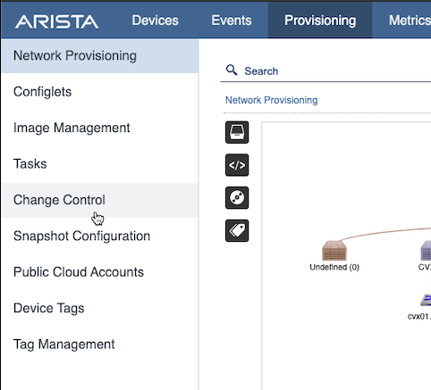
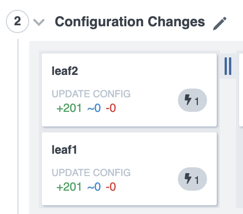
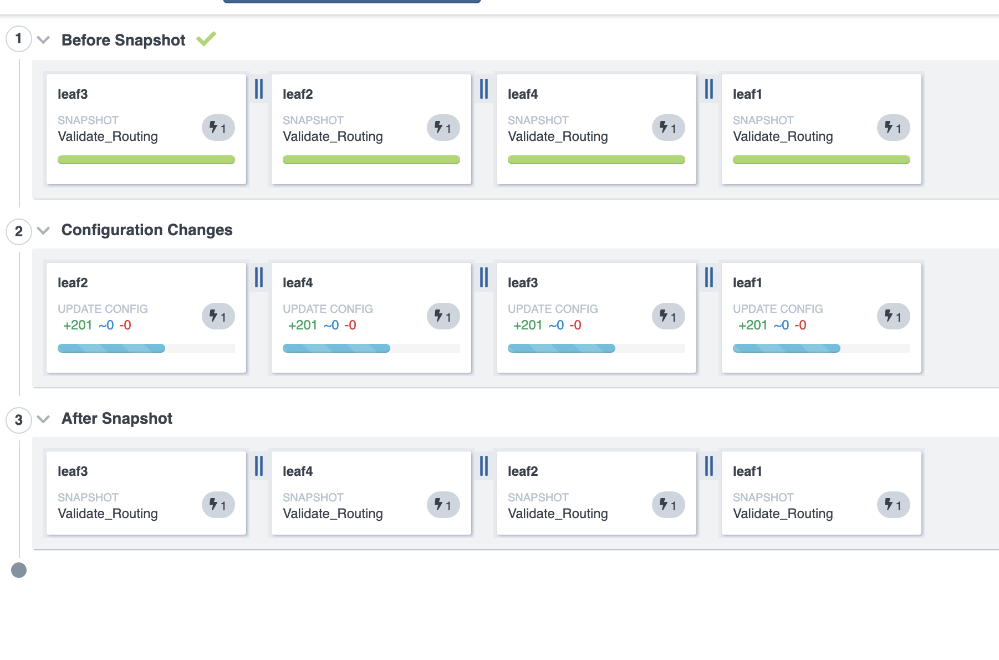
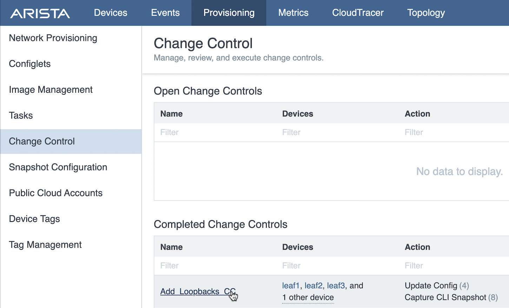

CVP Change Control, Telemetry & Rollback
==========================================

Learn how to use CloudVision’s Change Control. A Change Control (CC) can be associated with one or mores Tasks. CloudVision will take pre and post snapshots when a CC is executed to give us a state to revert back should there be any issues after the change.

Next, the lab will review Telemetry state-streaming information of the change of adding routes and how the routes propagate across the environment.

Lastly, the lab will initiate a Network Rollback to revert the changes that were implemented. The Network Rollback feature can greatly minimize downtime and gives the user the ability to restore the environment to a previous network state quickly.

**If students have not completed previous lab modules or have reset their environment:**

1. Log into the LabAccess jumpserver:
    1. If starting from this lab module, type ``cvp`` at the prompt. The script will configure all devices in the lab so you can complete this lab.

.. note:: Did you know → the “cvp” script is composed of python code that uses the CloudVision Portal Rest API to automate the provisioning of CVP Configlets.

TASK 1: Apply a Configlet Builder to create a group of Tasks
************************************************************

We want to add several Loopbacks to each device using a Configlet Builder at the ‘Leaf’ level.

1. Navigate to the 'Network Provisioning' page under the 'Provisioning' tab.

.. image:: images/cvp_cc/cvp_cc01.png
   :align: center
   
|
|

2.  Right click on the 'Leaf' container and select 'Manage' -> 'Configlet'

|
|

.. image:: images/cvp_cc/cvp_cc02.png
   :align: center

|
|

3. Select the ‘Add_Loopbacks’ from the list of configlets.

|
|

4. Select 'Generate' to build a configlet for each device. View the generated configuration by expanding the Proposed Configuration on the right by selecting the '+' 

|
|

.. image:: images/cvp_cc/cvp_cc03.png
   :align: center

|
|

.. image:: images/cvp_cc/cvp_cc04.png
   :align: center

|
|

5. Select 'Update' to return to 'Network Provisioning' and select 'Save' at the bottom of the screen. Tasks will show up in the notifications. Now that we have Tasks created we can use Change Control feature.

|
|

6. Navigate to 'Change Control' from the Provisioning Tab.

|
|

|
|

7. Create a new Change Control by clicking the '+ Create Change Control' in the top right.

|
|

.. image:: images/cvp_cc/cvp_cc06.png
   :align: center

|
|

8. This screen will show pending tasks that will be associated with a Change Control(CC). Select all pending Tasks and click '+ Create Change Control'.

|
|

.. image:: images/cvp_cc/cvp_cc07.png
   :align: center

|
|

9. First, we need to give the Change Control a name. Click the pencil on the top right to edit the CC name. Name it 'Add_Loopbacks_CC' and hit Enter.

|
|

.. image:: images/cvp_cc/cvp_cc08.png
   :align: center

|
|

10. Next we will create 2 new stages. Click the '+' in the top right (above the default stage) twice in order to create 2 new stages.

|
|

.. image:: images/cvp_cc/cvp_cc09.png
   :align: center

|
|

11. Drag one of the empty 'Change Control Stages' above the default stage.

|
|

.. image:: images/cvp_cc/cvp_cc10.png
   :align: center

|
|

12. Rename the top and bottom stages to 'Before Snapshot' and 'After Snapshot' respectively. Name the middle stage 'Configuration Changes'.

|
|

.. image:: images/cvp_cc/cvp_cc11.png
   :align: center

|
|

12. Next we can select a Snapshot template that we want to run before and after the change. Select 'Add Actions' under the right side menu.

|
|

.. image:: images/cvp_cc/cvp_cc12.png
   :align: center

|
|

13. Select 'Snapshot -> Validate_Routing' under 'Select action' 'and 'leaf1', 'leaf2', 'leaf3', and 'leaf4' under 'Select devices to run on'.
Select 'Before Snapshot' under 'Assign to stage' and 'Parallel' under 'Select ordering', then click 'Add to change control'.

|
|

.. image:: images/cvp_cc/cvp_cc13.png
   :align: center

|
|

14. Repeat step 13, but select 'After Snapshot' under 'Assign to stage'. We should now have 2 stages that will take a before and after snapshot of the devices being changed.

|
|

A few notes about Change Control:
    a. Each Task can be assigned to different stages if wanted. Health checks can be performed in stages before the next stage executes.

|
|

    b. The order of Task execution can be specified if there are dependencies. This is done by dragging tasks under the same column (Series).

|
|

|
|

15. For this lab, we now want to execute the CC. First a review and approval will need to take place. Select 'Review and Approve'. 

|
|

.. image:: images/cvp_cc/cvp_cc15.png
   :align: center

|
|

Here we can view all of the changes for the tasks, snapshots to be taken, and any other information relative to the change control in order to approve it.

|
|

16. Once changes have been reviewed, we can click 'Approve' in the bottom right.

|
|

.. image:: images/cvp_cc/cvp_cc16.png
   :align: center

|
|

17. Once the change has been approved. We should now have a green button that says 'Execute Change Control' in the top right corner. Click this to execute the changes.

|
|

.. image:: images/cvp_cc/cvp_cc17.png
   :align: center

|
|

18. We will now be prompted with with a confirmation. Click 'Execute' to confirm the CC execution.

|
|

.. image:: images/cvp_cc/cvp_cc18.png
   :align: center

|
|

19. While the CC executes, we can see the progress of each task as it is executed.

|
|

|
|

20. Once the Change Control is successfully completed, we can view the snapshots under 'Devices -> <device_name> -> Snapshots'

|
|

.. image:: images/cvp_cc/cvp_cc20.png
   :align: center

|
|

21. To compare the before and after, select 'Compare against a previous snapshot in time' and select the snapshot we wish to compare to.

|
|

.. image:: images/cvp_cc/cvp_cc21.png
   :align: center

|
|

22. A diff will be shown of the before and after.

|
|

.. image:: images/cvp_cc/cvp_cc22.png
   :align: center

|
|

Note: We can also compare against any other snapshot in time by clicking on the date and selecting the snapshot to compare to.

|
|

.. image:: images/cvp_cc/cvp_cc23.png
   :align: center

|
|

TASK 2: View Telemetry
**********************

|

1. Using Telemetry we can view the routes that were added as part of this change propagate across the environment. To Telemetry information, navigate to the 'Metrics' tab.

|

.. image:: images/cvp_cc/cvp_cc24.png
   :align: center

|

2. Dashboards can be created and saved for metrics, but metrics can also be explored on demand in the metrics explorer.

|

.. image:: images/cvp_cc/cvp_cc25.png
   :align: center

|

3. Upon login, the 'Events' tab is a quick view current state.

|

.. image:: images/cvp_cc/cvp_cc26.png
   :align: center

|

4. On the 'Device' tab, we can select a device to drill down on device specific information. Click on 'leaf1'.

|

.. image:: images/cvp_cc/cvp_cc27.png
   :align: center

|

5. The following page will be displayed:

|

.. image:: images/cvp_cc/cvp_cc28.png
   :align: center

|

6. Navigate to 'Routing',and 'IPv4 Routing Table' to view the routing table metrics.

|

.. image:: images/cvp_cc/cvp_cc29.png
   :align: center

|

TASK 3: Rollback
****************

1. Initiate a Network Rollback to revert the changes that were implemented. Go to the 'Network Provisioning -> Change Control' page and find the change control we just executed: 'Add_Loopbacks_CC'.

|

|

2. In the top right, click 'Rollback Change'.

|

.. image:: images/cvp_cc/cvp_cc31.png
   :align: center

|

3. Here we will select the tasks we wish to roll back. Select all of the tasks for the leafs and click 'Create Rollback Change Control'.

|

.. image:: images/cvp_cc/cvp_cc32.png
   :align: center

|

4. We will now have a rollback change control created. The same change control process can be followed as before. For now, we can select 'Execute Change Control' to roll back the changes.

|

LAB COMPLETE

|
|
