.. # define a hard line break for HTML
.. |br| raw:: html

    

VxLAN
=====

.. note:: The manually-entered configlet below as part of this lab is equivalent to ``Leaf3-VXLAN-Lab-Full``.

**To access the command line of particular switch, click on that switch or CloudVision in the topology diagram at the top of the lab guide.**

1. Log into CloudVision and find **leaf3** on the **Devices** page

* The username to access CloudVision is ``arista`` and the password is ``{REPLACE_ARISTA}``
   
* Search for ``leaf3`` in the **Device** column of the **inventory** table.

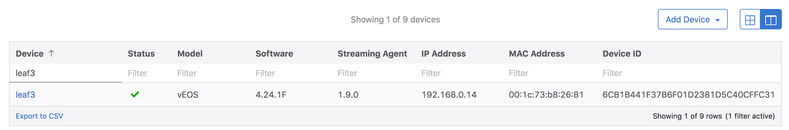
|br|

* Click on **leaf3**
|br|

2. Review the current VXLAN information in CVP

* Click on **VXLAN** in the left selection column under **Switching**

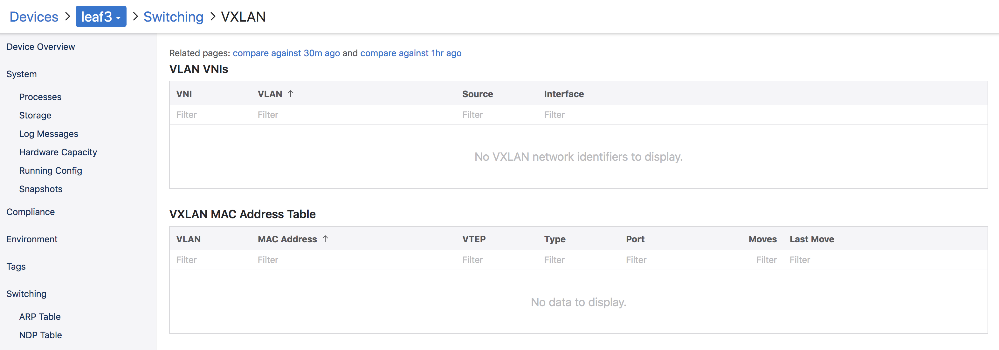
|br|

* **Note:** leaf3 currently has no VXLAN configuration

* Click on **Topology** in the navigation bar at the top of the page 
* Click the **Link Overlay** dropdown in the left selection column

.. image:: images/cvp-vxlan/leaf3-vxlan-before.png
    :align: center
    :width: 50%
|br|

* Click the **VXLANs** selection, also click and view the **VLANs** selection
* **Note:** You should see VLAN 12 on ``leaf3`` & ``leaf4``
* **Note:** You should see that ``leaf4`` has both VLAN 12 and VNI 1212 with a dashed line to ``leaf2``
* **Note:** You should not see VLAN 12 or VNI 1212 as a dashed line from leaf3 to leaf2

.. image:: images/cvp-vxlan/leaf3-vxlan-vlan-before.png
    :align: center
    :width: 50%
|br|

.. image:: images/cvp-vxlan/leaf3-vxlan-vni-before.png
    :align: center
    :width: 50%
|br|

3. Create the VXLAN configlet

* Click on **Provisioning**, click on **Configlets** in the left selection column
* Click the **+** sign in the Configlets list toolbar

.. image:: images/cvp-vxlan/leaf3-vxlan-configlet-list.png
    :align: center
    :width: 50%
|br|

* Create a configlet called ``Leaf3-VXLAN-Lab-Full-user``

.. code-block:: text

    !! Configure physical interface et4 and port-channel 4 for host2 in access vlan4
    interface port-channel 4
        description MLAG - HOST2
        switchport access vlan 12
        mlag 4
    !
    interface Ethernet4
        description HOST2
        channel-group 4 mode active
        lacp timer fast

    !! Configure a loopback interface to be used with interface vxlan1 for vxlan encapsulation
    interface Loopback1
      ip address 172.16.0.56/32
    !
    interface vxlan 1
      vxlan source-interface loopback 1
      !! Map vlan 12 to vni 1212
      vxlan vlan 12 vni 1212
      !! Send BUM traffic to vtep(s)
      vxlan flood vtep 172.16.0.34

* Add the CLI text from above to the new configlet

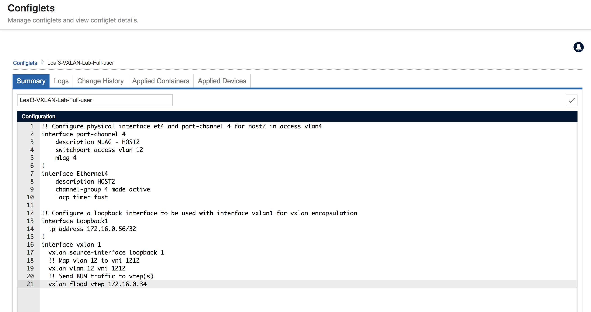
|br|

* Validate configlet syntax on **leaf3**

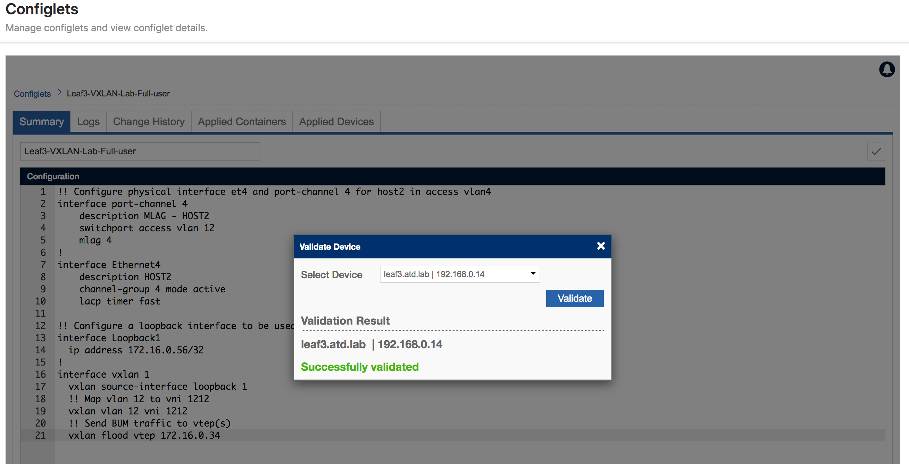
|br|

4. Assign the VXLAN configlet to **leaf3**

* Click on **Provisioning**, then click on **Network Provisioning** in the left selection column
* Right click on **leaf3**, Click on **Manage->Configlets** and then search for ``Leaf3-VXLAN``

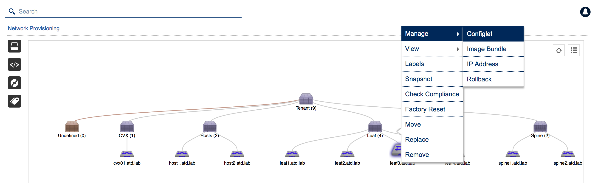
|br|

* Click the checkbox next to ``Leaf3-VXLAN-Lab-Full-user``

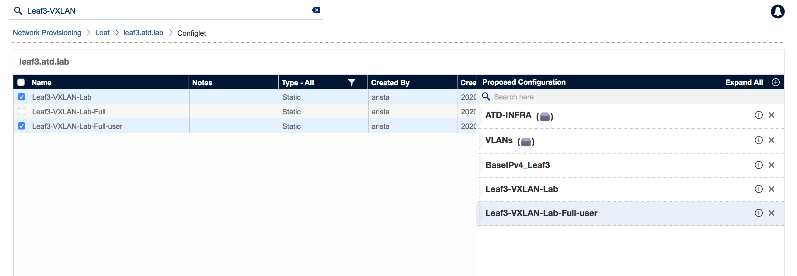
|br|

* Click **Validate**, review the new lines added to the **Designed Configuration**

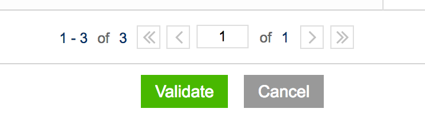
|br|

* click **Save**

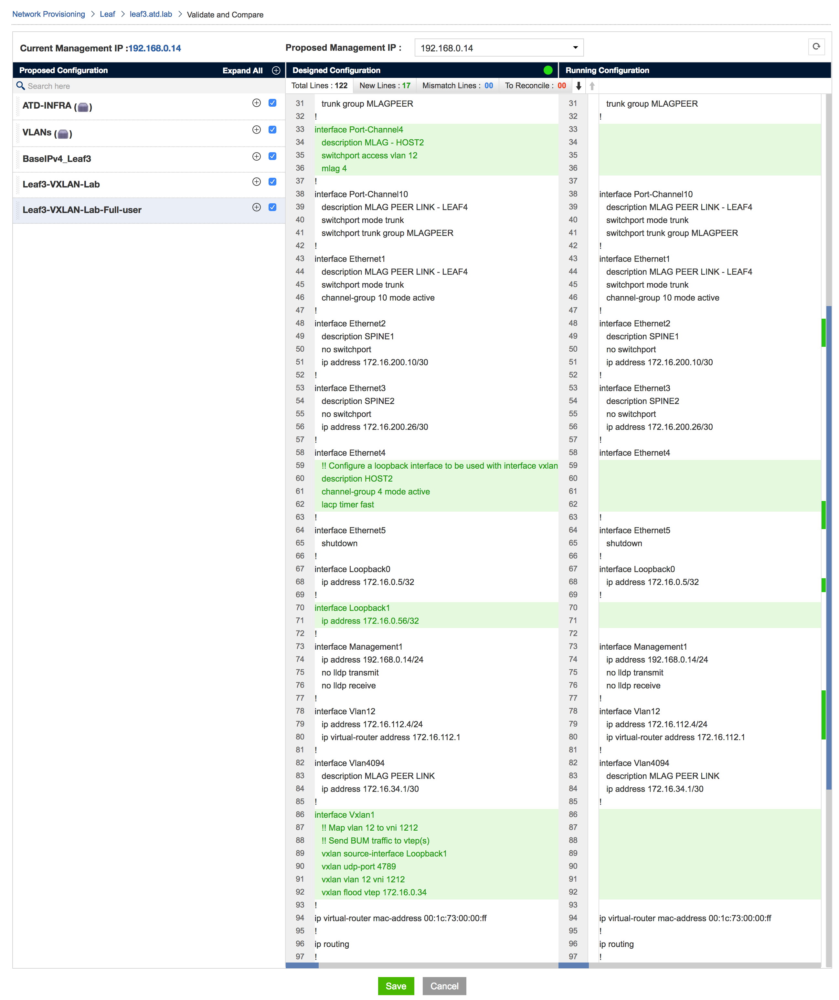
|br|

* Click **Save** on the **Network Provisioning** main view
   **Note:** a Task will be generated

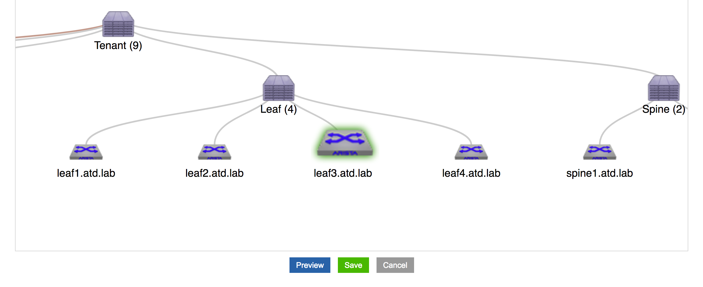
|br|

5. Create a Change Control with the generated Task

* Click **Tasks** from the left selection column

* Click the checkbox next to the generated task from the pool of **Assignable Tasks**

.. image:: images/cvp-vxlan/leaf3-vxlan-cc-task.png
    :align: center
    :width: 50% 
|br|

* Click **+ Create Change Control with 1 Task**

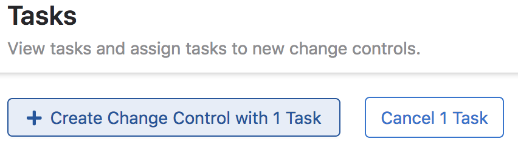
|br|

* Click **Review and Approve** on the newly created **Change Control**

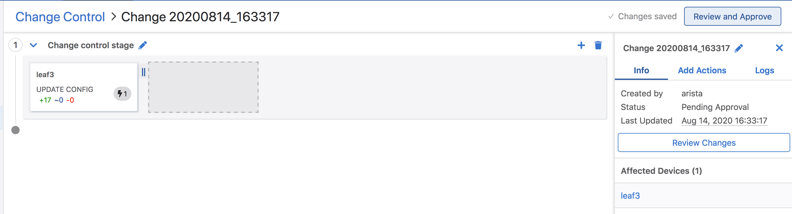
|br|

* Click **Execute Change Control** in upper right of the UI

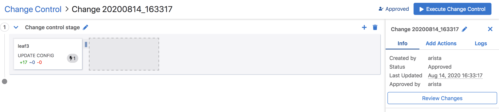
|br|

* Click **Execute** in the resulting confirmation dialog box

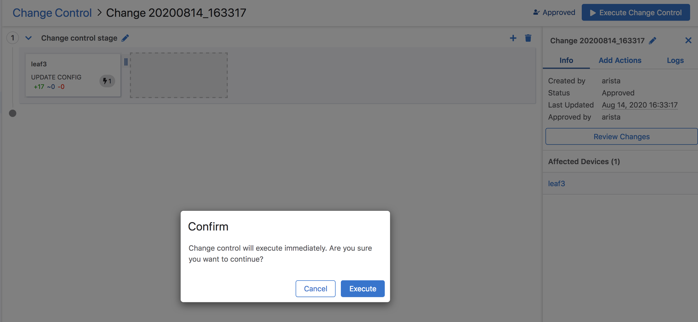
|br|

6. Verify VXLAN operation with CVP Telemetry

* From **Device** page **Inventory** click on **leaf3**
* Click on **VXLAN** in the left selection column under **Switching**

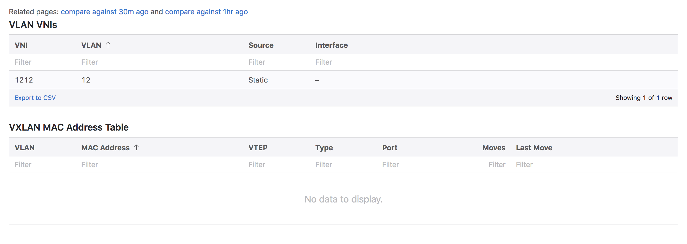
|br|

* **Note:** you should now see the VLANs to VNI mappings related the to VXLAN configuration on ``leaf3``

* Ping ``host1`` from ``host2``
    
.. code-block:: text

    host1# ping 172.16.112.201
    PING 172.16.112.201 (172.16.112.201) 72(100) bytes of data.
    80 bytes from 172.16.112.201: icmp_seq=1 ttl=64 time=0.248 ms
    80 bytes from 172.16.112.201: icmp_seq=2 ttl=64 time=0.165 ms
    80 bytes from 172.16.112.201: icmp_seq=3 ttl=64 time=0.181 ms
    80 bytes from 172.16.112.201: icmp_seq=4 ttl=64 time=0.150 ms
    80 bytes from 172.16.112.201: icmp_seq=5 ttl=64 time=0.146 ms

    --- 172.16.112.201 ping statistics ---
    5 packets transmitted, 5 received, 0% packet loss, time 1ms
    rtt min/avg/max/mdev = 0.146/0.178/0.248/0.037 ms, ipg/ewma 0.421/0.211 ms
    host1#

* Again, click on **VXLAN** in the left selection column under **Switching**

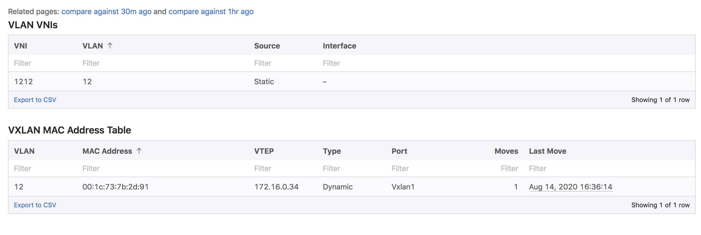

* **Note:** In addition to the VLAN to VNI Mappings, you will see an entry in the ``VXLAN MAC Address Table`` section

* Click on the **MAC Address Table** for ``leaf3`` in left selection column

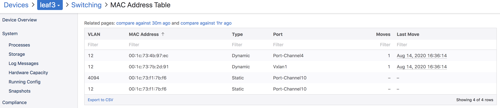
|br|

* **Note:** You will see the local MAC Address of Host2 on Port-Channel 4 and the remote MAC Address of Host1 showing port ``Vxlan1``

* Click on **Topology View** 
* Click the **Link Overlay** dropdown in the left selection column

.. image:: images/cvp-vxlan/leaf3-vxlan-before.png
    :align: center
    :width: 50%
|br|

* Click the **VXLANs** selection, also click and view the **VLANs** selection
* **Note:** You should see VLAN 12 on ``leaf3`` & ``leaf4``
* **Note:** You should see that ``leaf4`` has both VLAN 12 and VNI 1212 with a dashed line to ``leaf2``
* **Note:** You should **now** see VLAN 12 and VNI 1212 as a dashed line from leaf3 to leaf2, indicating VLAN 12 is extended via VNI 1212

.. image:: images/cvp-vxlan/leaf3-vxlan-vlan-after.png
    :align: center
    :width: 50%
|br|

.. image:: images/cvp-vxlan/leaf3-vxlan-vni-after.png
    :align: center
    :width: 50%
|br|

**LAB COMPLETE!**
