CVP Change Control, Telemetry & Rollback
==========================================

Learn how to use CloudVision’s Change Control. A Change Control (CC) can be associated with one or mores Tasks. CloudVision will take pre and post snapshots when a CC is executed to give us a state to revert back should there be any issues after the change.

Next, the lab will review Telemetry state-streaming information of the change of adding routes and how the routes propagate across the environment.

Lastly, the lab will initiate a Network Rollback to revert the changes that were implemented. The Network Rollback feature can greatly minimize downtime and gives the user the ability to restore the environment to a previous network state quickly.

.. note:: Did you know → the “cvp” script is composed of python code that uses the CloudVision Portal Rest API to automate the provisioning of CVP Configlets.

TASK 1: Apply a Configlet Builder to create a group of Tasks
************************************************************

1. Log into the LabAccess jumpserver:
    1. If starting from this lab module, type ``cvp`` at the prompt. The script will configure all devices in the lab so you can complete this lab.

Now we want to add several Loopbacks to each device using a Configlet Builder at the ‘Leaf’ level.

2. Navigate to the 'Network Provisioning' page under the 'Provisioning' tab.

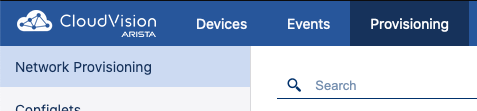
   
|
|

3.  Right click on the 'Leaf' container and select 'Manage' -> 'Configlet'

|
|

.. image:: images/cvp_cc/cvp_cc02.png
   :align: center

|
|

4. Select the ‘Add_Loopbacks’ from the list of configlets.

|
|

5. Select 'Generate' to build a configlet for each device. View the generated configuration by expanding the Proposed Configuration on the right by selecting the '+' 

|
|

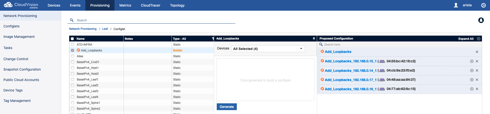

|
|

.. image:: images/cvp_cc/cvp_cc04.png
   :align: center

|
|

6. Select 'Update' to return to 'Network Provisioning' and select 'Save' at the bottom of the screen. Tasks will be generated and a notifcation will show next to the 'Tasks' option in the Navigation column. Now that we have Tasks created we can use Change Control feature.

|
|

7. Navigate to 'Change Control' from the Provisioning Tab.

|
|

.. image:: images/cvp_cc/cvp_cc05.png
   :align: center

|
|

8. Create a new Change Control by clicking the '+ Create Change Control' in the top right.

|
|

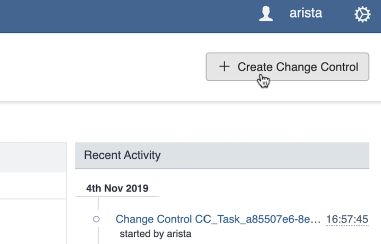

|
|

9. This screen will show pending tasks that will be associated with a Change Control(CC). Select all pending Tasks and click '+ Create Change Control with 4 Tasks'.

|
|

.. image:: images/cvp_cc/cvp_cc07.png
   :align: center

|
|

10. First, we need to give the Change Control a name. Click the pencil on the top right to edit the CC name. Name it 'Add_Loopbacks_CC' and hit Enter.

|
|

.. image:: images/cvp_cc/cvp_cc08.png
   :align: center

|
|

11. Next we will create 2 new stages. Click the '+' in the top right (above the default stage) twice in order to create 2 new stages.

|
|

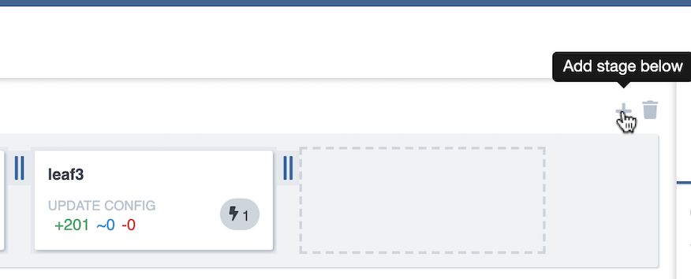

|
|

12. Drag one of the empty 'Change Control Stages' above the default stage.

|
|

.. image:: images/cvp_cc/cvp_cc10.png
   :align: center

|
|

13. Rename the top and bottom stages to 'Before Snapshot' and 'After Snapshot' respectively by clicking the Pencil icon. Name the middle stage 'Configuration Changes'.

|
|

.. image:: images/cvp_cc/cvp_cc11.png
   :align: center

|
|

14. Next we can select a Snapshot template that we want to run before and after the change. Select 'Add Actions' under the right side menu.

|
|

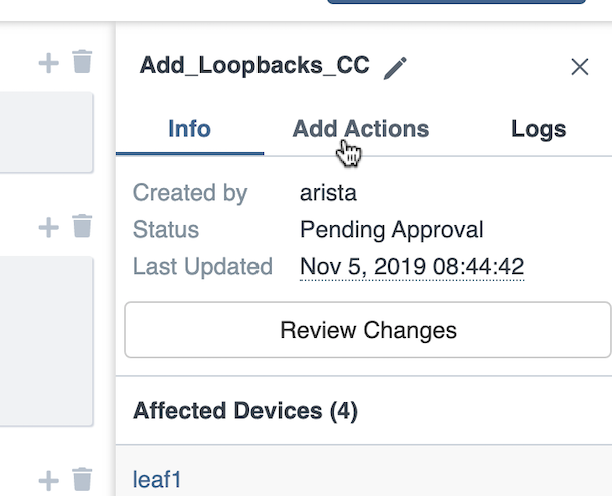

|
|

15. Under 'Select action', select 'Snapshot -> Validate_Routing'  and 'leaf1', 'leaf2', 'leaf3', and 'leaf4' under 'Select devices to run on'.
Select 'Before Snapshot' under 'Assign to stage' and 'Parallel' under 'Select ordering', then click 'Add to change control'.

|
|

.. image:: images/cvp_cc/cvp_cc13-1.png
   :align: center

|
|

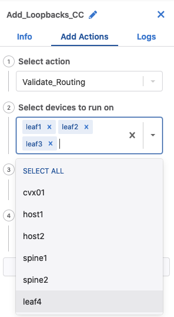

|
|

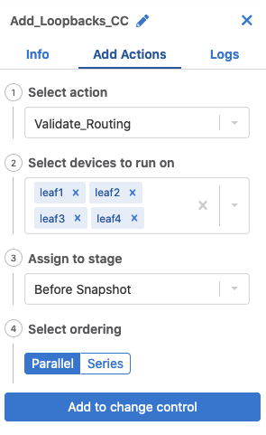

|
|

16. Repeat step 15, but select 'After Snapshot' under 'Assign to stage'. We should now have 2 stages that will take a before and after snapshot of the devices being changed.

|
|

.. image:: images/cvp_cc/cvp_cc13-4.png
   :align: center

|
|

A few notes about Change Control:
    a. Each Task can be assigned to different stages if wanted. Health checks can be performed in stages before the next stage executes.
    b. The order of Task execution can be specified if there are dependencies. This is done by dragging tasks under the same column (Series).

|
|

.. image:: images/cvp_cc/cvp_cc14.png
    :align: center

|
|

17. For this lab, we now want to execute the CC. First a review and approval will need to take place. Select 'Review and Approve'.  Here we can view all of the changes for the tasks, snapshots to be taken, and any other information relative to the change control in order to approve it.

|
|

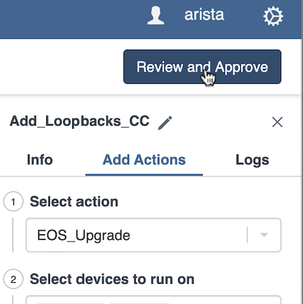

|
|

18. Once changes have been reviewed, we can click 'Approve' in the bottom right.

|
|

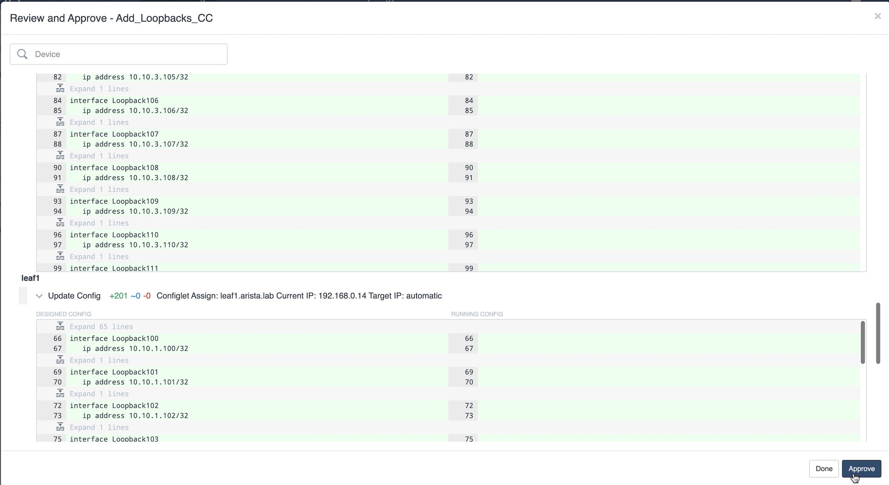

|
|

19. Once the change has been approved, we should now have a button that says 'Execute Change Control' in the top right corner. Click this to execute the changes.

|
|

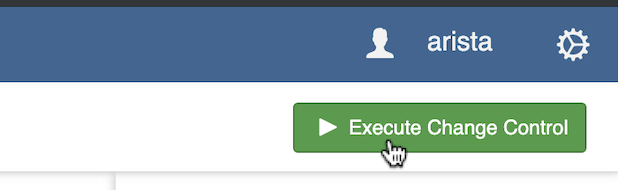

|
|

20. We will now be prompted with with a confirmation. Click 'Execute' to confirm the CC execution.

|
|

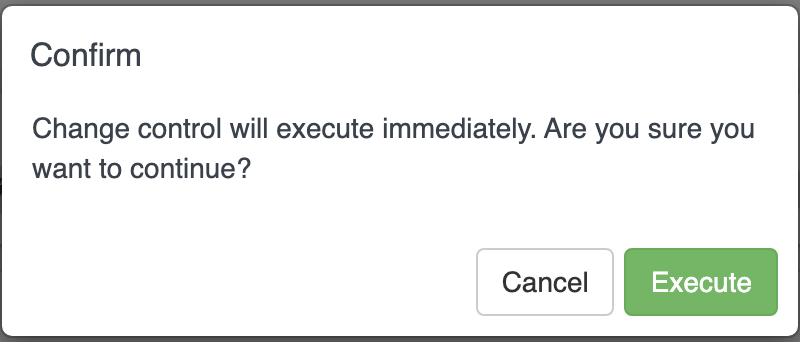

|
|

21. While the CC executes, we can see the progress of each task as it is executed.

|
|

.. image:: images/cvp_cc/cvp_cc19.png
   :align: center

|
|

22. Once the Change Control is successfully completed, we can view and compare the snapshots under 'Devices' -> 'Comparison'

|
|

.. image:: images/cvp_cc/cvp_cc20-1.png
   :align: center

|
|

23. To compare the before and after from our CC, select the 'Two times' option to compare two points in time for the same device. Select 'leaf1' from the dropdown menu and click the Quick link for '30 minutes ago'.   Then hit 'Compare'.

|
|

.. image:: images/cvp_cc/cvp_cc21-2.png
   :align: center

|
|

24. CVP will bring up a variety of views that allows you to compare the state of the device from 30 minutes ago to the current time.  Select 'Snapshots' from the left Navigation column.

|
|

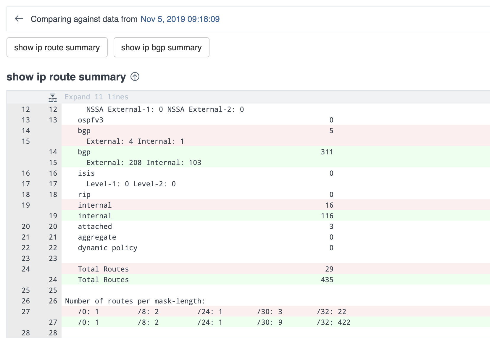

|
|

25. In the 'Comparing Data...' heading, select the first time to bring up a list of optional times to compare the Snapshot from.  The top option represents the 'Before Change' Snapshot taken when the Change Control was executed.  Select that to see a comparison of the command outputs from before and after the change.

|
|

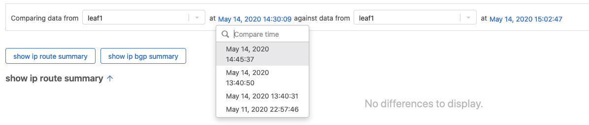

|
|

.. image:: images/cvp_cc/cvp_cc23-2.png
   :align: center

|
|

TASK 2: View Telemetry
**********************

|

1. Using Telemetry, we can view the routes that were added as part of this change propagate across the environment. One way to view telemetry information is per device in the 'Devices' tab.  Navigate to the 'Devices' tab and select 'leaf1' to view detailed information.

|

.. image:: images/cvp_cc/cvp_cc24.png
   :align: center

|

2. On the left Navigation column, select 'IPv4 Routing Table' to see a live view of the device's routing table.  Using the timeline at the bottom of the screen, you can navigate to any point in time to see what the route table was at that exact moment.  You can also see a running list of changes to the routing table on the right.

|

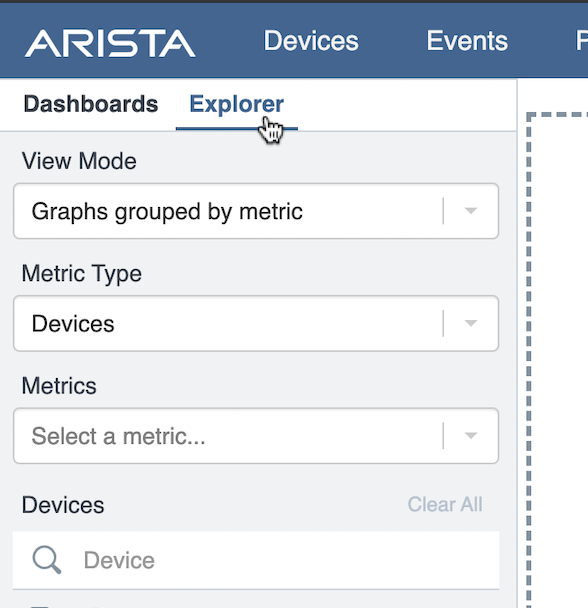

|

3. By clicking on the 'compare against 30m ago' link, you can navigate back to the Comparison view of the routing table to see all the routes added in green as part of the Change Control pushed earlier.

|

.. image:: images/cvp_cc/cvp_cc26-1.png
   :align: center

|
|

.. image:: images/cvp_cc/cvp_cc26-2.png
   :align: center

|

4. To view Telemetry information for multiple devices in a common dashboard, select the 'Metrics' tab.

|

.. image:: images/cvp_cc/cvp_cc27.png
   :align: center

|

5. To build a dashboard, select 'Explorer' in the left column to bring up a list of available telemetry metrics to add.

|

.. image:: images/cvp_cc/cvp_cc28.png
   :align: center

|

6. Under the 'Metrics' dropdown, select 'IPv4 Total Route Count' and select 'leaf1', 'leaf2', 'leaf3' and 'leaf4' to add them to the dashboard view.

|

.. image:: images/cvp_cc/cvp_cc29-1.png
   :align: center

|
|

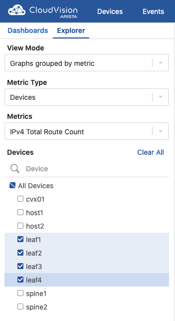

|

7. This will bring up a live rolling view of the selected metric.  In the timeline at the bottom, select 'Show Last: 1h' to view metric data for the last hour.  You will see a graphical representation of the increase in routes for each device.

|

.. image:: images/cvp_cc/cvp_cc29-3.png
   :align: center

|
|

.. image:: images/cvp_cc/cvp_cc29-4.png
   :align: center

|

8. Select the 'Add View' button to save this metric view and add another if desired.  Using the same process, add a view for 'IPv4 BGP Learned Routes' and 'IP Interfaces' to see other results of the Change Control.  Then hit the 'Save Dashboard' button in the bottom left.

|

.. image:: images/cvp_cc/cvp_cc29-6.png
   :align: center

|
|

.. image:: images/cvp_cc/cvp_cc29-5.png
   :align: center

|

9. Name the dashboard 'Leaf Routing Metrics' and hit 'Save'.  The dashboard is now saved and can be pulled up by other users of CVP at any time to view the consolidated metrics selected.

|

.. image:: images/cvp_cc/cvp_cc29-7.png
   :align: center

|
|

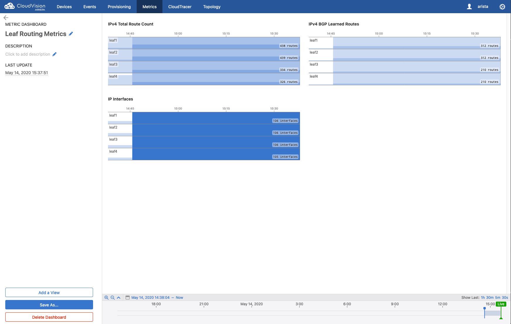

|

TASK 3: Rollback
****************

1. Initiate a Network Rollback to revert the changes that were implemented. Go to the 'Provisioning -> Change Control' page and find the change control we just executed: 'Add_Loopbacks_CC'.

|

.. image:: images/cvp_cc/cvp_cc30-1.png
   :align: center

|
|

.. image:: images/cvp_cc/cvp_cc30-2.png
   :align: center

|

2. In the top right, click 'Rollback Change'.

|

.. image:: images/cvp_cc/cvp_cc31.png
   :align: center

|

3. Here we will select the tasks we wish to roll back. Select all of the tasks for the leafs and click 'Create Rollback Change Control'.

|

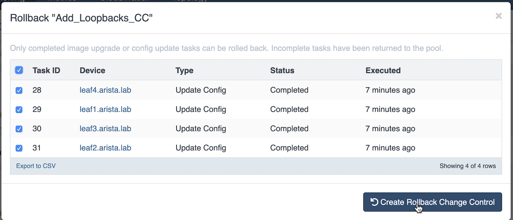

|

4. We will now have a rollback change control created. The same change control process can be followed as before. Select 'Review and Approve' to see a reflection of the changes that will be executed.  Note that the config lines are now red as they will be removed when the Rollback Change is pushed. Select 'Approve' to move to the next step.

|

.. image:: images/cvp_cc/cvp_cc33.png
   :align: center

|

5. Hit 'Execute Change Control' to push the change to rollback the configuration of the devices to the previous state.

|

.. image:: images/cvp_cc/cvp_cc34.png
   :align: center

|

6. Navigate back to 'Metrics' then the 'Leaf Routing Metrics' dashboard.  Select 'Show Last: 5m" in the timeline to see your telemetry reflect in real-time the removal of the IPv4 routes and interfaces.

|

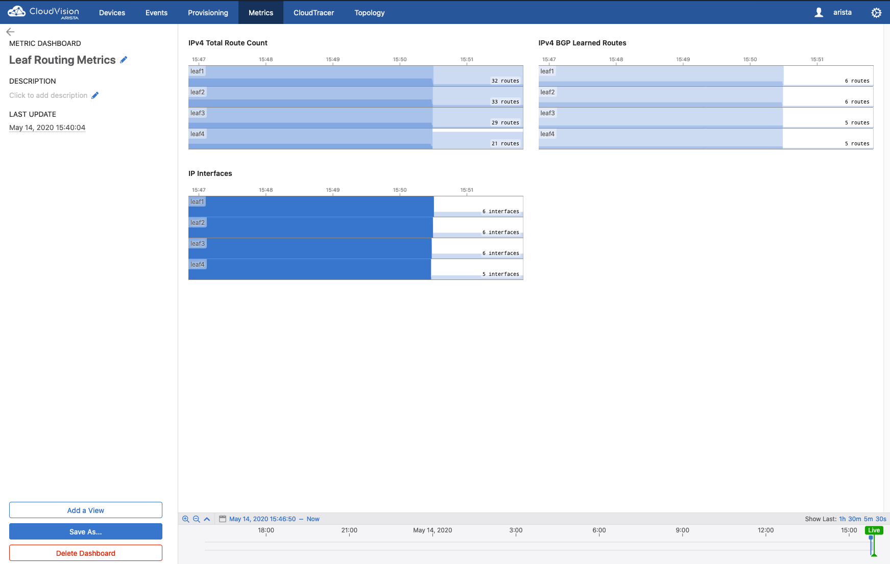

|

LAB COMPLETE

|
|
