.. note:: Ongoing WIP, document should be treated as early release and incomplete.

**To successfully run this lab in the Datacenter ATD, once the environment is up, do not initalize any of the preset labs. SSH into Host1 and Host2 and remove the existing port channels, and reconfigure as shown in the topology. Also Create vlans and SVIs as shown. When this ATD is final, this step will not be needed as there will be a lab option for it.**

==============================================
CloudVision Studios  -  L3LS/EVPN Introduction
==============================================
Cloudvision Studios allows us to easily and quickly deploy complicated network topologies in a matter of minutes. 
Before we get started, let's get familiarized with the basic data structure of CVP Studios. 
CVPS works much like the GIT framework. 
In GIT we have a staging area, a commit to finalize our changes to, and 
pull requests that will submit our changes to a top level authority to either approve or deny our changes. 

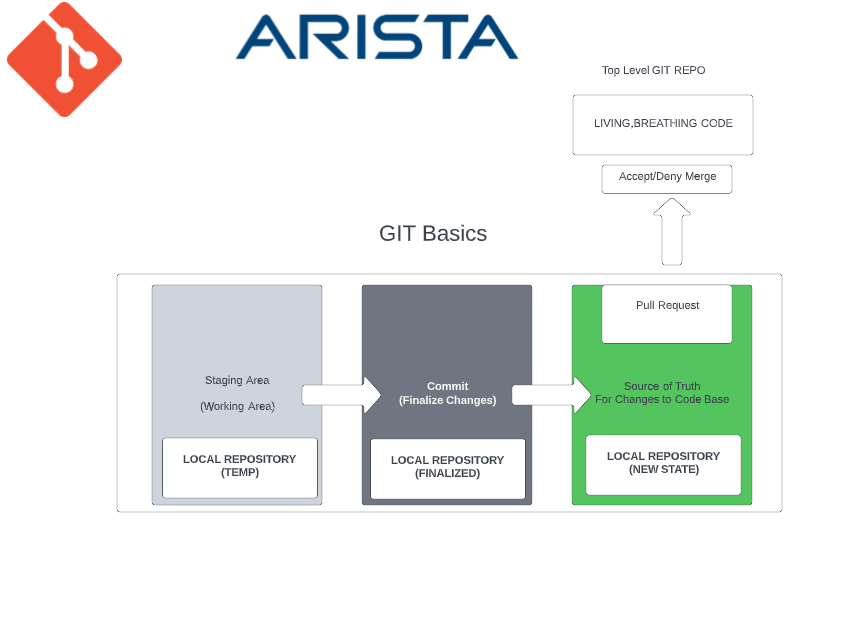
   
   

CVPS follows that schema very closely. 

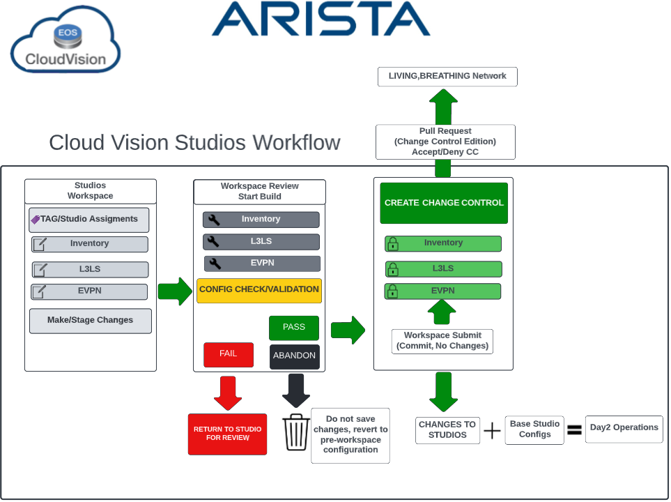

In CVPS, we have our **Workspace** (staging area) , our **Studios** (Local Repositories) and our **Workspace Submit** (commit) just like in git. 
In CVPS we modify our Studios, then check/validate the configuration for submission. 
The Workspace Submit closes out the workspace,and no further change can be made to that particular workspace. 
The changes are then merged into the base state of the modified studios to be used in a new workspace for Day2 changes. 

Our Change Control request is analogous to the Pull Request, in that we are asking permission for our changes to be the new state of the network. 
Once complete, both the state of the operating network and Studios are the same. 
No action is performed on the network until the change control process is authorized.
It’s important to note that the modified workspace can be abandoned at any time before submission, which returns the modified studios to their original pre-workspace state. 
Now that we’ve covered the structure of CVPS, let’s move onto the lab itself. 

Our topology consists of two spines and 4 leafs.  Any other switch should be ignored from a studios perspective. 
Our hosts will be pre-configured as L2 LACP trunk port-channels up to their respective leafs. 
VLAN 60 and 70 will be pre-configured with SVIs on each host for post change reachability testing. 
All underlay addressing will be performed by CVPS.

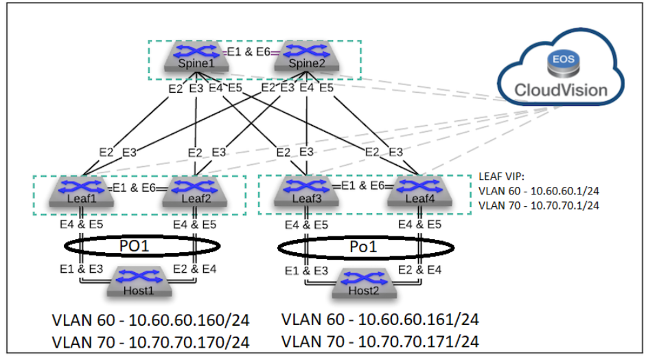
 
Let’s open CVP, and get started!
--------------------------------

The first step we need to do is create a workspace and perform the inventory studio.
This is where we will tell studios which devices to include, and the studio will know how the physical topology is built. 
This allows the other studios to auto detect links to assign properly for a functional network. 
Let’s navigate to Provisioning>Studios>Create Workspace. Name it anything you want.

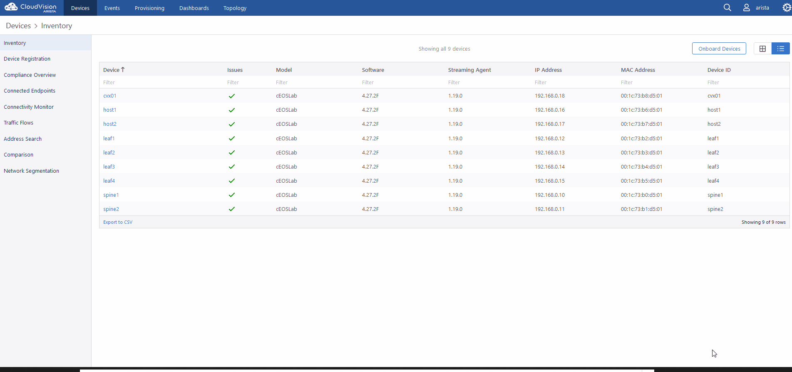

Now that our workspace is created, let’s edit our Inventory studio. 
Enter the studio and click the “add updates” tab. 
All of our devices should be there. 
Ignore anything that isn’t the Spines or Leaf1-4. 
Click on “add updates.” 
Now, notice that there are devices in the “onboarded devices” section. 
You can enter the device and see how Studios has detected the topology connections.

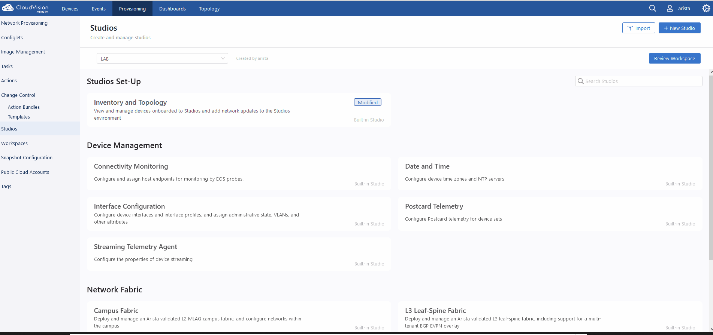

Next, let’s click on “review workspace” on the upper right. 
This will save our changes for this studio to the staging area for use. 

Note: You can absolutely make a separate workspace for every studio if you wish. 
For this lab we are going to do all this work in the same workspace, because 
I want to demonstrate how this process builds on itself in our staging area. 

Once we hit review, it will run through the checks and tell us if we are good to proceed. 
You can see in the workspace summary what studios have been modified. 

 .. image:: images/cvp_studios_l3ls_evpn/6InventoryBuild.PNG
   :align: center

Note: In the current CVPS build the build process will only kick off automatically the first time. 
As we modify other studios, we will manually start this process. 

Now, we move on to the second part of the lab, device tagging. 
Tagging is used to easily group devices and assign them to a studio. 
Tagging can be done from within a workspace even though it's technically not a studio. 
You will find tags under Provisioning, on the bottom left.  

 .. image:: images/cvp_studios_l3ls_evpn/7tagslocation.PNG
   :align: center

Note: there are user tags and tags the system creates as we move through our studio configurations. 
We should try to only use our user created tags in our studio assignments via the query builder.

 Tags are formed in a label:value format. As a best practice, there are labels you should avoid using such as “DC” and “container”, as these are used by studios during creation. 
 For this lab, we will be using “DC1:ALL” for all assets in DC1, and adding “LEAFS:DC1” for our leafs. 

Note: you can use almost any naming convention that makes sense for your use case. Examples are for this lab.

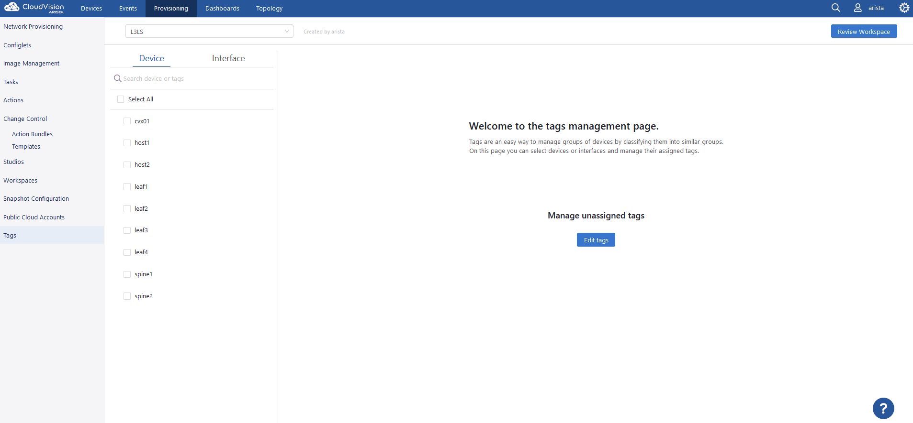

Note that the workspace now shows we have two tag changes. Now, let's trigger the “start build” and start to build our topology. We are going to focus on L3LS/EVPN, so we need to start with L3LS first, then do EVPN. 

Navigate to the “L3 Leaf-Spine Fabric” studio. First, we need to set our tag query to assign our devices. 

Note: The tag query at this time is an implicit “AND” operation. For example, if you had a DC1:ALL and DC2:ALL tag, if you just used both tags, it would not present a result. In this instance you would need to add the “OR” operator in between them. Also, the tagging must be precise. Do not include any devices that will not be assigned to the studio in question. 

Let’s tag DC1:ALL. You’ll see the number of devices it finds and their IDs. Next, let’s create our datacenter, for this lab, we’ll just use “1”. 

Note: anytime you see “create” in a field it is automatically creating a tag for the studio to use. We’ll come back to this later.  

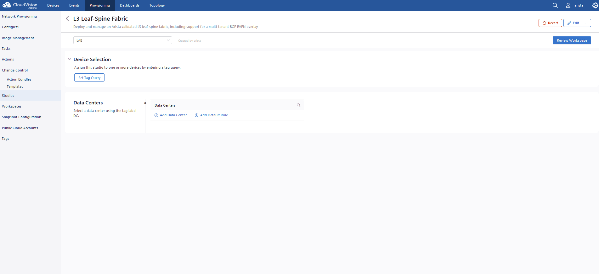

Once complete, click the arrow on the Datacenter to continue. Now, we need to assign the individual devices from our query, assign the fabric device roles, and create our pod. 

Note: a “pod” is not a rack construct in Studios. In this nomenclature, a pod is a leaf/spine collection. E.G. if you had more than one leaf/spine in the same datacenter they would get their own pod configuration. 

The Fabric Device section is critical. Here we will set our roles and ID numbers. Every Spine and Leaf needs a unique number. E.G. if you have 6 spines between 2 pods there will be six entries, 1 through 6. The Fabric devices will auto fill important sections later in the Studio. 

Let’s do this now. 

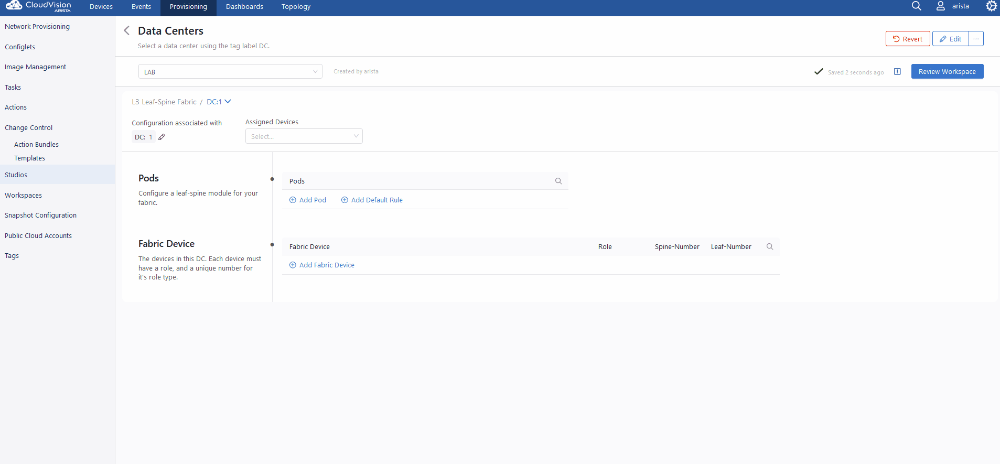

Once complete, let's “Add Pod”, give it a name of “1” then make use of the arrow in the pod field to move on. 

Once again, you’ll find we have to manually assign our devices.  Add the spines first, and you’ll see them automatically get added! Now add the leafs. Once done, we need to make our leaf domains. A leaf domain can be a pair of switches or a standalone. So in this lab, we need to make two. Leaf 1 and 2 will be in 1, and Leaf 3 and 4 will be in 2. 
Let’s do this now. 

Note: Leaf Domains must be an integer or the build process will fail.

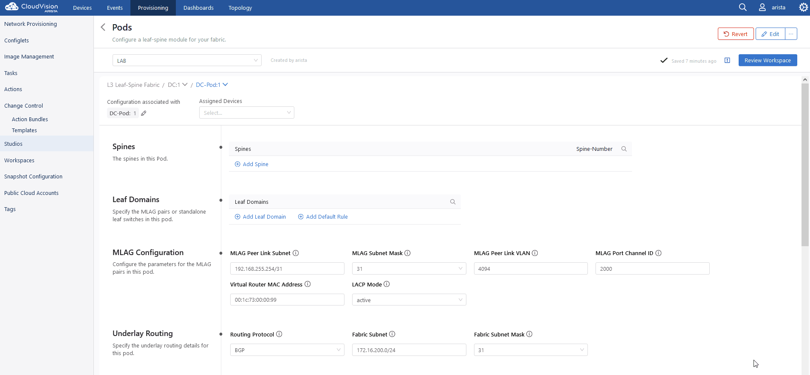

And that’s it! Our next step is to review the workspace. But before we do that, let's have a good look  at the lower section. These are all the variables that the topology will be built on. For this lab we’ll leave it all at defaults. Feel free in production to change to meet your needs and if you are building two or more data centers or pods in studios you’re going to want to make sure these variables are unique per site/pod for proper ebgp on your border leafs/unique VTEPs between EVPN domains if that's your goal.

Also noteworthy are those blue knobs below. They set BGP dynamic listeners on the Spines,configure the VXLAN Overlay and get the topology ready for EVPN. If all you wanted was strictly L3LS as a foundation you could turn off VXLAN/EVPN if you so chose.      

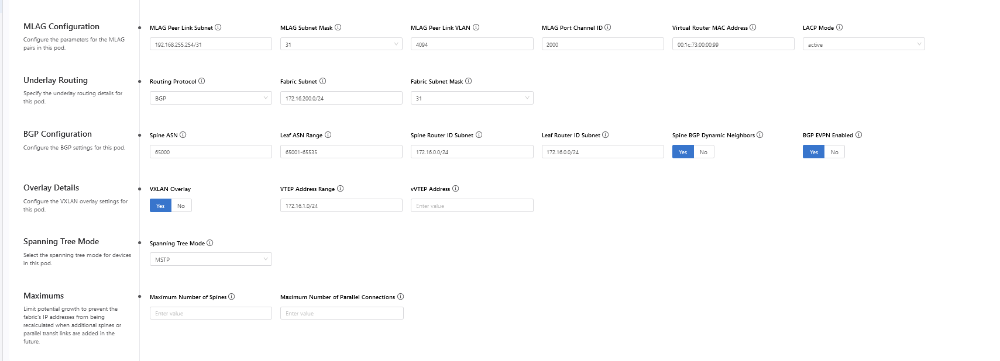

Let's start our build! Now remember, we need to manually kick the build off, and if everything went according to plan, we will get three green checks. 

Note: Notice the tag changes have increased, and L3 Leaf-Spine Fabric is in the list of modified studios.  

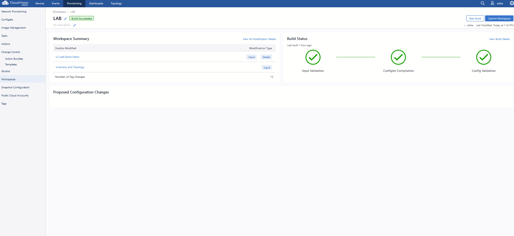

Success! Now that we have these changes saved to our workspace, let’s work on EVPN, which will pull data from this configuration. 

Let’s go to the EVPN Services section and get started! Once again, we need to add our device query. But seeing as how this is EVPN, our focus is on the leafs. Let’s use our Leafs:DC1 query, then create our tenant, we’ll call “A”. 

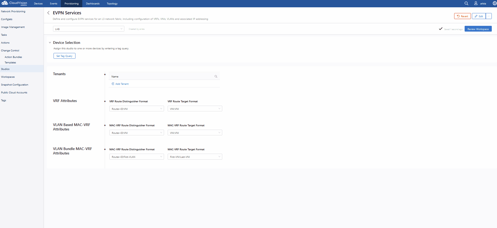

Then, let’s enter our tenant and set up our VRF, let’s also call this one “A”, and enter the configuration. The only required entry here is the VNI. Your VNI can be whatever you want, just ensure it does not conflict with the VNI the VLANS will get auto assigned with (though you can override the VNI on the VLAN page) As best practice we will set our VNI as 50000.

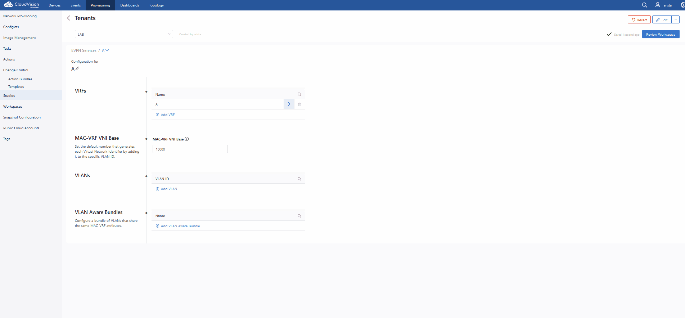

Next step is to create the vlans in the VRF, and assign them to the devices that will carry them. We can also use VLAN Aware Bundles if all devices support it (if you are cross vendor, you might not be able to use bundles) and we will configure for this lab. Let’s add vlan 60 and 70, then configure them. Let’s start with vlan 60.

Enter 60 in the VLAN ID field and enter the configuration. Let's make a name. Let’s call it “PROD” and then set our SVI of 10.60.60.1/24 

Note: The CIDR is required. 

Now, let's choose our VRF to “A”, and assign our device assignments. Use Leafs:DC1 as our tag.  Mark all to “Yes”. 

Repeat with creation of VLAN 70 with a SVI of 10.70.70.1/24 and description of “PROD2.”

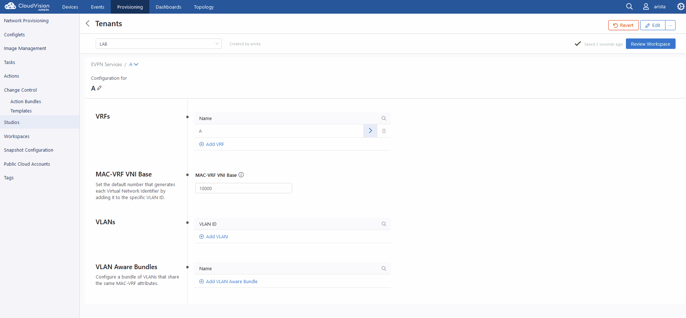

Note: Notice how when you add the leafs to the vlan the router_bgp.router_id and router_bgp.as variables auto-filled. The studio is pulling this information directly from our information stored from our L3LS studio! 

As the final step of this studio, let's quickly create our vlan aware bundle. As our value, let's call it “BUNDLE” then enter the configuration. Use 60,70 as our vlan range for this example.  

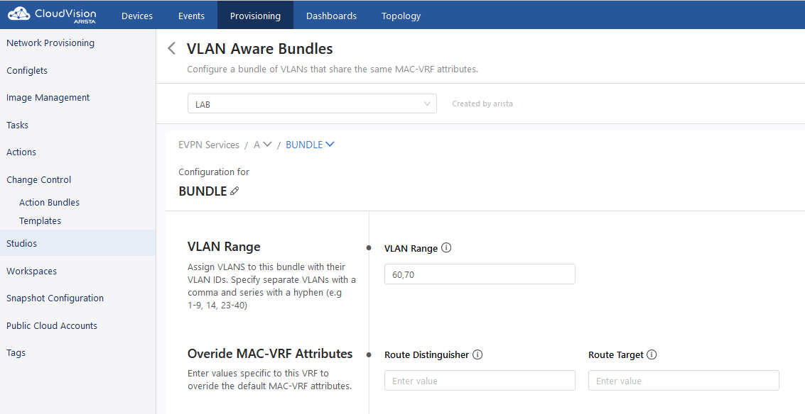

We’re done with the EVPN studio! Let’s spin the wheel of build and see how we did. Click review workspace and then start the build.  

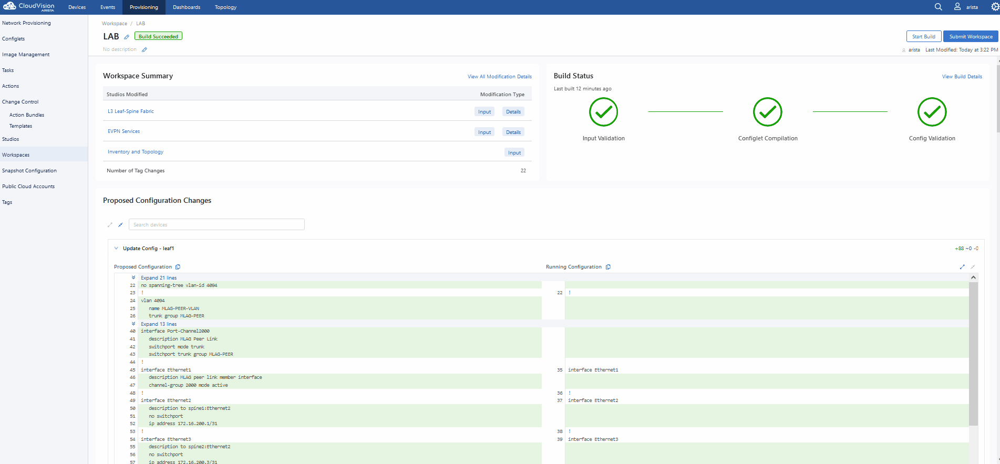

Success! We now have a working L3LS/EVPN topology, but not for the hosts yet. We need to configure the port-channels on the leafs to the hosts below them. For that, let’s use the Interface Configuration studio and then we’ll test connectivity across the fabric. 

Let’s take a look at our topology. The hosts are already pre configured for PO1 on ports E1-4 in LACP. Our yet to be configured Leafs are connected to the hosts on E4 and 5. 

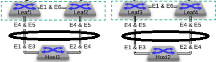

The hosts are also configured in vlan 60 and 70 with respective SVIs for testing. 
Let’s navigate to our Interface Studio and start our configuration. 

Let’s start by adding a profile, let’s call it “MLAG-PO”.  Let’s make it a trunk port, set native VLAN of “1”, allow vlans 60 and 70, and give the PO a number of 1, and check “yes” for mlag. 

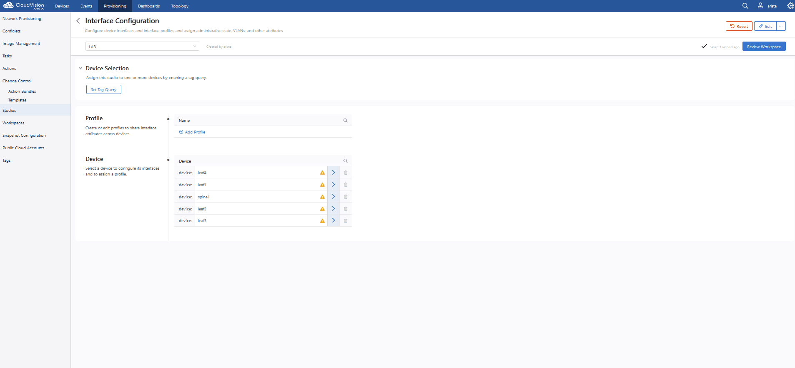

   Now, let’s put our leafs in the search query and then apply our profile to ports E4 and E5 on each leaf pair.

   .. image:: images/cvp_studios_l3ls_evpn/20-intstudio1.gif
   :align: center

   Let’s review our workspace so we can kick off a build! Hit “Start Build” and you should get a successful build. Once your build is successful, we are going to  “Submit Workspace”.

Note:
As discussed previously, we are going to commit this workspace as a final build to studios. Once we submit, this workspace will close out and it cannot be modified. But, because our inputs are committed to Studios (the repository) we can open up a new workspace and make/add/remove new changes. 

Hit “Submit Workspace” to close out and create our Change Control. 
 
 .. image:: images/cvp_studios_l3ls_evpn/21-CC1.gif
   :align: center

After the Workspace has been submitted and the Change Control created, you’ll see a “View Change Control” option. Hit that to be taken to Change Control. Now we are going to “Review and Approve” and apply our changes to the network. We are going to run these changes in parallel, and execute them immediately. Click “Review and Approve”. All tasks should complete successfully, and we can move onto the verification part of the lab.

 .. image:: images/cvp_studios_l3ls_evpn/22-CC1.gif
   :align: center

Let’s log into our Spines and run “sh bgp summary” and verify our underlay and overlay BGP adjacencies are “Established” Repeat for Leafs. 

SPINES - BGP Summary
=================================
 .. image:: images/cvp_studios_l3ls_evpn/23-Verification1.PNG
   :align: center

LEAFS - BGP Summary
=================================

 .. image:: images/cvp_studios_l3ls_evpn/23-Verification2.PNG
   :align: center

Now, let’s verify MLAG on our Leafs. On Leafs 1-4 run the “show mlag” command and verify all Leafs show as “Active” and “Up-Up.”

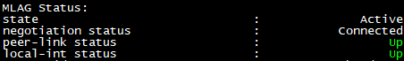

Now, on Leafs 1 and 3 let's verify our Port-Channel status. 
Run the command “sh port-channel dense”

Note: MLAG has an enhancement where the port-channel command will show the status of the port channel across both switches in the pair. See the highlighted section below. (P) shows the status and configuration of the MLAG PortChannel of the local switch as well as the peer. 

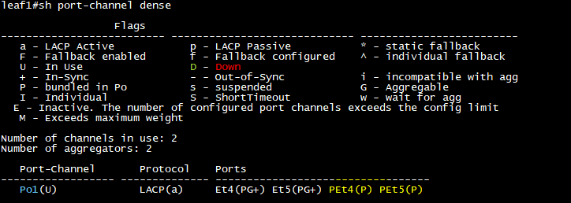

Now that we’ve confirmed all our base connectivity, let’s test our fabric and look at some outputs. 

Let’s start with Host1, and ensure we can ping our gateway at 10.60.60.1. This should be successful. Next, let's ensure we can ping our local SVI at 10.60.60.160. This should also be successful. Let’s ping across the fabric now in the same vlan, from .160 to .161. This should be successful as well. 

Do a “show int vlan 60” on Host1 and on Host2 and make note of their mac. ON host 1, do “show mac address-table vlan 60” and notice Host1’s mac comes across PO1 and Host2’s comes across Vx1.

Next, let’s ping inter-vlan from .160 to .171, which should be successful. On leaf1, review the EVPN routing table using “show bgp evpn “

