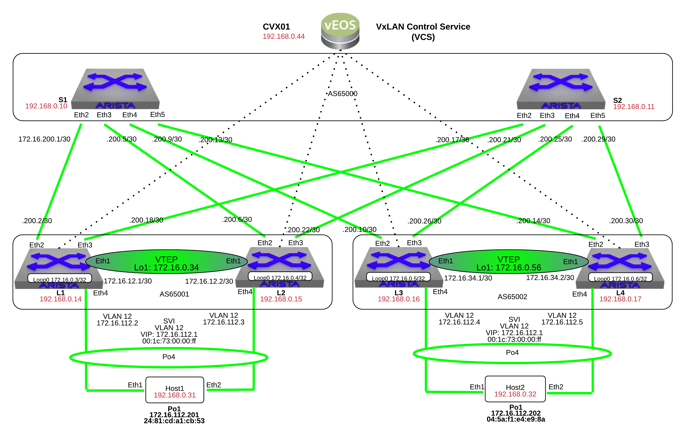

CVX
====

.. note:: Did you know the CVX stands for CloudVision eXchange? CVX is simply a virtual instance of Arista's EOS known as vEOS. CVX can be run in Standalone mode (Single VM) or Multi-node (up to 3 VMs) cluster.

1. Log into the **LabAccess** jumpserver:

   1. Type ``vxlan`` at the prompt. The script will configure the datacenter with the exception of Leaf3

   2. On **CVX01**, verify the that CVX is really a vEOS instance:

        .. code-block:: text

            show version

2. Enable the VXLAN Control Service (VCS) on **CVX01**

   1. On **CVX01**:

        .. code-block:: text

            configure
            cvx
              no shutdown
              service vxlan
                no shutdown

   2. Verify CVX Service is running:

        .. code-block:: text

            show cvx

3. On **Leaf3**, perform these commands to complete the southbound MLAG to HOST2 and configure the VTEP & loopback1 IP address:

        .. code-block:: text

            configure
            interface Port-Channel4
              description MLAG - HOST2
              switchport access vlan 12
              mlag 4

            interface Ethernet4
              description HOST2
              channel-group 4 mode active
              lacp timer fast

            interface Loopback1
              ip address 172.16.0.56/32

            interface Vxlan 1
              vxlan source-interface Loopback1
              vxlan udp-port 4789
              vxlan vlan 12 vni 1212
              vxlan controller-client

4. On **each** Leaf in the topology, configure CVX controller client and the interface vxlan1

   1. On **Leaf1**, **Leaf2**, **Leaf3**, and **Leaf4**:

        .. code-block:: text

            configure
            management cvx
              server host 192.168.0.44
              no shutdown

   2. On **Leaf1**, **Leaf2**, & **Leaf4** add the CVX/VCS control place config and also remove the explicit HER flood list VTEPs. Since CVX will create the flood list for us, we don't need to explicit declare it now.

        .. code-block:: text

            configure
            interface Vxlan 1
              no vxlan flood vtep
              vxlan controller-client

   3. Verify VxLAN controller status on **Leaf1**, **Leaf2**, **Leaf3**, and **Leaf4**:

        .. code-block:: text

            show vxlan controller status
            show vxlan controller address-table advertised
            show vxlan controller address-table received

   4. Log onto **host1** and ping **host2**:

        .. code-block:: text

            enable
            ping 172.16.112.202

5. Verify that **CVX01** has established connections and is receiving VxLAN advertisements

        .. code-block:: text

            show cvx connections
            show service vxlan address-table advertised
            show service vxlan address-table received

6. Verify that **CVX01** can view the network topology:

        .. code-block:: text

            show network physical-topology hosts
            show network physical-topology neighbors

**LAB COMPLETE!**
