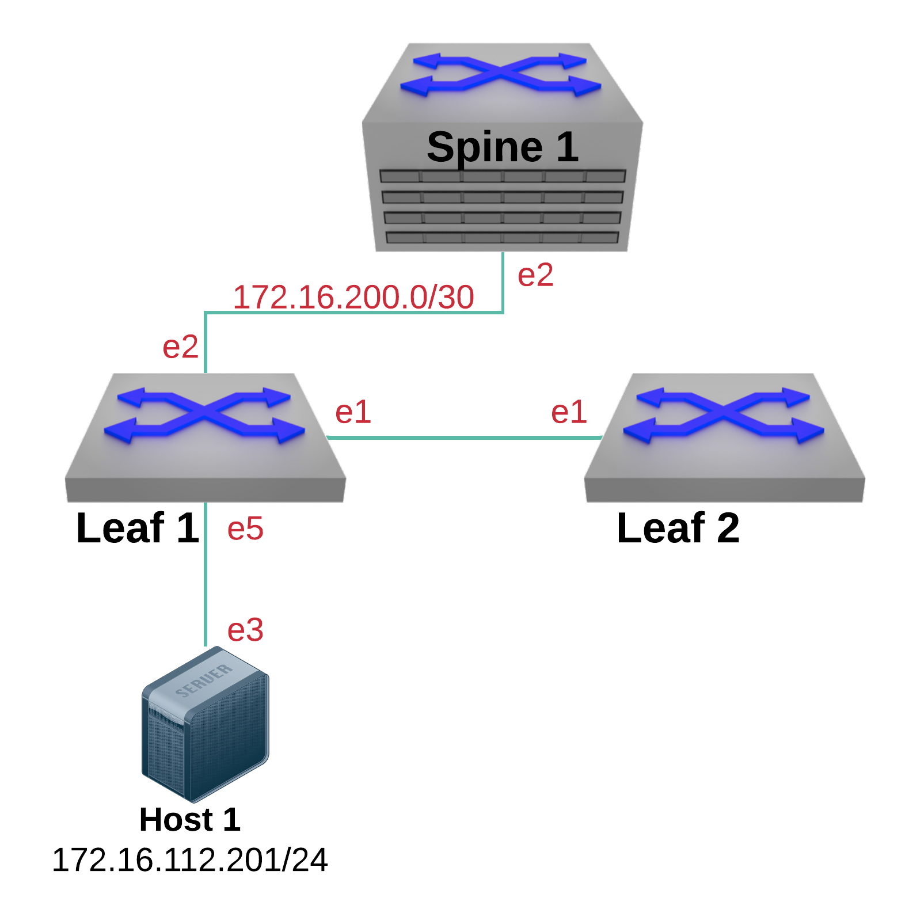

Troubleshooting Introduction
============================

.. note:: A set of possible answers are available here_. This hyperlink is only available to Arista employees.
          Please work with your Arista SE for teroubleshooting lab answers.

.. _here: https://drive.google.com/file/d/16NJ0hKy2ZfhV4Z4fdLgcp6hBnJ_iIn9P/view?usp=sharing

Log into the **LabAccess** jumpserver:

      - Type ``tshoot-intro`` at the prompt. The script will configure the lab into a errored set of states It is upto you to come
        up with a solution for each of the questions below.

Question #1:

   - Why can’t Leaf1 ping Host1? Are there multiple ways to fix this?

Question #2:

   - Why is Leaf2 the spanning tree root for all VLANs?

Question #3:

   - Why isn’t 172.16.112.0/24 being advertised into BGP?

Question #4:

   - Why won’t the OSPF adjacency come up between Leaf1 & Spine1?

