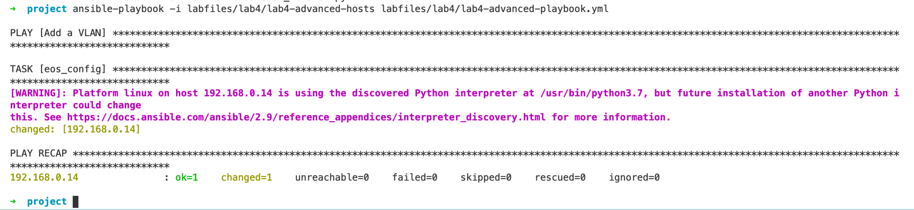

Ad Hoc and Simple Playbooks
===========================

For this lab, we will be playing with Ansible - both ad-hoc
(one-off) and playbooks.

.. note:: While Ansible is one of the easiest automation platforms out
          there, it is impossible to fully teach how it works in a lab or two
          in the course of a day. If you are interested in experimenting in
          this lab more, please let your SE know and they can provide you
          additional access after the event is completed.

          For some good reading, we recommend browsing the \ `Ansible
          website <https://www.google.com/url?q=http://docs.ansible.com/ansible/latest/intro_getting_started.html&sa=D&ust=1523980189984000>`__\.

Ad-Hoc Commands
---------------

The first part of the lab will show you how to issue ad-hoc commands to
your lab switch. An ad-hoc command is essentially a one-off command;
something you might issue once, but not ever need to repeat again.

While this is handy, the real power of Ansible comes from using
orchestrated playbooks.

Before you run your first Ansible ad-hoc command, we’ll need to create a
hosts file. Open the Atom editor, and create a new file and save it to
your desktop with the filename ``hosts``.

.. code-block:: ini

    [veos]
    192.168.0.12

This is an Ansible hosts file - you might recognize it as INI formatted!
The top bracketed entry is a group, and the entry below it is a host.
Save the file to your project directory.

Now, let’s run an ad-hoc command. Open up your handy terminal window,
and enter:

.. code-block:: bash

    ansible veos -i hosts -m raw -a "show version" -u arista -k

Enter the password **{REPLACE_PWD}** when prompted.

This probably looks complicated at first, but let’s step through it:

.. cssclass:: table-hover

+-----------------------------------+-----------------------------------+
| **Command**                       | **Description**                   |
+-----------------------------------+-----------------------------------+
| ``ansible``                       | The command, duh!                 |
+-----------------------------------+-----------------------------------+
| ``veos``                          | The group of hosts to run         |
|                                   | against. Notice the [veos] from   |
|                                   | your hosts file. If there were    |
|                                   | more than one entry here, it      |
|                                   | would run against more than one   |
|                                   | host (unless you specify in       |
|                                   | playbook to do otherwise).        |
+-----------------------------------+-----------------------------------+
| ``-i hosts``                      | Reads from the hosts file you     |
|                                   | created. There are locations that |
|                                   | Ansible will look for this file   |
|                                   | by default, but for this lab      |
|                                   | we’re specifying one.             |
+-----------------------------------+-----------------------------------+
| ``-m raw``                        | Uses the Ansible raw SSH module   |
|                                   | to connect to the switch          |
+-----------------------------------+-----------------------------------+
| ``-a "show version"``             | The ad hoc command to run, in     |
|                                   | this case ``show version``.       |
+-----------------------------------+-----------------------------------+
| ``-u arista``                     | Username ``arista`` - this can    |
|                                   | be SSHkey based or saved          |
|                                   | in another location               |
+-----------------------------------+-----------------------------------+
| ``-k``                            | Prompt for password - this can be |
|                                   | SSH key based or saved in another |
|                                   | location                          |
+-----------------------------------+-----------------------------------+

Looks a lot harder than it is, but either way when your hosts file has
100 devices in it adding a VLAN becomes a lot easier!

Playbook
--------

For simplicity's sake, for this lab we have uploaded the required files
for this lab to your lab machine. You will find them on the desktop in
the ``lab4`` folder under ``labfiles``.

Double click on the ``lab4-advanced-playbook.yml`` and let’s dive into what
it’s doing:

.. cssclass:: table-hover

+-----------------------------------+--------------------------------------+
| **Command**                       | **Description**                      |
+-----------------------------------+--------------------------------------+
| ``---``                           | The standard beginning of an         |
|                                   | Ansible playbook                     |
+-----------------------------------+--------------------------------------+
| ``- name: Add a VLAN``            | Names the task. This will be         |
|                                   | displayed at runtime.                |
+-----------------------------------+--------------------------------------+
| ``hosts: 192.168.0.14``           | Defines the host(s) to run           |
|                                   | against. This is currently set to    |
|                                   | one host, but could be a group!      |
+-----------------------------------+--------------------------------------+
| ``gather_facts: no``              | Don’t gather information about       |
|                                   | the device, just run the command.    |
|                                   | We do this for speed, but you may    |
|                                   | need to use it for some things       |
+-----------------------------------+--------------------------------------+
| ``connection: local``             | Sets the task to run from the        |
|                                   | local machine                        |
+-----------------------------------+--------------------------------------+
|   ``vars:``                       | Defines a variable section           |
+-----------------------------------+--------------------------------------+
|     ``provider:``                 | Defines a provider section           |
+-----------------------------------+--------------------------------------+
|     ``host: "{{ ansible_host }}"``| Sets the host to run against as      |
|                                   | an Ansible canned variable           |
|                                   | of ``ansible_host``. This will key   |
|                                   | off ``hosts`` above. Note that       |
|                                   | Ansible variables use {{ curly       |
|                                   | brackets }}                          |
+-----------------------------------+--------------------------------------+
|       ``username: "arista"``      | Sets the username to ``arista``      |
+-----------------------------------+--------------------------------------+
|  ``password: "{REPLACE_PWD}"``    |  Sets password to ``{REPLACE_PWD}``  |
+-----------------------------------+--------------------------------------+
|       ``authorize: yes``          | Enables once connected               |
+-----------------------------------+--------------------------------------+
|       ``transport: eapi``         | Uses eAPI instead of the SSH. You    |
|                                   | can do either                        |
+-----------------------------------+--------------------------------------+
|       ``validate_certs: no``      | Don’t validate SSL certificates      |
+-----------------------------------+--------------------------------------+
|   ``tasks:``                      | Begins the ``tasks`` section         |
+-----------------------------------+--------------------------------------+
|     ``- eos_config:``             | Tells Ansible to use                 |
|                                   | the \ `eos_config module             |
|                                   | <http://docs.ansible                 |
|                                   | .com/ansible/latest/eos_config_mo    |
|                                   | dule.html&sa=D&ust=15239801900020    |
|                                   | 00>`__\                              |
+-----------------------------------+--------------------------------------+
|        ``lines:``                 | Per the ``eos_config`` module,       |
|                                   | define the configuration lines to    |
|                                   | be issued to the switch. There can   |
|                                   | be more than one!                    |
+-----------------------------------+--------------------------------------+
|          ``- name foo``           | The actual line to issue. Note       |
|                                   | that it starts with a -. The next    |
|                                   | line would start with another -      |
+-----------------------------------+--------------------------------------+
|         ``parents: vlan 500``     | The parent of the lines above.       |
|                                   | This is important for things like    |
|                                   | interfaces or VLANs. There is        |
|                                   | always a parent above them           |
+-----------------------------------+--------------------------------------+
|         ``provider: "{{ provider  | Specifies the provider               |
| }}"``                             | (connection information). This is    |
|                                   | also a variable, and it keys in      |
|                                   | on the provider section above        |
+-----------------------------------+--------------------------------------+

For all if of its lines, all this Ansible file is really doing is
creating a vlan named ``foo`` with an ID of ``500``. Note that while this is just
adding it to a single device, you could use this to add it to every
switch in your fleet!

First we will need to update the ``password`` value in the ``provider`` section. 

Replace ``password: arista`` with ``password: {REPLACE_PWD}``

Then save the file.

Let’s go ahead and run it. Open up a Terminal window and type the
following and hit **Enter**:

.. code-block:: html

    ansible-playbook -i labfiles/lab4/lab4-advanced-hosts labfiles/lab4/lab4-advanced-playbook.yml

It’ll look like this when it’s run:

Note that it says ok=1 **changed=1**. This is telling you that it ran
successfully and made a change. Now, you can either take our word for
it, or log into the switch and verify the VLAN is there!

Run it one more time. Notice how it just says ok=1 - this is because the
configuration is already there and nothing needs to be changed.
Idempotency at its finest - neat right?

Change the playbook to use a group instead of a single host.
1. Change ``hosts: 192.168.0.14`` in ``lab4-advanced-playbook.yml`` to ``hosts: veos``
2. Add ``192.168.0.12`` and ``192.168.0.13`` to ``labfiles/lab4/lab4-advanced-hosts`` under the ``[veos]`` group. 

Now, rerun the playbook

.. code-block:: html

    ansible-playbook -i labfiles/lab4/lab4-advanced-hosts labfiles/lab4/lab4-advanced-playbook.yml

.. note:: Notice that the changes occur on the newly added hosts ``192.168.0.12`` and ``192.168.0.13``. Again, Ansible is Idempotent, only the devices lacking vlan 500 will be changed upon sebsequent runs.

Bonus
-----

Create a new playbook (or alter the one you have) that creates a new
VLAN and then adds it to ``interface Ethernet2`` as ``switchport access vlan``.

.. note:: Check out the Ansible eos_config module \ `documentation <https://www.google.com/url?q=http://docs.ansible.com/ansible/latest/eos_config_module.html&sa=D&ust=1523980190009000>`__\ .
