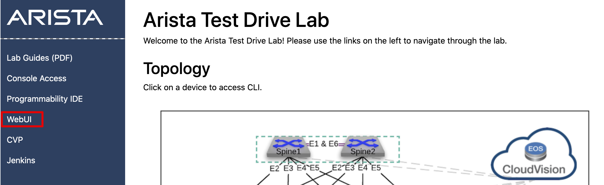
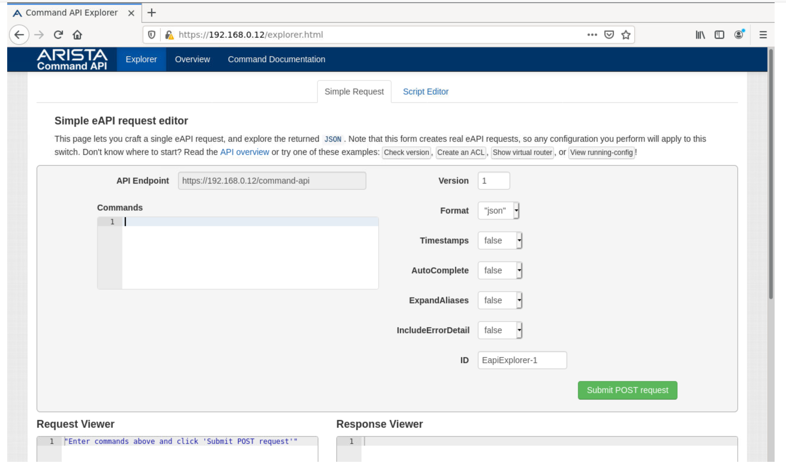

Command API
===========

The first lab will demonstrate the on-switch Command API explorer
feature. The Command API provides an interface to experiment with
commands and view their request and response structure without having to
write a script or program to test it with.

Connect to the **WebUI** service by clicking on the already open tab, or clicking on the **WebUI** link on the topology landing page.

|
This will launch a **Firefox** instance in your browser located in your topology, not your laptop. Once logged in to access Firefox, to access the switch's Command API, type  should automatically connect to the demo
switch’s Command API. If it doesn’t, log onto the switch enter the below address into Firefox.
HTTPS: `https://192.168.0.12`

.. image:: images/command_api/nested_firefox_1.png
   :align: center

When prompted, enter in the username ``arista`` and ``{REPLACE_ARISTA}`` as the password.
Accept the self-signed SSL certificate, please do so.

You will be greeted with the following window:

Get familiar with the interface. Try entering in ``show interfaces`` and
clicking **Submit POST** request. Note that it requires the full command to
work properly; shorthand commands, such as ``sh int`` do not work. Any API
action is the same way.

.. note:: Technically, you can use the AutoComplete command to use shorthand, but it’s a good practice to use long form. When writing
          code it’s always important to think about the next person to look at it!                                                                  

When you successfully issue a command, notice what the response looks
like:

.. image:: images/command_api/commandapi_4.png
   :align: center

The format above is in JSON (JavaScript Object Notation). Every line has
a *key*, and a *value*. This is why JSON is nice to use; it’s easy to
reference and use key/value pairs. We will play with this more in the
next lab.

Now try to issue a configuration command. Try:

.. code-block:: html

   vlan 1000
   name test

Hit **Submit POST Request**.

What does the response viewer say? Note there’s an error, in this
case ``"message": "CLI command 1 of 2 'vlan 1000' failed: invalid command"`` 

If you were to log into the switch right now and issue that command without using an API, what would cause this?

Now try it with the following:

.. code-block:: html

   configure
   vlan 1000
   name test

Just like if you were to login to a switch and issue those commands
normally, the same applies here. The response indicates a success now.

Log into your switch, with a ssh session, or by leveraging the opened tab for the **Console Access** service. 

To get to the ssh menu, type in the menu option **ssh** and press Enter. Next we will connect to **leaf1**, by typing **leaf1** in the menu.

When prompted, enter the arista user's password: ``{REPLACE_ARISTA}``

Now type ``show run sec vlan`` to observe that the VLAN is present:

.. image:: images/command_api/nested_eos_1.png
   :align: center

.. note:: To exit out of the EOS CLI, simply type ``exit`` and you will return the ssh menu.

Play around some more if you’d like! Check out the **Overview** and **Command Documentation**
tabs. Also, this is running on a virtual edition of our switch, so you can also do this at home or in your work lab!
