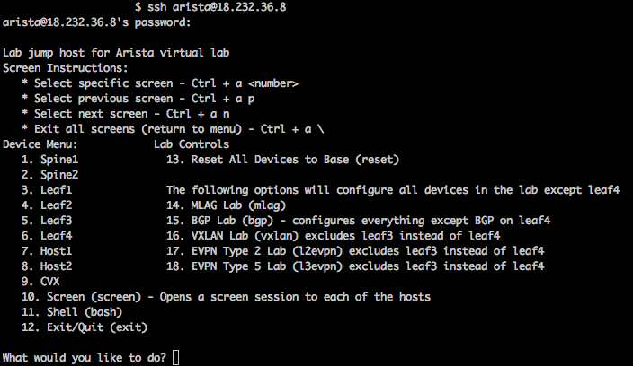

Connecting
==========

1. Log into the Arista Demo Cloud portal with your assigned URL. If you
   don’t have one, please see your ATD staff.

2. SSH to the public IP address assigned to the LabAccess jumphost server (this is the IP address shown in the "Welcome to Arista's
   Demo Cloud" picture above). The username is ``arista`` and the password is ``{REPLACE_PWD}``:

    .. code-block:: text

       ssh arista@x.x.x.x

|

|

3. The LabAccess menu allows users to connect to each device and specify
   lab topology. It is recommended to open multiple SSH sessions or use
   the Screen option to jump between devices rapidly.

4. If at any point a device is unreachable: due to removing configlets, management IP address, modifying an existing configlet, etc.  From option ``99. Shell (bash)`` use the ``eos-reset.py`` command.  Below are examples.

    .. code-block:: text

        # To restore only the spine1 vEos device:
        eos-reset.py -d spine1 

        # To restore spine1, leaf1 and cvx01 devices enter:
        eos-reset.py -d spine1 leaf1 cvx01

        # To restore all devices:
        eos-reset.py -d all
