.. # define a hard line break for HTML
.. |br| raw:: html

    

.. raw:: html

 
.. role:: red

*NOTE: Ongoing WIP, document should be treated as early release and incomplete.*

|br|:red:`If you are running the lab from ATD-DEV, disregard the disclaimer below.`
|br|:red:`Option 8 on the ATD-DEV console will format the hosts.`
|br|:red:`If running from standard ATD, please ensure you follow the below section.`

**To successfully run this lab in the Datacenter ATD, once the environment is up,** 
|br| **do not initalize any of the preset labs, instead follow the steps below:** 

|br| **1. SSH into Host1 and Host2 and remove the existing port channels.**
|br| **2. Reconfigure as trunks with interfaces E1-E4 in PO1 for each Host.** 
|br| **3. Create vlan60 and vlan70 with the SVIs as shown.**
|br| **4. Set a default route to 10.60.60.1** 

===========================================
CloudVision Studios  -  L3LS/EVPN LAB GUIDE
===========================================
*CVP Version 2021.3.0*

Our topology consists of two spines, four leafs, and two "hosts" for reachability testing. 
Our hosts will be pre-configured as L2 LACP trunk port-channels up to their respective leafs. 
VLAN 60 and 70 will be pre-configured with SVIs on each host for post change reachability testing. 
All underlay addressing will be performed by CVPS.

The hosts are already configured via lab configlets, we will not be involving them in the Studios process. 

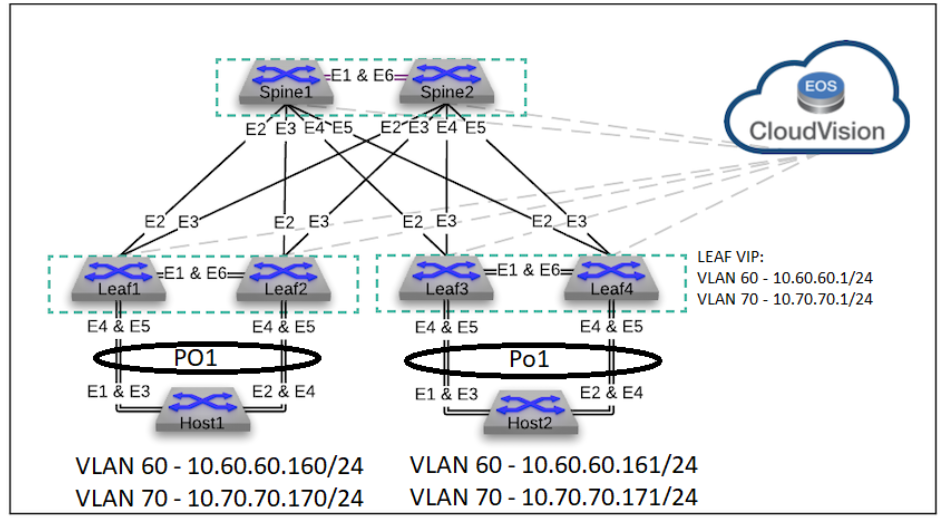
 
Let’s open CVP, and get started!
--------------------------------

**1. Workspace Creation**
--------------------------------------------------------------------------------------------

- Navigate to **Provisioning>Studios>Create Workspace**. Name it anything you want.

Once created, let's go to the **"Inventory Studio"**

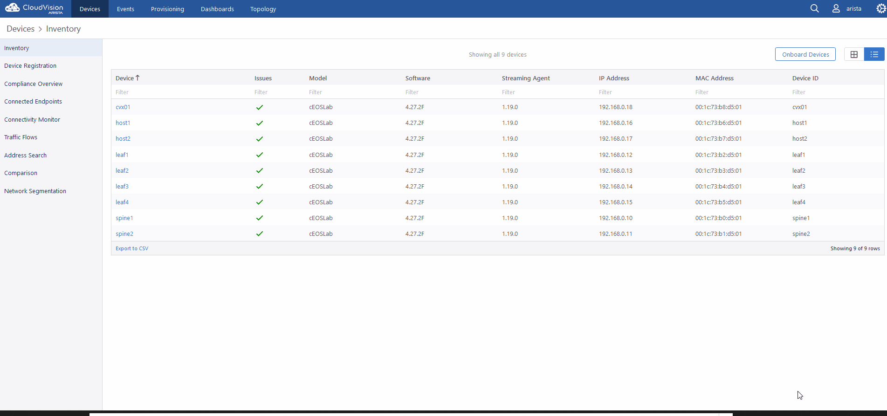

**2. Inventory studio.** 
--------------------------------------------------------------------------

- Navigate to **Provisioning>Studios>Inventory and Topology**.

 NOTE: 
 |br| This is where we will tell studios which devices to include, and the studio will know how the physical topology is built.
 |br| This allows the other studios to auto detect links to assign properly for a functional network.
 |br| All of our devices should be there. Ignore anything that isn’t the ``Spines`` or ``Leaf1-4``.  
  

- Enter the studio and click the *“add updates”* tab.
  

|br| Now, notice that there are devices in the *“onboarded devices”* section. 
|br| You can enter the device and see how Studios has detected the topology connections.

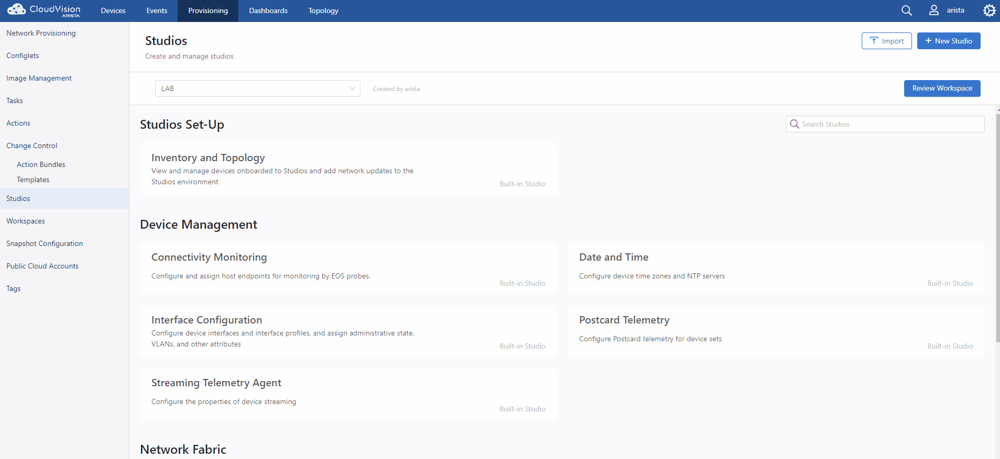

**3. Workspace review**
-----------------------
    
- Click on *“Review Workspace”* on the upper right. This will take us to the *"Workspace Summary"* page to save our inputs for this studio to the staging area for later use. 
  |br| Once we hit review, it will run through the checks and tell us if we are good to proceed. You can see in the workspace summary what studios have been modified.
  |br| **In the current CVPS build the build process will only kick off automatically the first time. As we modify other studios, we will manually start this process by clicking "Start Build".** 
 
 NOTE: 
 |br| You can absolutely make a separate workspace for every studio if you wish, however for this lab we are going to do all this work in the same workspace, because I want to demonstrate how this process builds on itself in our staging area. 

 .. image:: images/cvp_studios_l3ls_evpn/6InventoryBuild.PNG
   :align: center

 

**4. Device Tagging**
---------------------

- Go to the Provisioning tab and click *"Tags"* on the lower left 

Tagging is used to easily group devices and assign them to a studio. 
Tagging can be done from within a workspace even though it's technically not a studio. 

 
   
   

 .. image:: images/cvp_studios_l3ls_evpn/7tagslocation.PNG
   :align: center

There are user tags and tags the system creates using the *"auto tagger"* as we move through our studio configurations. 
|br| Tags are formed in a **label:value format.** 
|br| For this lab, we will be using ``“DC:DC1”`` for all assets in ``DC1``, Let's go ahead and tag our devices now. 

   NOTE:
    |br| You can use almost any naming convention that makes sense for your use case. Examples are for this lab.

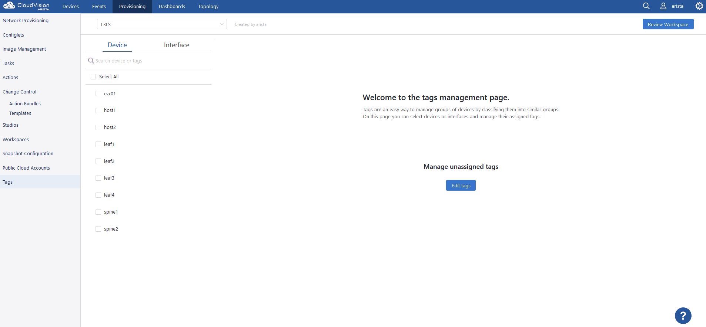

Click on **"Review Workspace"** in the upper right and observe that the workspace now shows we have two tag changes. 

|br| Now, let's trigger the *“start build”* and allow the build process to complete. 
|br| Let's move on with the lab, we are going to focus on **L3LS** first, then do **EVPN** after.

**5. L3LS Studio**
------------------

- Navigate to the **Provisioning>Studios>L3 Leaf-Spine Fabric** studio. 

First, we need to set our tag query to assign our devices.
|br| Let’s include all devices with the ``DC:DC1`` tag pair. You’ll see the number of devices it finds and their IDs. 

Once the query is complete and you verify all devices are included, let's create our Datacenter.
|br| In the "Data Centers" section, let's use a value of **"1"**  *(this can be a name or an integer, but for the lab let's use the aforementioned value)*
|br| Once complete, click the arrow to proceed into the configuration. 

**Important Tip:** 
|br| **Anytime you see “create” in a field the autotagger is automatically creating a tag for the devices included in the studio. We’ll come back to this later.** 

 

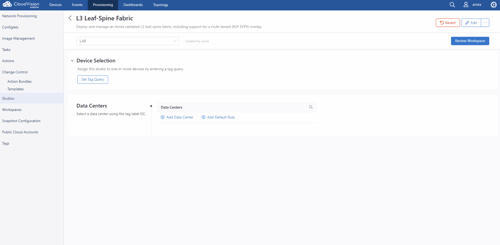

|br| Now, we need to assign the individual devices from our query, assign the **fabric device roles**, and create our pod. 
|br| The Fabric Device section is critical. Here we will set our **roles** and **ID** numbers. Every Spine and Leaf requires a unique number. 

|br| Let’s do this now. 

   Note: The devices in the Fabric Device section will auto fill important sections later in the EVPN Studio. 

  

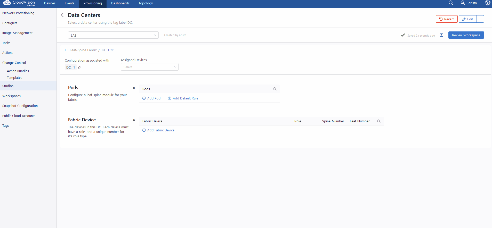

Once complete, let's *“Add Pod”*, give it a name of *“1”* then make use of the arrow in the pod field to move on. 

Once again, you’ll find we have to manually assign our devices.  
|br| Add the spines first, and you’ll see them automatically get added! Now add the leafs. Once done, we need to make our **leaf domains.** 
|br| A leaf domain can be a pair of switches or a standalone. So in this lab, we need to make two. 
|br| ``Leaf1`` and ``Leaf2`` will be in ``Leaf Domain 1``, and ``Leaf3`` and ``Leaf4`` will be in ``Leaf Domain 2``. 
|br| Let’s do this now. 

   Note: Leaf Domains must be an integer or the build process will fail.

.. image:: images/cvp_studios_l3ls_evpn/11L3LSPT3.gif
   :align: center

And that’s it! 

|br| Our next step is to review the workspace. But before we do that, let's have a good look  at the lower section. 
|br| These are all the variables that the topology will be built on. For this lab we’ll leave it all at defaults. 
|br| Also noteworthy are those blue knobs below. 

|br| They set BGP dynamic listeners on the Spines,configure the VXLAN Overlay and get the topology ready for EVPN. 
|br| If all you wanted was strictly L3LS as a foundation you could turn off VXLAN/EVPN if you so chose.      

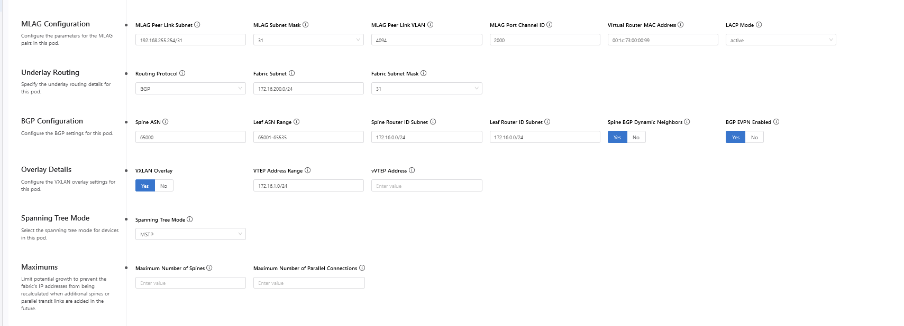

Let's start our build! Now remember, we need to manually kick the build off, and if everything went according to plan, we will get three green checks. 

   Note: Notice the tag changes have increased, and L3 Leaf-Spine Fabric is in the list of modified studios.  

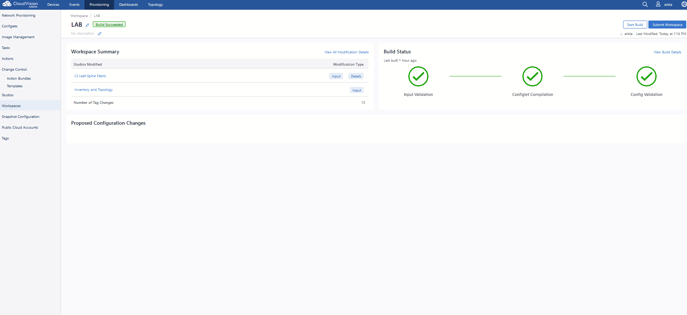

Success! Now that we have these changes saved to our workspace, let’s work on EVPN, which will pull data from this configuration. 

**6. EVPN Studio**
------------------

- Navigate to the **Provisioning>Studios>EVPN Services** studio. 

Once again, we need to add our device query. But seeing as how this is EVPN, our focus is on the leafs. 
|br| Let’s use  ``Role:Leaf AND DC:DC1`` as our query, then create our tenant, which we’ll call **“A”**. 

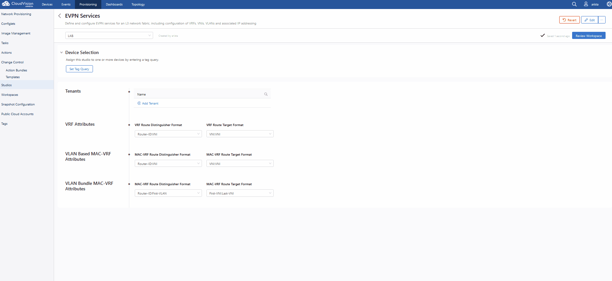

Then, let’s enter our tenant and set up our VRF, let’s also call this one **“A”**, and enter the configuration. 
|br| The only required entry here is the **VNI**. Your **VNI** can be whatever you want, just ensure it does not conflict with the VNI the VLANS will get auto assigned with (though you can override the VNI on the VLAN page) 
|br| As best practice we will set our **VNI** as **50000**.

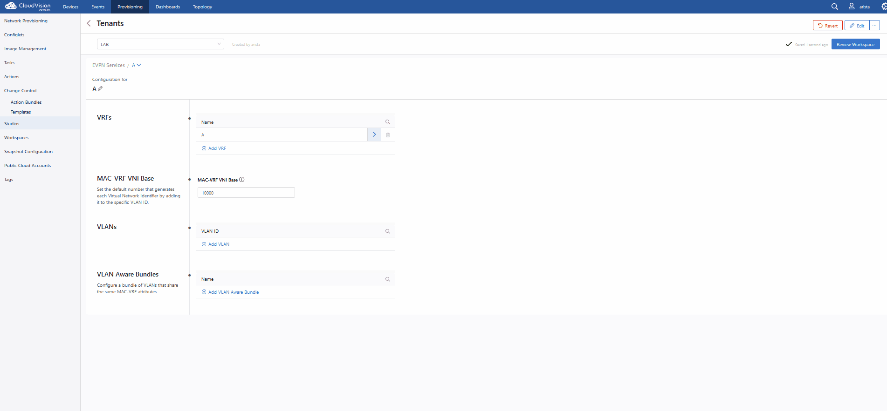

Our next step is to create the vlans in the VRF, and assign them to the devices that will carry them. 
|br| We can also use VLAN Aware Bundles if all devices support it *(if you are cross vendor, you might not be able to use bundles)* 
|br| We will configure a VLAN Aware Bundle for this lab in a moment. 
|br| Let’s add ``vlan60`` and ``vlan70``, then configure them. Let’s start with ``vlan60``.
|br| Enter 60 in the VLAN ID field and enter the configuration. Let's make a name. Let’s call it “PROD” and then set our SVI of **10.60.60.1/24** 

   Note: The CIDR is required. 

|br| Now, let's choose our VRF to ``“A”``, and assign our device assignments. Use ``Role:Leaf AND DC:DC1`` as our search. Enter the vlan area and  mark all to “Yes”. 
|br| Repeat with creation of ``vlan70`` with a SVI of **10.70.70.1/24** and description of “PROD2.”

   Note: 
   |br| Notice how when you add the leafs to the vlan the router_bgp.router_id and router_bgp.as variables auto-filled. 
   |br| The studio is pulling this information directly from our information stored from our L3LS studio! 

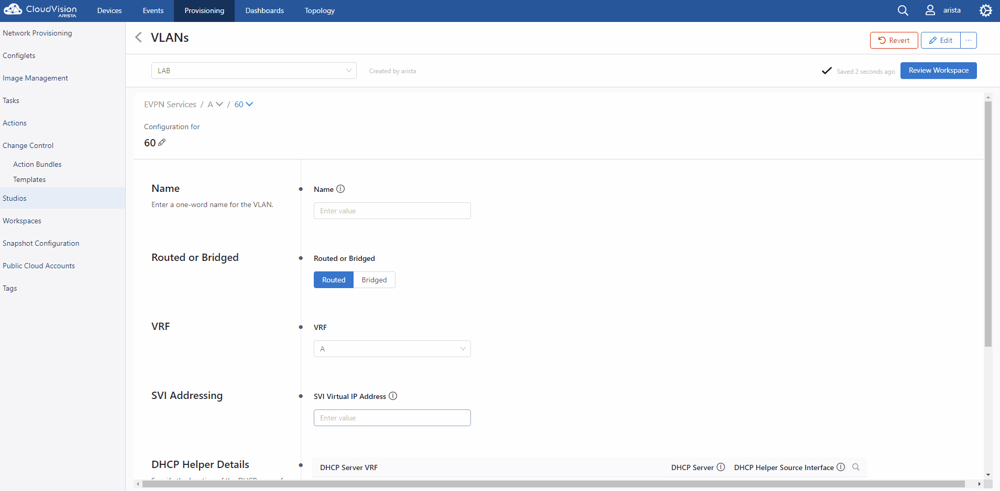

   

As the final step of this studio, let's quickly create our vlan aware bundle. 
|br| As our value, let's call it **"BUNDLE”** then enter the configuration. 
|br| Use 60,70 as our vlan range for this example.  

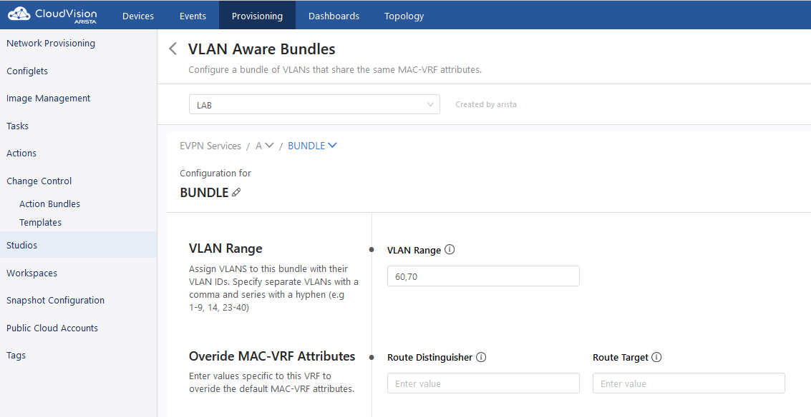

We’re done with the EVPN studio! Let’s spin the wheel of build and see how we did. Click review workspace and then start the build.  

.. image:: images/cvp_studios_l3ls_evpn/17EVPNPT4.gif
   :align: center

Success! We now have a working L3LS/EVPN topology, but not for the hosts yet. We need to configure the port-channels on the leafs to the hosts below them. 
|br| For that, let’s use the **Interface Configuration Studio** and then we’ll test connectivity across the fabric. 

**7. Interface Studio**
-----------------------

- Navigate to the **'Provisioning>Studios>Interface Configuration”** studio. 

Let’s take a look at our topology. The hosts are already pre configured for PO1 on ports ``E1-4`` in LACP. Our yet to be configured Leafs are connected to the hosts on ``E4`` and ``E5``. 

.. image:: images/cvp_studios_l3ls_evpn/18-topoforPO.PNG
   :align: center

The hosts are also configured in vlan 60 and 70 with respective SVIs for testing. 
Let’s navigate to our Interface Studio and start our configuration. 

Let’s start by adding our search query ``Role:Leaf AND DC:DC1``.
|br| Then make a  profile, let’s call it **“MLAG-PO”**.  Let’s make it a **trunk port**, set native VLAN of **“1”**, allow ``vlan60`` and ``vlan70``, and give the PO a number of **"1"**, and check **“yes”** for mlag. 

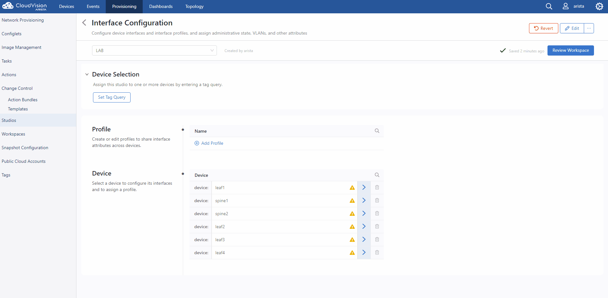

Now, let’s apply our profile to ports ``E4`` and ``E5`` on each leaf pair.

   .. image:: images/cvp_studios_l3ls_evpn/20-intstudio1.gif
    :align: center

Let’s review our workspace so we can kick off a build! Hit “Start Build” and you should get a successful build. 
|br| Once your build is successful, we are going to  “Submit Workspace”.

   Note:
   |br| As discussed previously, we are going to commit this workspace as a final build to studios. 
   |br| Once we submit, this workspace will close out and it cannot be modified. 
   |br| However, because our inputs are committed to Studios (the repository) we can open up a new workspace and make/add/remove new changes. 

Hit “Submit Workspace” to close out and create our Change Control. 
 
 .. image:: images/cvp_studios_l3ls_evpn/21-CC1.gif
   :align: center

After the Workspace has been submitted and the Change Control created, you’ll see a *“View Change Control”* option. 
|br| Hit that to be taken to Change Control. Now we are going to *“Review and Approve”* and apply our changes to the network. 
|br| We are going to run these changes in parallel, and execute them immediately. 
|br| Click *“Review and Approve”*. All tasks should complete successfully, and we can move onto the verification part of the lab.

 .. image:: images/cvp_studios_l3ls_evpn/22-CC1.gif
   :align: center

Let’s log into our Spines and run “sh bgp summary” and verify our underlay and overlay BGP adjacencies are “Established” Repeat for Leafs. 

SPINES - BGP Summary
=================================
 .. image:: images/cvp_studios_l3ls_evpn/23-Verification1.PNG
   :align: center

LEAFS - BGP Summary
=================================

 .. image:: images/cvp_studios_l3ls_evpn/23-Verification2.PNG
   :align: center

Now, let’s verify MLAG on our Leafs. On Leafs 1-4 run the **“show mlag”** command and verify all Leafs show as **“Active”** and **“Up-Up.”**

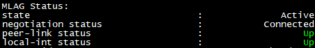

Now, on Leafs 1 and 3 let's verify our Port-Channel status. 
|br| Run the command **“sh port-channel dense”**

   Note: MLAG has an enhancement where the port-channel command will show the status of the port channel across both switches in the pair. See the highlighted section below. (P) shows the status and configuration of the MLAG PortChannel of the local switch as well as the peer. 

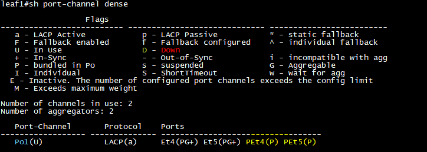

Now that we’ve confirmed all our base connectivity, let’s test our fabric and look at some outputs. 

Let’s start with ``Host1``, and ensure we can ping our gateway at **10.60.60.1**. This should be successful. 
|br| Next, let's ensure we can ping our local SVI at **10.60.60.160**. This should also be successful. Let’s ping across the fabric now in the same vlan, from **.160 to .161.** This should be successful as well. 

Do a **“show int vlan 60”** on ``Host1`` and on ``Host2`` and make note of their **mac**. On ``Host1``, do ``“show mac address-table vlan 60”`` and notice ``Host1’s`` mac comes across PO1 and ``Host2’s`` comes across Vx1.

Next, let’s ping inter-vlan from **.160** to **.171**, which should be successful. On ``leaf1``, review the EVPN routing table using **“show bgp evpn“**

LAB COMPLETE!
=============
