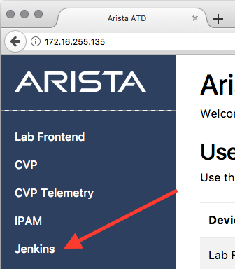
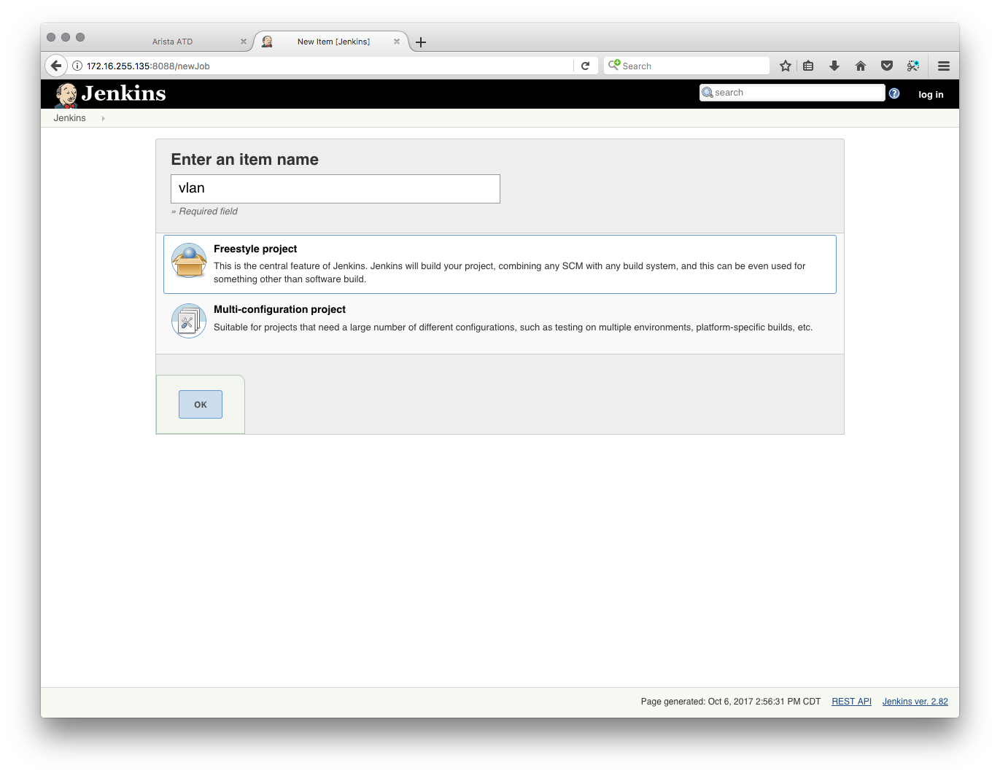
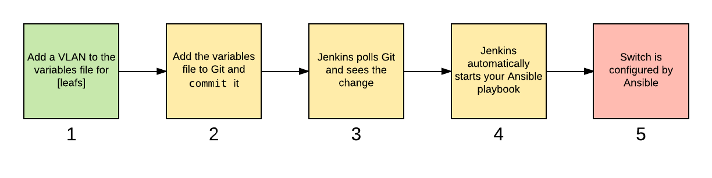
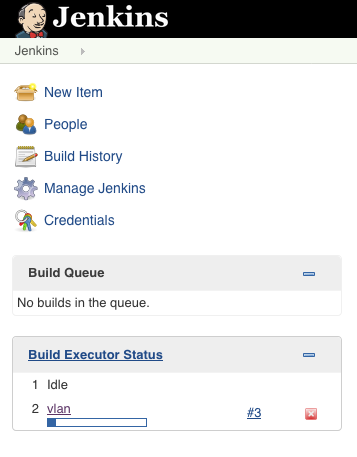
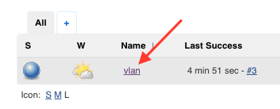
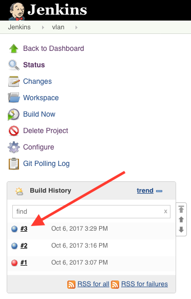

Day 2 Operations
========================

If you were recall the earlier presentation, we mentioned Continuous
Integration and Continuous Development (CI/CD). Now we’re going to show
you an example.

In this lab we’re going to go from 0-60 pretty quickly and introduce a
couple of new tools. We’re also going to do things a little bit
differently - we’re going to action against many switches at the same
time.

Tools used in this lab
----------------------

`Git <https://www.google.com/url?q=https://git-scm.com/&sa=D&ust=1523980190033000>`__\  is
the most popular version control system. If you are familiar with SVN
(Subversion) or CVS, it is a more modern and distributed system. Git
keeps your source code/configurations in a repository (repo) and
maintains a record of what changed and by whom.

.. note:: Git is an incredibly powerful tool. We’re using shortcuts that
          are specific to this lab. When using Git in production - or even just
          for fun, please make sure that you understand the commands you are
          using. Some Git commands are destructive and irreversible!

`Jenkins <https://www.google.com/url?q=https://jenkins.io/&sa=D&ust=1523980190034000>`__\  is
one of the most popular open source automation tools with hundreds of
plugins for building/deploying/automating pretty much anything. It’s not
outside the realm of possibility to have it test and push changes to
your switches and then order you a pizza if it’s successful.

Git commands
~~~~~~~~~~~~

This lab makes use of a handful of git commands, and the table below
describes their function:

.. cssclass:: table-hover

+-----------------------------------+-----------------------------------+
| **Command**                       | **Description**                   |
+-----------------------------------+-----------------------------------+
| ``git init``                      | Initializes an empty git          |
|                                   | repository                        |
+-----------------------------------+-----------------------------------+
| ``git add``                       | Adds files to the local git       |
|                                   | repository                        |
+-----------------------------------+-----------------------------------+
| ``git commit``                    | Commits the git repository        |
+-----------------------------------+-----------------------------------+
| ``git remote add origin``         | Adds a remote repository to       |
|                                   | commit to                         |
+-----------------------------------+-----------------------------------+
| ``git push``                      | Pushes code to the repository     |
+-----------------------------------+-----------------------------------+
| ``git reflog``                    | The git reflog command lists      |
|                                   | every commit, their checksum,     |
|                                   | their distance from the current   |
|                                   | commit, and the commit message.   |
+-----------------------------------+-----------------------------------+
| ``git revert``                    | Reverts the local repository to a |
|                                   | previous commit                   |
+-----------------------------------+-----------------------------------+

Making a change
---------------

Our tried and true “add a VLAN” task is back in full force for this lab,
but with a twist. We’re going to set up the usual suspects - a hosts
file and a playbook, but this time we’re going to use group variables as
well. Group variables are similar to the variables defined within your
playbook in Lab #4 and Lab #5, but can be consumed by a group of hosts
and not just the target of the play.

This is particularly useful for things like adding a VLAN where you
typically want to add the VLAN to multiple devices at a same time.

Write it
~~~~~~~~

This lab is broken into steps.

Step #1: Hosts File
^^^^^^^^^^^^^^^^^^^

Let’s start out with a different looking hosts file, this time with
every one of your leaf switches in it. Take special note of ``[leafs]`` -
we’ll be using this later.

Open **Atom**, and create the file below:

.. code-block:: ini

    [leafs]
    192.168.0.14
    192.168.0.15
    192.168.0.16
    192.168.0.17

**Save** the file with the name ``hosts`` into the ``labfiles/lab6/lab`` folder found
on your desktop.

.. note:: You will notice that there are existing files and folders.
          Please don’t overwrite anything for this lab.

Step #2: Playbook
^^^^^^^^^^^^^^^^^

The playbook is different from the other labs; we’re going to call a
pre-created role that is provided by Arista on \ `Ansible
Galaxy <https://www.google.com/url?q=https://galaxy.ansible.com/&sa=D&ust=1523980190043000>`__\ .

Ansible Galaxy is a website where individuals and organizations can
freely share their roles with each other. In this case, we’ll be using
the ``arista.eos-bridging`` role to add VLANs.

In **Atom**, create the file below:

.. code-block:: ini

    - hosts: leafs
      connection: local
      roles:
         - arista.eos-bridging

Save the file with the name ``vlan.yml`` into the ``labfiles/lab6/lab`` folder
found on your desktop.

Step #3: Group Variables
^^^^^^^^^^^^^^^^^^^^^^^^

Now we’re really going to mix it up a bit. In previous labs, we
used ``vars:`` and only actioned against a single host. This time around,
we’re going to be using what are called group variables. Group variables
are used for groups of hosts and not individuals.

Remember how in the hosts file above we started with ``[leafs]``? If we
create a group variable file named ``leafs.yml``, Ansible will automagically
use it for the hosts listed below ``[leafs]``!

Some more things to know about the file below:

#. Notice that we’re using the same ``provider`` information as the other
   labs.
#. ``eos_purge_vlans``: true tells the role to purge VLANs if they don’t
   exist in the variables file. This is useful for when you need to
   remove VLANs.
#. ``vlans``, ``vlanid``, and ``name`` are what the ``arista.eos-bridging`` role take as an
   input. If you want to see every variable that the role can use, see
   the \ `readme for the
   role <https://www.google.com/url?q=https://galaxy.ansible.com/arista/eos-bridging/%23readme&sa=D&ust=1523980190047000>`__\ .

Open **Atom** and create the file below:

.. code-block:: yaml

    provider:
     host: "{{ inventory_hostname }}"
     username: arista
     password: arista
     authorize: yes
     transport: eapi
     validate_certs: no
    eos_purge_vlans: true
    vlans:
     - vlanid: 1001
       name: default

Save the file with the name ``leafs.yml`` into
the ``labfiles/lab6/lab/group_vars`` folder found on your desktop.

Step #4: Jenkins
^^^^^^^^^^^^^^^^

Go back to the ATD web landing page, and click on the **Jenkins** link:

|

Jenkins will open in a new tab. Click on **create new jobs** in the middle of
the window.

You will be greeted with a screen like the one below. Enter **vlan** as the
name and select **Freestyle project**.

Click **OK**.

Now comes the fun part.

Under **Source Code Management**, check **Git** and
enter ``/home/aristagui/Desktop/labfiles/lab6/lab`` in the **Repository URL** field.

.. note:: You will see a warning, ignore it for now.

Scroll down to **Build Triggers**, and check **Poll SCM**. Poll SCM will poll for
changes in Git and trigger a build from it.

.. note:: This is a crucial aspect of continuous delivery - once a change is made, this is the part that deploys it.

In the **Schedule** field, enter in:

.. code-block:: html

    * * * * *

If you are familiar with Linux cron, this is the same format - it’s
telling Jenkins to check every 1 minute for a change.

Scroll down to **Build** and click on **Add build step**. Select **Invoke Ansible Playbook**.

For **Playbook path**, enter ``vlan.yml``. Select **File** or **host list** and enter
in ``hosts``.

Click **Save**.

Step #5: Git
^^^^^^^^^^^^

We have to commit our changes into a Git repository for Jenkins to
detect a change and run our playbook. Let’s go back to our **labvm** and run
a few of quick commands for our initial commit.

Open a **terminal** window and type:

.. code-block:: bash

    cd ~/Desktop/labfiles/lab6/lab

Now enter the following:

.. code-block:: bash

    git init
    git add .
    git commit -m "Initial commit"
    git remote add origin /home/aristagui/Desktop/labfiles/lab6/repo
    git push origin master

Run it
~~~~~~

Phew, that was a lot of setup! Fortunately. unlike previous labs we’re
not going to be running this one by hand - that wouldn’t be CI/CD! We’re
going to use Jenkins to run the playbook.

At a high level, the workflow of the “Run it” part of the lab looks like
this:

Let’s start with Step 1.

Step #1: Add a VLAN to the variables file
^^^^^^^^^^^^^^^^^^^^^^^^^^^^^^^^^^^^^^^^^

Open the ``leafs.yml`` variables file in **Atom**.

Add the following highlighted lines directly below the existing text:

.. code-block:: yaml

    vlans:
     - vlanid: 1001
       name: default
     - vlanid: 2000
       name: production
     - vlanid: 3000
       name: development

**Save** the file.

Step #2: Add the file to the Git commit and push it
^^^^^^^^^^^^^^^^^^^^^^^^^^^^^^^^^^^^^^^^^^^^^^^^^^^

Now, let’s add the file into Git commit and push it.We’re going to need
to act somewhat quickly here if you want to see it run, so get ready!

In a **terminal** window, type:

.. code-block:: bash

    cd ~/Desktop/labfiles/lab6/lab

Now enter the following:

.. code-block:: bash

    git add .
    git commit -m "Added VLAN 2000 and 3000"
    git push origin master

Quickly, open Jenkins!

Step #3: Jenkins
^^^^^^^^^^^^^^^^

Depending on how fast you were able to switch to Jenkins, you will see
different things. If you were quick, you will see this:

See the **vlan** build running? No worries if you weren’t able to see it,
Jenkins keeps a history - handy for when you want to see how things
went.

From the main screen, click on **vlan**:

On the left hand side, click on the latest build which should be **#3**, but
could be a higher or lower number.

In the left hand menu, click **Console Output**.  Scroll all the way to the
bottom to see:

.. code-block:: html

    PLAY RECAP
    ***************************************************************************
    192.168.0.14               : ok=7    changed=2    unreachable=0    failed=0
    192.168.0.15               : ok=7    changed=2    unreachable=0    failed=0
    192.168.0.16               : ok=7    changed=2    unreachable=0    failed=0
    192.168.0.17               : ok=7    changed=2    unreachable=0    failed=0

Woot, sweet success!

Step #4: Switches are configured
^^^^^^^^^^^^^^^^^^^^^^^^^^^^^^^^

Now, for the final step log into a couple of the leaf switches. Notice
the VLANs are there. Pretty cool, huh?

You can do this for 1 or 1000 switches using this playbook.
