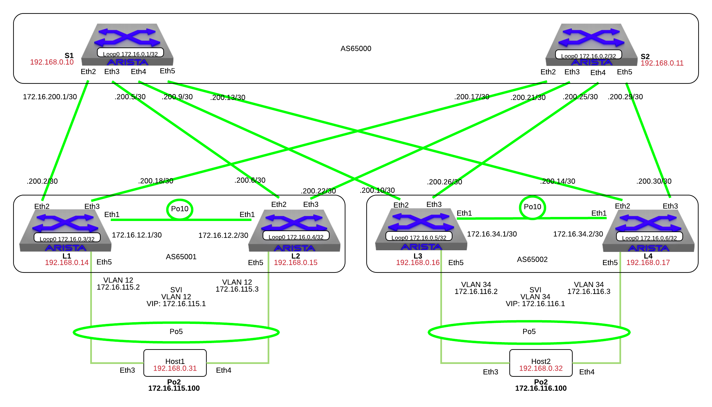

Layer 3 Leaf-Spine
==================

.. note:: Did you know the “bgp” script is composed of Python code that
          uses the CloudVision Portal REST API to automate the provisioning of
          CVP Configlets.

1. Log into the **LabAccess** jumpserver:

   1. Type ``bgp`` at the prompt. The script will configure the datacenter with the exception of **Leaf4**.

2. Configure SVI and VARP Virtual IP on the **Leaf4** switch using the following criteria

   1. Create the vARP MAC Address in Global Configuration mode

        .. code-block:: text

            configure
            ip virtual-router mac-address 00:1c:73:00:00:34
    
   2. Create the SVI and the Virtual Router Address

        .. code-block:: text

            configure
            interface vlan 34
              ip address 172.16.116.3/24
              ip virtual-router address 172.16.116.1

   3. Validate the configuration issue the following commands

        .. code-block:: text

            show ip interface brief
            show ip virtual-router

3. Configure BGP on the **Leaf4** switch using the following criteria

   1. Based on the diagram, configure L3 interfaces to **Spine1/Spine2** and interface Loopback0

        .. code-block:: text

            configure
            interface ethernet2
              no switchport
              ip address 172.16.200.14/30

            interface ethernet3
              no switchport
              ip address 172.16.200.30/30

            interface loopback0
              ip address 172.16.0.6/32

   2. Validate the configuration issue the following commands

        .. code-block:: text

            show ip interface brief

   3. Based on the diagram, turn on BGP and configure the neighbor 
      relationships on **Leaf4**. eBGP to **Spine1/Spine2** and iBGP to **Leaf3**.

        .. code-block:: text

            configure
            router bgp 65002
              router-id 172.16.0.6
              neighbor 172.16.200.13 remote-as 65000
              neighbor 172.16.200.29 remote-as 65000
              neighbor 172.16.34.1 remote-as 65002
              neighbor 172.16.34.1 next-hop-self

   4. Validate the configuration and neighbor establishment

        .. code-block:: text

            show active
            show ip bgp summary

4. Configure networks on **Leaf4** to advertise to **Spine1/Spine2**

   1. Add the following network to BGP announcements on **Leaf4**:

        .. code-block:: text

            configure
            router bgp 65002
              network 172.16.0.6/32
              network 172.16.116.0/24

   2. Verify all of the **Spines** and **Leafs** see these new network announcements

        .. code-block:: text

            show ip route
            show ip bgp
            show ip route bgp

   3. Add in multiple paths by enabling ECMP, on **Leaf4**, jump into BGP configuration mode and add:

        .. code-block:: text

            configure
            router bgp 65002
              maximum-paths 4 ecmp 4

   4. Check the BGP and IP route tables on each of the **Spines** and **Leafs**

        .. code-block:: text

            show ip bgp
            show ip route
            show ip route bgp

.. note:: ECMP is now working - notice the new status code in the `show ip bgp` output

5. Validate connectivity from **Host1** to **Host2**

    .. code-block:: text

        ping 172.16.116.100

6. Other BGP features to play with if you have time:

   Route Redistribution:

    .. code-block:: text
    
        configure
        router bgp 65002
          redistribute connected

   Route Maps:

    .. code-block:: text

        configure
        route-map <name> etc
            
   BFD:

    .. code-block:: text

        configure
        router bgp 65002
          neighbor fall-over bfd
    
7. Troubleshooting BGP:

    .. code-block:: text

        show ip bgp summary
        show ip bgp
        show ip bgp neighbor x.x.x.x
        show run section bgp
        show log

**LAB COMPLETE!**
