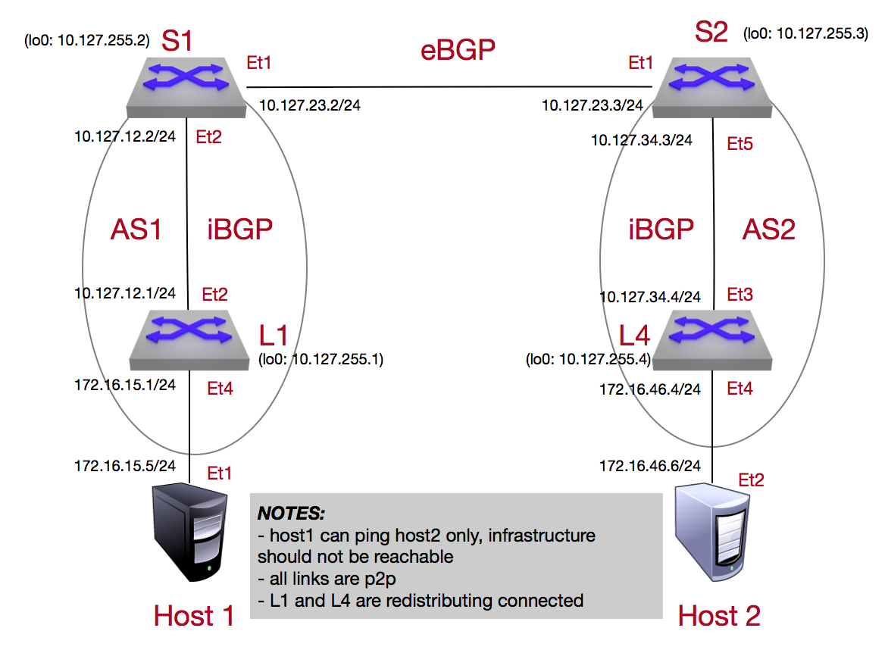

Media BGP Lab
=============

.. note:: The Border Gateway Protocol (BGP) makes routing decisions based on paths (protocol is classified as a path vector) and is widely used in the backbone of the internet to redistribute information

1. Log into the **LabAccess** jumpserver:

   1. Type ``labs`` at the Main Menu prompt. This will bring up additional lab menu selections.
   2. Type ``media`` at this prompt to open the media lab section (If you were previously in the Media Labs Menu, you can type ``back`` to go back).
   3. Type ``media-bgp`` at the prompt. The script will configure the topology with the exception of **Leaf 4**.

   4. On **spine2**, verify the BGP operation (it should not be operating correctly) and current routing table and command outputs similar to the outputs below.

        .. code-block:: text

            show ip bgp summary
            show ip bgp
            show ip route

      **Example:**

        .. code-block:: text

            spine2#show ip bgp summary
            BGP summary information for VRF default
            Router identifier 10.127.255.3, local AS number 2
            Neighbor Status Codes: m - Under maintenance
              Neighbor         V  AS           MsgRcvd   MsgSent  InQ OutQ  Up/Down State  PfxRcd PfxAcc
                10.127.23.2      4  1                  7         6    0    0 00:02:03 Estab  2      2
                10.127.34.4      4  2                  0         0    0    0 00:02:10 Active

            spine2#show ip bgp
            BGP routing table information for VRF default
            Router identifier 10.127.255.3, local AS number 2
            Route status codes: s - suppressed, * - valid, > - active, # - not installed, E - ECMP head, e - ECMP
                    S - Stale, c - Contributing to ECMP, b - backup, L - labeled-unicast
            Origin codes: i - IGP, e - EGP, ? - incomplete
            AS Path Attributes: Or-ID - Originator ID, C-LST - Cluster List, LL Nexthop - Link Local Nexthop

                    Network                Next Hop              Metric  LocPref Weight  Path
             * >     10.127.255.1/32        10.127.23.2           0       100     0       1 i
             * >     172.16.15.0/24         10.127.23.2           0       100     0       1 i

            spine2#show ip route

            VRF: default
            Codes: C - connected, S - static, K - kernel,
                   O - OSPF, IA - OSPF inter area, E1 - OSPF external type 1,
                   E2 - OSPF external type 2, N1 - OSPF NSSA external type 1,
                   N2 - OSPF NSSA external type2, B I - iBGP, B E - eBGP,
                   R - RIP, I L1 - IS-IS level 1, I L2 - IS-IS level 2,
                   O3 - OSPFv3, A B - BGP Aggregate, A O - OSPF Summary,
                   NG - Nexthop Group Static Route, V - VXLAN Control Service,
                   DH - DHCP client installed default route, M - Martian,
                   DP - Dynamic Policy Route

            Gateway of last resort:
             S      0.0.0.0/0 [1/0] via 192.168.0.254, Management1

             C      10.127.23.0/24 is directly connected, Ethernet1
             C      10.127.34.0/24 is directly connected, Ethernet5
             B E    10.127.255.1/32 [200/0] via 10.127.23.2, Ethernet1
             C      10.127.255.3/32 is directly connected, Loopback0
             B E    172.16.15.0/24 [200/0] via 10.127.23.2, Ethernet1
             C      192.168.0.0/24 is directly connected, Management1

      All the routing entries with a preceding "B" was learned by the BGP protocol on Spine2.

2. Configure Loopback 0 on **Leaf 4** with the following commands

   1. Under Loopback 0 interface assign the ip.  This will be used to define the Router-id in the next step.  Loopbacks are used as as router-id addresses, as they are an always available interface that can be advertised reliably.

        .. code-block:: text

            configure
            interface loopback 0
            ip address 10.127.255.4/32

      **Example:**

        .. code-block:: text

            leaf4#configure
            leaf4(config)#interface loopback 0
            leaf4(config-if-Lo0)#ip address 10.127.255.4/32

3. Configure BGP on the **Leaf4** switch using the following criteria

   1. Configure BGP router process (also the autonomous system number, ASN) on **Leaf4**. **Leaf 4** will be configured to communicate to adjacent BGP speakers (**Spine2** in this case).  The router-id is configured so it can be consistent and not randomly chosen (normally the peering interface if not specified).

        .. code-block:: text

            configure
            router bgp 2
              router-id 10.127.255.4

      **Example:**

        .. code-block:: text

            leaf4(config)#configure
            leaf4(config)#router bgp 2
            leaf4(config-router-bgp)#router-id 10.127.255.4

       .. note::
        The process number for BGP corresponds to the autonomous-system number (ASN) the router is associated with and is globally significant.  These values should not be chosen randomly and should be part of a larger design scheme for the environment.

   2. BGP neighbours are explicitly defined so only the desired neighbors create a session with.  A TCP connection is established between the two peers (using port 179) in which the routing information can be securely transported between the peers.

        .. code-block:: text

            configure
            router bgp 2
                neighbor 10.127.34.3 remote-as 2

      **Example:**

        .. code-block:: text

            leaf4(config)#configure
            leaf4(config)#router bgp 2
            leaf4(config-router-bgp)#neighbor 10.127.34.3 remote-as 2

      The BGP session we are setting up on **Leaf4** to **Spine2** is considered a point-to-point iBGP (Internal BGP) connection because they are a part of the same autonomous-system (AS).

        .. note::
          Although there are mechanisms to allow all incoming BGP sessions to be established, these are typically corner cases in which you will use that approach. It is best common practice to specify your desired neighbor to establish a session with along with a md5 hash password for an extra level of security.

   3. By default, the BGP protocol will only re-advertise eBGP (external) prefixes it has leaned to its other iBGP / eBGP peers.  We will need to tell the BGP process what to advertise by various methods.  In this lab we want the router to advertise its connected (vlan) prefix

        .. code-block:: text

            configure
            router bgp 2
              redistribute connected

      **Example:**

        .. code-block:: text

            leaf4#configure
            leaf4(config)#router bgp 2
            leaf4(config-router-bgp)#redistribute connected

        Once the ``redistribute connected`` command has been added, we can actually see the prefixes our switch (Leaf4) is receiving and advertising

        .. code-block:: text

            show ip bgp summary
            show ip bgp neighbors 10.127.34.3 advertised-routes
            show ip bgp neighbors 10.127.34.3 received-routes

      **Example:**

        .. code-block:: text

            leaf4(config-router-bgp)#show ip bgp summary
            BGP summary information for VRF default
            Router identifier 10.127.255.4, local AS number 2
            Neighbor Status Codes: m - Under maintenance
              Neighbor         V  AS           MsgRcvd   MsgSent  InQ OutQ  Up/Down State  PfxRcd PfxAcc
              10.127.34.3      4  2                 22        22    0    0 00:10:37 Estab  2      2

            leaf4(config-router-bgp)#show ip bgp neighbors 10.127.34.3 advertised-routes
            BGP routing table information for VRF default
            Router identifier 10.127.255.4, local AS number 2
            Route status codes: s - suppressed, * - valid, > - active, # - not installed, E - ECMP head, e - ECMP
                    S - Stale, c - Contributing to ECMP, b - backup, L - labeled-unicast
            Origin codes: i - IGP, e - EGP, ? - incomplete
            AS Path Attributes: Or-ID - Originator ID, C-LST - Cluster List, LL Nexthop - Link Local Nexthop

                    Network                Next Hop              Metric  LocPref Weight  Path
             * >     10.127.34.0/24         10.127.34.4           -       100     -       i
             * >     10.127.255.4/32        10.127.34.4           -       100     -       i
             * >     172.16.46.0/24         10.127.34.4           -       100     -       i
             * >     192.168.0.0/24         10.127.34.4           -       100     -       i

            leaf4(config-router-bgp)#show ip bgp neighbors 10.127.34.3 received-routes
            BGP routing table information for VRF default
            Router identifier 10.127.255.4, local AS number 2
            Route status codes: s - suppressed, * - valid, > - active, # - not installed, E - ECMP head, e - ECMP
                    S - Stale, c - Contributing to ECMP, b - backup, L - labeled-unicast
            Origin codes: i - IGP, e - EGP, ? - incomplete
            AS Path Attributes: Or-ID - Originator ID, C-LST - Cluster List, LL Nexthop - Link Local Nexthop

                    Network                Next Hop              Metric  LocPref Weight  Path
             * >     10.127.255.1/32        10.127.34.3           -       100     -       1 i
             * >     172.16.15.0/24         10.127.34.3           -       100     -       1 i

4. We will now validate the end-to-end connectivity once BGP neighbor relationship has been established

   1. Confirm the BGP neighbor relationship has been established and the routing table on **Leaf4** has been populated with the appropriate entries as shown on the outputs below

        .. code-block:: text

            show ip bgp summary
            show ip bgp
            show ip route
            show ip route bgp

      **Example:**

        .. code-block:: text

            leaf4(config-router-bgp)#show ip bgp summary
            BGP summary information for VRF default
            Router identifier 10.127.255.4, local AS number 2
            Neighbor Status Codes: m - Under maintenance
              Neighbor         V  AS           MsgRcvd   MsgSent  InQ OutQ  Up/Down State  PfxRcd PfxAcc
              10.127.34.3      4  2                 22        22    0    0 00:10:37 Estab  2      2

            leaf4(config-router-bgp)#show ip bgp
            BGP routing table information for VRF default
            Router identifier 10.127.255.4, local AS number 2
            Route status codes: s - suppressed, * - valid, > - active, # - not installed, E - ECMP head, e - ECMP
                                S - Stale, c - Contributing to ECMP, b - backup, L - labeled-unicast
            Origin codes: i - IGP, e - EGP, ? - incomplete
            AS Path Attributes: Or-ID - Originator ID, C-LST - Cluster List, LL Nexthop - Link Local Nexthop

                    Network                Next Hop              Metric  LocPref Weight  Path
             * >     10.127.34.0/24         -                     1       0       -       i
             * >     10.127.255.1/32        10.127.34.3           0       100     0       1 i
             * >     10.127.255.4/32        -                     0       0       -       i
             * >     172.16.15.0/24         10.127.34.3           0       100     0       1 i
             * >     172.16.46.0/24         -                     1       0       -       i
             * >     192.168.0.0/24         -                     1       0       -       i

            leaf4(config-router-bgp)#show ip route | Begin Gateway
            Gateway of last resort:
             S      0.0.0.0/0 [1/0] via 192.168.0.254, Management1

             C      10.127.34.0/24 is directly connected, Ethernet3
             B I    10.127.255.1/32 [200/0] via 10.127.34.3, Ethernet3
             C      10.127.255.4/32 is directly connected, Loopback
             B I    172.16.15.0/24 [200/0] via 10.127.34.3, Ethernet3
             C      172.16.46.0/24 is directly connected, Ethernet4
             C      192.168.0.0/24 is directly connected, Management1

            leaf4(config-router-bgp)#show ip route bgp

            VRF: default
            Codes: C - connected, S - static, K - kernel,
                   O - OSPF, IA - OSPF inter area, E1 - OSPF external type 1,
                   E2 - OSPF external type 2, N1 - OSPF NSSA external type 1,
                   N2 - OSPF NSSA external type2, B I - iBGP, B E - eBGP,
                   R - RIP, I L1 - IS-IS level 1, I L2 - IS-IS level 2,
                   O3 - OSPFv3, A B - BGP Aggregate, A O - OSPF Summary,
                   NG - Nexthop Group Static Route, V - VXLAN Control Service,
                   DH - DHCP client installed default route, M - Martian,
                   DP - Dynamic Policy Route

             B I    10.127.255.1/32 [200/0] via 10.127.34.3, Ethernet3
             B I    172.16.15.0/24 [200/0] via 10.127.34.3, Ethernet3

    The routing table output should list all routing entries to ensure reachability between the 2 hosts

   2. To confirm connectivity, log into **Host 2** and execute a ping command to **Host 1**

        .. code-block:: text

            ping 172.16.15.5

      **Example:**

        .. code-block:: text

            host2(config)# ping 172.16.15.5
            PING 172.16.15.5 (172.16.15.5) 72(100) bytes of data.
            80 bytes from 172.16.15.5: icmp_seq=1 ttl=60 time=436 ms
            80 bytes from 172.16.15.5: icmp_seq=2 ttl=60 time=433 ms
            80 bytes from 172.16.15.5: icmp_seq=3 ttl=60 time=429 ms
            80 bytes from 172.16.15.5: icmp_seq=4 ttl=60 time=425 ms
            80 bytes from 172.16.15.5: icmp_seq=5 ttl=60 time=422 ms

      If all the BGP configuration have been applied successfully and the routing table on **Leaf 4** is correct then **Host 1** should be reachable from **Host 2**.

.. admonition:: **Test your knowledge:**

    When **Leaf 4** receives the incoming routes from **Spine 2**, why can we not reach all the infrastructure IP addresses?

**LAB COMPLETE!**

.. admonition:: **Helpful Commands:**

    During the lab you can use the different commands to verify connectivity and behaviour for validation and troubleshooting purposes:

   - show ip route
   - show ip route bgp
   - show ip bgp summary
   - show ip bgp
   - show ip bgp neighbors <neighbor address> advertised-routes
   - show ip bgp neighbors <neighbor address> received-routes
