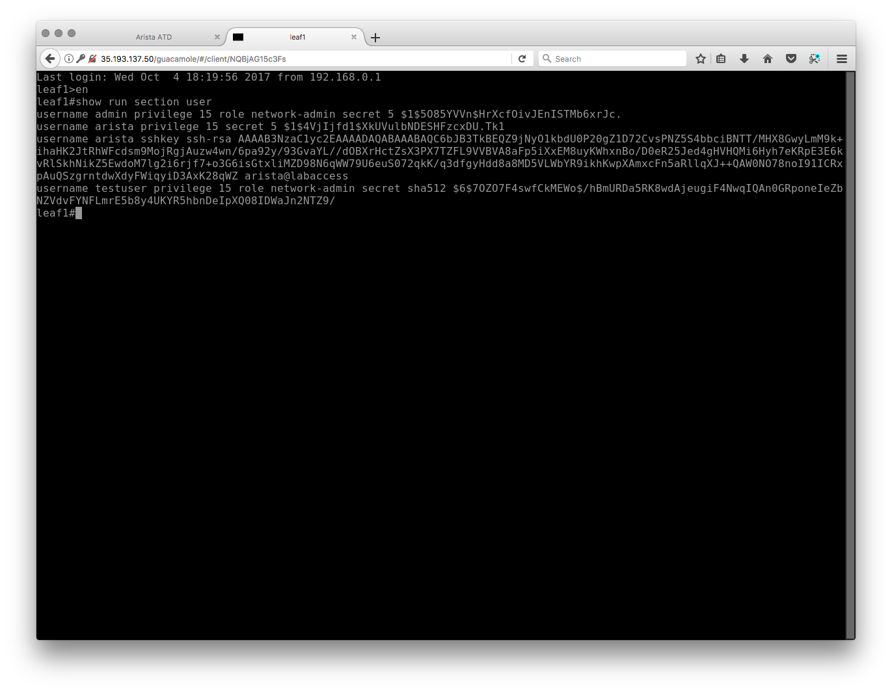

pyeapi
======

In this lab we will still use Python, but this time with Arista’s pyeapi
module. If you recall from the last lab, a module is a way of enhancing
the capability of native Python.

Pyeapi is a wrapper around eAPI that abstracts common EOS commands into
a more programmatic style. This allows someone without a heavy network
background to easily interact with an Arista device. In other words,
instead of issuing ``enable; configure; vlan 100; name foo``, we can
use ``vlans.set_name(100,'foo')``.  While that may look similar, the
abstracted way is easier to implement in Python because it shortcuts
some of the steps, and someone that only knows they need to create a
VLAN can grok it without having to know the EOS command line.

Click \ `here <http://pyeapi.readthedocs.io/en/latest/quickstart.html>`__\  for
pyeapi documentation.

.. note:: While Arista switches have a fully functional Python
          installation, please make sure to usedevboxfor the scripting part of this lab.

Your first pyeapi script
------------------------

For your first pyeapi script, we are going to add a new user:testuser.
We will use the following script:

.. code-block:: python

    #!/usr/bin/python

    import pyeapi

    node = pyeapi.connect(host='192.168.0.14',username='arista',password='arista',return_node=True)

    users = node.api('users')
    
    users.create('testuser',secret='foo')
    users.set_privilege('testuser',value='15')
    users.set_role('testuser',value='network-admin')

What does this script do?

**import pyeapi** - this imports the pyeapi module.

**node = pyeapi.connect(host='192.168.0.14',username='arista',password='arista',return_node=True)** -
instantiates the variable ``node``, and uses pyeapi to create a connection to
the switch using the username of ``arista`` and the
password ``arista``. ``return_node`` allows you to use the node object to consume
the API with - don’t focus on this one for now, let’s just roll with the
rest of the script.

**users = node.api('users')** - creates a new variable ``users`` and specifies
the API submodule ``users``. This tells Python we want to create a user using
pyeapi.

**users.create('testuser',secret='foo')** - Using the Users API, we use
the ``create`` method. ``testuser`` is the username, and the password is ``foo``.

**users.set_privilege('testuser',value='15')** - Using the Users API, we use
the ``set_privilege`` method. ``testuser`` is the username which was created in
the last step, and the privilege level is ``15``.

**users.set_role('testuser',value='network-admin')** - Using the Users API,
we use the ``set_role`` method. ``testuser`` is the username which was created in
the last step, and the Arista role is the predefined default role of
 ``network-admin``.

Write it
~~~~~~~~

Create a new file in the Atom editor and either write or paste the code
in. Save it to your desktop like the previous lab.

Run it
~~~~~~

Run the script the same way you did in the previous lab (``python
~/Desktop/your_script_name_here``) - allowing for the different file name.
Wait, you didn’t save over your previous work did you?!

--------------

Let’s take a look and see if the user has been added switch to your
virtual switch using the Ctrl-Alt-Shift trick and type ``show run section
user``.

**Success!**

Advanced
--------

Write a script that adds more than one user.

Bonus
-----

Using the\  `pyeapi
documentation <http://pyeapi.readthedocs.io/en/latest/>`__\ ,
create a new script that creates a VLAN and then adds it to ``interface
Ethernet1`` as a ``switchport access vlan``.

.. note:: Check out the config example, as well as Modules > API > switchports and vlans.

