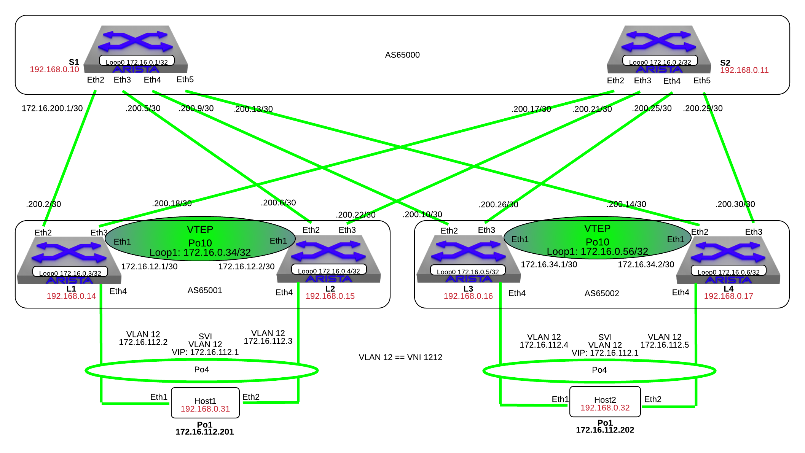

VXLAN
=====

.. note:: Did you know the “VXLAN” script is composed of Python code that
          uses the CloudVision Portal REST API to automate the provisioning of
          CVP Configlets.

1. Log into the LabAccess jumpserver:

   1. Type ``vxlan`` at the prompt. The script will configure the datacenter with the exception of **Leaf3**.

|

2. On **Leaf3**, configure Port-channels connecting to **Host2**

    .. code-block:: text
        
        configure
        interface port-channel 4
            description MLAG - HOST2
            switchport mode access
            switchport access vlan 12
            mlag 4

        interface Ethernet4
            description HOST2
            channel-group 4 mode active
            lacp rate fast

3. Verify MLAG on **Leaf3**

    .. code-block:: text

        show mlag
        show mlag detail
        show mlag interfaces

4. Validate BGP operation **Leaf3**

    .. code-block:: text

        show ip route bgp
        show ip route
        show ip interface brief
        !! Verify bgp configuration
        show run section bgp
        !! Verify BGP neighbors moved to Esta
        show ip bgp summary

5. Create Loopback 1 and the VXLAN VTEP (VTI) interfaces on **Leaf3**

   1. Configuration

    .. code-block:: text

        configure
        interface Loopback1
          ip address 172.16.0.56/32

        interface vxlan 1
          vxlan source-interface loopback 1
          vxlan vlan 12 vni 1212
          !! Add shared loopback1 IP on leaf1 & leaf2
          vxlan flood vtep 172.16.0.34

   2. Verification

    .. code-block:: text
    
        !! Show the running-config and vxlan 1 interface status
        show run interface vxlan 1
        show interface vxlan 1

6. Log into **Host 1** and **Host 2**, ping the gateway and the other host.

   1. Host 1

    .. code-block:: text

        ping 172.16.112.1
        ping 172.16.112.202
        !! Note the MAC address returned by the command below:
        show interface po1 | grep Hardware

   3. Host 2

    .. code-block:: text

        ping 172.16.112.1
        ping 172.16.112.201
        !! Note the MAC address returned by the command below:
        show interface po1 | grep Hardware

6. Verification – on **Leaf 1/2** and **Leaf 3/4**

   1. Verify the MAC addresses and the associated VTEP IP

    .. code-block:: text

        show vxlan vtep
        show vxlan address-table

   2. Verify the MAC address and the associated interface

    .. code-block:: text

       show mac address-table

7. Let’s run some other show commands and tests to poke around
   VXLAN. On **Leaf1** and **Leaf3** issue the following commands:

    .. code-block:: text

        show interface vxlan 1
        show mac address-table
        show log

**LAB COMPLETE!**
