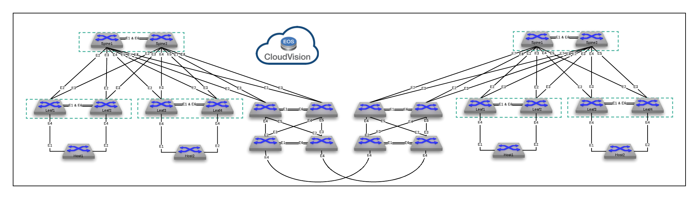

# ATD-AVD-Dual-DC
Arista Dual DC w/Ansible
Beta stage, not for production use.

To Setup ATD Topology run the following commands
 - cd labfiles/AristaValidatedDesigns
 - make atd-setup
 - make provision
 - Deploy pending tasks from cvp
 - Experiment with AVD ...

Topology
