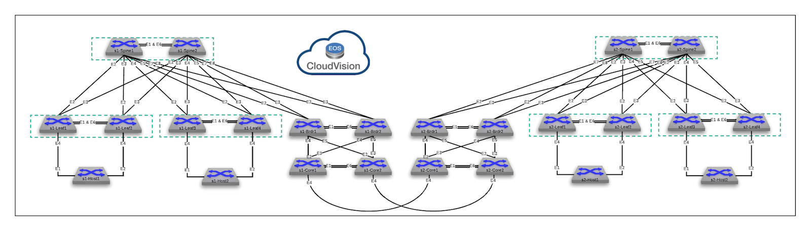

## Arista Validated Designs
This directory will contain the necessary data/files needed to run the Ansible Collection For Arista Validated Designs with the Arista Test Drive dual-datacenter topology.

This is currently under development, not for production use.

Topology

