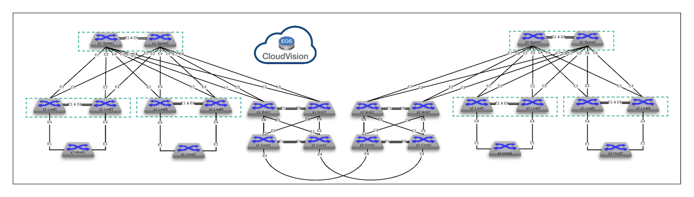

# Deploy L3LS with EVPN VXLAN using AVD and CVP
This PoC will allow you to use Arista's AVD automation framework to deploy a dual datacenter, layer 3 leaf spine fabric with EVPN VXLAN.  Additionally, it incorporates CVP into the CI/CD pipeline for configuration change management and auditing.  The PoC has some devices with static configurations that need to be deployed with the via ansible playbooks utilizing the **eos_config** role, and some that you will be modifying and implementing yourself using AVD.  

***Note:*** This PoC is built to work with AVD 3.8.  Work is currently in progress to update everything to support AVD 4.0.

## Datacenter Fabric Topology
Below is a network diagram of the datacenter topology you will be working with.  In this topology, all `s1` devices correspond with `sites/dc1`, and all `s2` devices correspond with `sites/dc2`.



## Directory Structure and Layout
Since this topology is for two datacenters, the vars and inventory directories and files are broken out per datacenter.  This means there is an inventory file and group_vars directory for each datacenter.  Additionally, since some things are standard across both datacenters, there is a global_vars directory and file.  Finally, the playbooks for building and deploying changes are also split between the datacenters.  The tree structure below outlines all of these items:

### Directory and File Structure
```bash
|---global_vars
    |---global_dc_vars.yml
|---lab guide
    |---evpn-vxlan-labs.md
|---playbooks
    |---build_dc1.yml
    |---build_dc2.yml
    |---deploy_dc1_cvp.yml
    |---deploy_dc1_dci_eapi.yml
    |---deploy_dc1_eapi.yml
    |---deploy_dc2_cvp.yml
    |---deploy_dc2_dci_eapi.yml
    |---deploy_dc2_eapi.yml
|---sites
    |---dc1 [Inventory and VARs for DC1 only]
    |   |---dci_configs [Non AVD Configs for Topology]
    |   |   |---s1-core1.cfg
    |   |   |---s1-core2.cfg
    |   |---groups_vars
    |   |   |---dc1_fabric_ports.yml
    |   |   |---dc1_fabric_services.yml
    |   |   |---dc1_fabric.yml
    |   |   |---dc1_hosts.yml
    |   |   |---dc1_leafs.yml
    |   |   |---dc1_spines.yml
    |   |   |---dc1.yml
    |   |---inventory.yml
    |---dc2 [Inventory and VARs for DC2 only]
    |   |---dci_configs [Non AVD Configs for Topology]
    |   |   |---s2-core1.cfg
    |   |   |---s2-core2.cfg
    |   |---groups_vars
    |   |   |---dc2_fabric_ports.yml
    |   |   |---dc2_fabric_services.yml
    |   |   |---dc2_fabric.yml
    |   |   |---dc2_hosts.yml
    |   |   |---dc2_leafs.yml
    |   |   |---dc2_spines.yml
    |   |   |---dc2.yml
    |   |---inventory.yml
|---ansible.cfg
|---Makefile
|---README.md
```

# Getting AVD going in the ATD programmability IDE
From your ATD environment, launch the programmability IDE, enter the password, and launch a new terminal:


## STEP #1 - Install deepmerge

- From the terminal session, run the following command.

``` bash
pip install deepmerge
```

## STEP #2 - Clone Necessary Repos

- Change working directory. The following commands will be executed from here.

``` bash
cd labfiles
```

- Install the AVD 3.8 collection

``` bash
ansible-galaxy collection install arista.avd:==3.8.0
```

- Clone the POC Repo

``` bash
git clone https://github.com/PacketAnglers/atd-avd-evpn-vxlan.git
```

- At this point you should see the `atd-avd-evpn-vxlan` directory under the labfiles directory.

### STEP #3 - Setup Lab Password Environment Variable

Each lab comes with a unique password. We set an environment variable called `LABPASSPHRASE` with the following command. The variable is later used to generate local user passwords and connect to our switches to push configs.

``` bash
export LABPASSPHRASE=`cat /home/coder/.config/code-server/config.yaml| grep "password:" | awk '{print $2}'`
```

You can view the password is set. This is the same password displayed when you click the link to access your lab.

``` bash
echo $LABPASSPHRASE
```

### STEP #4 - Change directory to the actual repo
``` bash
cd atd-avd-evpn-vxlan
```

## Building/Deploying Configurations & Labs Info

<br>

This AVD topology includes two labs, with tasks that show Day 2 operations using AVD on an EVPN VXLAN fabric.  These labs are located in the **lab guide** directory, in the file `evpn-vxlan-labs.md`.  You can view these labs in the easily readable MarkDown format within the IDE by right clicking the lab file, and clicking **Open Preview**.  You can also view them natively in github.

Prior to working on these labs, you will need to deploy the initial data center fabric, after you have modified the `ansible_password` as shown above.  The deployment of fabric, both initially, and of any changes, are all performed via running the appropriate ansible playbook, against the correct site inventory file.  To ease this process, alias commands are available to use via the included Makefile, which run the correct ansible playbook against the correct inventory file, using an abbreviated `make command`.

Below is a description of all the available make file commands, what their purpose is, as well as which ansible playbook and inventory file they control.  

<br>

**Command:**  `make deploy_dc1_dci`

```bash
deploy_dc1_dci: ## Deploy DC1 DCI configs to non-avd devices
	ansible-playbook playbooks/deploy_dc1_dci_eapi.yml -i sites/dc1/inventory.yml
```
**Playbook Called:**  `deploy_dc1_dci_eapi.yml`

**Inventory File:**  `dc1/inventory.yml`

**Description:** This command deploys a few interface and BGP configuration changes to the s1-core1 and s1-core2 devices in datacenter1.  This is required to enable routing between the two datacenter fabrics.  This playbook uses the eos_config module to merge the config changes on the devices via their eAPI.

<br>
<br>

**Command:**  `make deploy_dc2_dci`

```bash
deploy_dc2_dci: ## Deploy DC2 DCI configs to non-avd devices
	ansible-playbook playbooks/deploy_dc2_dci_eapi.yml -i sites/dc2/inventory.yml
```
**Playbook Called:**  `deploy_dc2_dci_eapi.yml`

**Inventory File:**  `dc2/inventory.yml`

**Description:** This command deploys a few interface and BGP configuration changes to the s2-core1 and s2-core2 devices in datacenter2.  This is required to enable routing between the two datacenter fabrics.  This playbook uses the eos_config module to merge the config changes on the devices via their eAPI.

<br>
<br>

**Command:**  `make build_dc1`

```bash
build_dc1: ## Build AVD Configs for DC1
	ansible-playbook playbooks/build_dc1.yml -i sites/dc1/inventory.yml
```
**Playbook Called:**  `build_dc1.yml`

**Inventory File:**  `dc1/inventory.yml`

**Description:** This command invokes AVD to build the device configurations for all devices in datacenter1.  The playbook ingests the global_vars file variables, as well as everything defined in the various yml files in the group_vars directory for site/dc1.  It then creates the `intended/configs`, `intended/structured_configs`, and `documentation` directories under the `site1` directory.  Finally, it generates the all device configs, structured configs, and markdown documentation files.

<br>
<br>

**Command:**  `make build_dc2`

```bash
build_dc2: ## Build AVD Configs for DC2
	ansible-playbook playbooks/build_dc2.yml -i sites/dc2/inventory.yml
```
**Playbook Called:**  `build_dc2.yml`

**Inventory File:**  `dc2/inventory.yml`

**Description:** This command invokes AVD to build the device configurations for all devices in datacenter2.  The playbook ingests the global_vars file variables, as well as everything defined in the various yml files in the group_vars directory for site/dc2.  It then creates the `intended/configs`, `intended/structured_configs`, and `documentation` directories under the `site2` directory.  Finally, it generates the all device configs, structured configs, and markdown documentation files.

<br>
<br>

**Command:**  `make deploy_dc1_cvp`

```bash
deploy_dc1_cvp: ## Deploy DC1 AVD Configs Through CVP
	ansible-playbook playbooks/deploy_dc1_cvp.yml -i sites/dc1/inventory.yml
```
**Playbook Called:**  `deploy_dc1_cvp.yml`

**Inventory File:**  `dc1/inventory.yml`

**Description:** This command invokes AVD to deploy the created configurations, and make the necessary container changes in CVP.  The playbook calls the deploy_cvp role, modifying the CVP container structure if necessary, uploading the created configuration to CVP as configlets, and deploying those configlets to the relevant devices in datacenter1.  The playbook also has a flag called `execute_tasks: true`, which tells CVP to automatically create a change control for the created tasts, and execute them without user intervention.

<br>
<br>

**Command:**  `make deploy_dc2_cvp`

```bash
deploy_dc1_cvp: ## Deploy DC2 AVD Configs Through CVP
	ansible-playbook playbooks/deploy_dc2_cvp.yml -i sites/dc2/inventory.yml
```
**Playbook Called:**  `deploy_dc2_cvp.yml`

**Inventory File:**  `dc2/inventory.yml`

**Description:** This command invokes AVD to deploy the created configurations, and make the necessary container changes in CVP.  The playbook calls the deploy_cvp role, modifying the CVP container structure if necessary, uploading the created configuration to CVP as configlets, and deploying those configlets to the relevant devices in datacenter2.  The playbook also has a flag called `execute_tasks: true`, which tells CVP to automatically create a change control for the created tasts, and execute them without user intervention.

<br>
<br>

**Command:**  `make deploy_dc1_eapi`

```bash
deploy_dc1_eapi: ## Deploy DC1 Spine/Leaf AVD generated configs via eAPI
	ansible-playbook playbooks/deploy_dc1_eapi.yml -i sites/dc1/inventory.yml
```
**Playbook Called:**  `deploy_dc1_eapi.yml`

**Inventory File:**  `dc1/inventory.yml`

**Description:** This command invokes the eos_config module to deploy the created configurations only on applicable devices in datacenter1, bypassing CVP and using the device eAPIs.  This playbook show an alternative way to use automation and AVD, without CVP for managing configurations.

<br>
<br>

**Command:**  `make deploy_dc2_eapi`

```bash
deploy_dc1_eapi: ## Deploy DC2 Spine/Leaf AVD generated configs via eAPI
	ansible-playbook playbooks/deploy_dc2_eapi.yml -i sites/dc2/inventory.yml
```
**Playbook Called:**  `deploy_dc2_eapi.yml`

**Inventory File:**  `dc2/inventory.yml`

**Description:** This command invokes the eos_config module to deploy the created configurations only on applicable devices in datacenter2, bypassing CVP and using the device eAPIs.  This playbook show an alternative way to use automation and AVD, without CVP for managing configurations.

<br>
<br>

### Initial Configuration Build & Deployment

Follow the below steps of which make commands to run to build the initial fabric using AVD.

1) Deploy dc1 DCI configs:  `make deploy_dc1_dci`
2) Deploy dc2 DCI configs:  `make deploy_dc2_dci`
3) Build dc1 configs:  `make build_dc1`
4) Build dc2 configs:  `make build_dc2`
5) Deploy dc1 configs via CVP:  `make deploy_dc1_cvp`
    1) login to cvp and watch the tasks and change control screens to see the tasks auto-created and executed.
6) Deploy dc2 configs via CVP:  `make deploy_dc2_cvp`
    1) login to cvp and watch the tasks and change control screens to see the tasks auto-created and executed.
7) Login to switch CLIs and verify configs and operation.
8) Continue on with labs in the `lab guide` directory.
