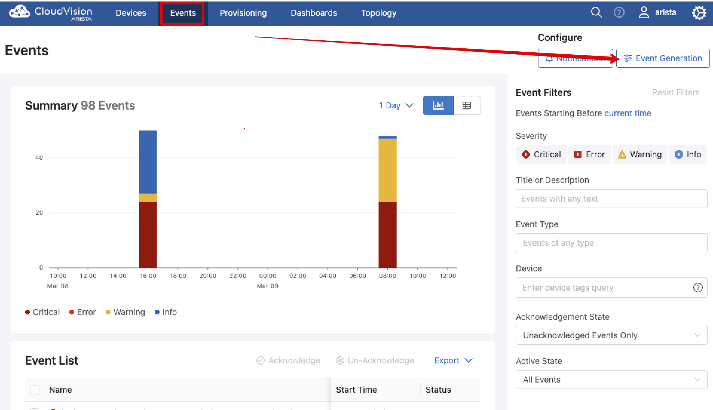
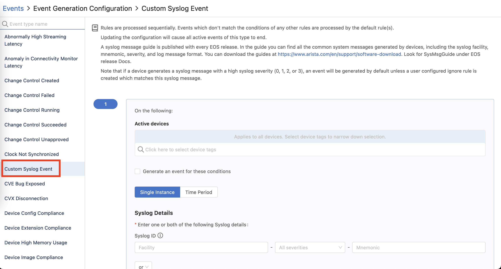
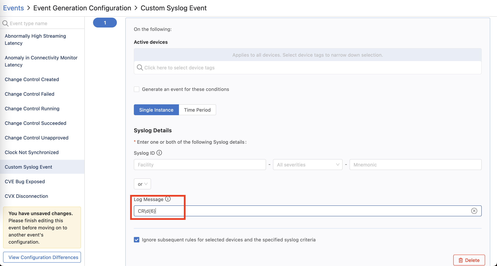
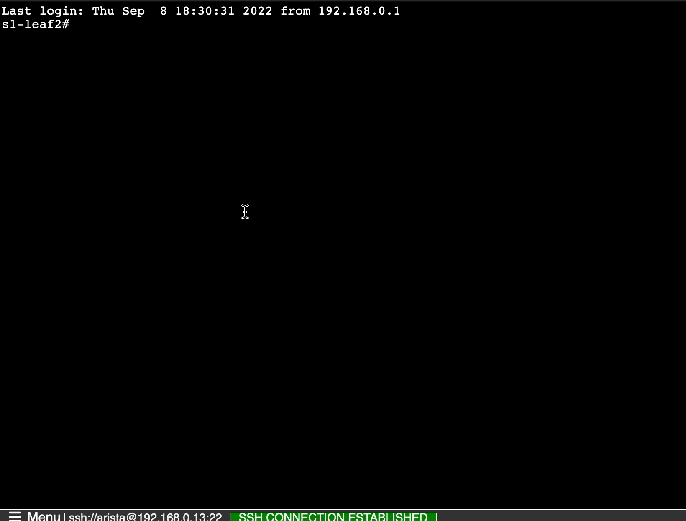
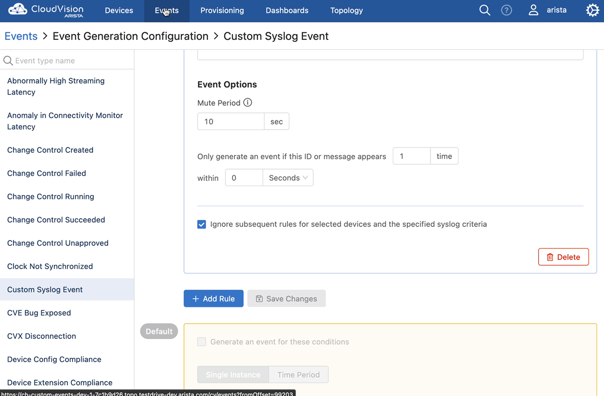

.. # define a hard line break for HTML
.. |br| raw:: html

    

CloudVision Custom Events
==========================
Using the EOS Syslog function, and CVP Custom Events, 
CVP users can trigger custom events of any severity. 
This can be done by creating a regular expression (aka regex) to detect 
and match an occurring log message. Or this log could be triggered by an EOS Event-Handler as part of the action.
In this lab we will use the EOS CLI to send log messages that CVP will detect and create an Event accordingly.

|br|

*  Start by choosing the **Events** tab. Then click **Event Generation**

|br|

|br|

*  After clicking **Event Generation** choose and click **Custom Syslog Event** 
   on the left vertical navigation area. 

|br|

*  Click **Add Rule** and scroll down until you see **Syslog Details**. in the **Log Message** field 
   add the following Regular Expression:
   
   ``CR\d{6}``

   This Regular expression will match when the log 
   message contains a string beginning with "CR" followed 
   by exactly 6 numeric digits. In this example CR means **Change Record**. 
   This will give the NOC the change record to review when an event is logged

|br|

*  Scroll down and click **Save Changes** to finish creating the
   Custom Syslog Event.

|br|

*  Next, log in to the CLI of a leaf switch like ``s1-leaf2``.
*  Type the following EOS CLI command:

  .. code-block:: shell

     s1-leaf2# send log level alerts message CR123456 starting now!

|br|

*  Review the events in CVP. You should see an event similar to the one below.

|br|

*  Experiment by sending messages with different severity levels, and modify the **CR123456** example using only 5 digits, or 7 digits. Does the event still trigger when using 5 or 7 digits?
*  Experiment with different regular expressions, perhaps try to build a match for other logs happening on **s1-leaf2**

LAB COMPLETE

   