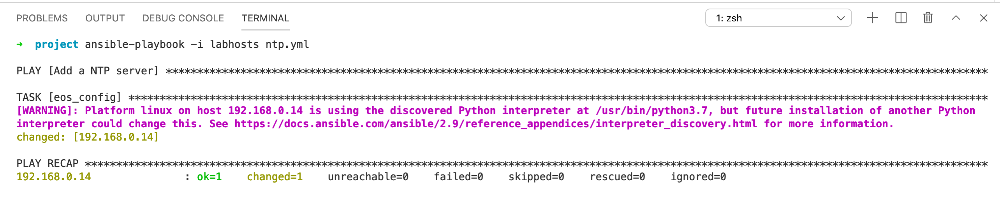

Ansible and Jinja Templates
===========================

As you might imagine, writing Ansible playbooks that issue command after
command to configure all 48+ interfaces on a switch can be extremely
tedious. Enter our
friend \ `Jinja <https://www.google.com/url?q=http://jinja.pocoo.org/&sa=D&ust=1523980190010000>`__\ .
Jinja is a Python-based templating engine that works with Ansible out of
the box.

Jinja templates take variables from Ansible and then output text. To
make an analogy, it’s a mail merge for configuration.

.. note:: Jinja isn’t just used for templates in Ansible. Ansible uses Jinja for filters, tests, and other functions as well!

A single command
----------------

Jinja and Ansible use cases range from single line configuration to
intricate for loops. Let’s start with a single line template for now.
Note that even though Ansible can handle single commands as shown above
natively, there will be times when you will develop a single template
that is comprised of both single commands and for loops.

.. warning:: Please do not start writing this script until you get to the
             next section

We’re going to create a Jinja template to configure an NTP server with
the following in it:

.. code-block:: html

    ntp server {{ ntp.host }}

Once run, Jinja will grab the defined Ansible variable ``host`` under
the ``ntp`` section:

.. code-block:: yaml

    ntp:
      host: 192.168.0.1

Once it finds the variable, it will generate the following:

.. code-block:: html

    ntp server 192.168.0.1

We’ll be calling this with the same Ansible module as above
(``eos_config``), but this time we’ll be using the ``src`` parameter to pass a
Jinja template instead of ``lines`` and ``parents`` like we did in lab #4.

Write it
~~~~~~~~

We’re going to create 3 files for this lab in the **IDE**. Once you have created
them, save them to your **project** directory.

#. A hosts file named ``labhosts``, though you can reuse the one you created
   earlier
#. A Jinja2 template named ``ntp.j2``
#. An Ansible playbook named ``ntp.yml``

.. note:: Save these files to path: ``/home/coder/project/labfiles``

Hosts file (``labhosts``):

.. code-block:: html

    [veos]
    192.168.0.12

Jinja2 template (``ntp.j2``):

.. code-block:: html

    ntp server {{ ntp.host }} source Management1

Ansible playbook (``ntp.yml``):

.. code-block:: yaml

    ---
    - name: Add a NTP server
      hosts: veos
      gather_facts: no
      connection: local
      vars:
        provider:
          host: "{{ ansible_host }}"
          username: "arista"
          password: "{REPLACE_PWD}"
          authorize: yes
          transport: eapi
          validate_certs: no
        ntp:
          host: 192.168.0.1
      tasks:
        - eos_config:
            src: ntp.j2
            provider: "{{ provider }}"

See how we’ve moved from having` `lines`` and ``parents`` in lab #4 to ``src`` to
indicate we’re going to use a Jinja template? Fancy!

Run it
~~~~~~

Assuming that you’ve saved the files to the labfiles directory, let’s run it with
the following command:

.. code-block:: html

    ansible-playbook -i labfiles/labhosts labfiles/ntp.yml

If all goes to plan, you will see  ok=1 **changed=1**. If you were to run it
again, it will show ok=1 **changed=0**. Idempotency strikes again! Feel free
to check **s1-Leaf1** to make sure the changes are there.

For Loops
---------

Now it’s time for something a little bit more useful - Jinja
template ``for`` loops. A ``for`` loop allows you to iterate through a template
and generate configuration until it reaches the end. In this lab, we’re
going to create a loop that sets the interface description on every
port.

This is a relatively benign example so that we can keep your lab
switches operational for other labs, but this could easily be the entire
switch - or switch port - configuration.

Let’s look at the Jinja template formatting:

.. code-block:: jinja

    
    interface {{ intf.name }}
       description {{ intf.description }}
    

This template is similar to any other language for loop - for arbitrary
value ``intf`` in a list of variables named ``interfaces``, configure
the ``name`` variable for that interface, with a description of
the ``description`` variable.  Jinja templates must have the same 
indentation as a live switch configuration.  EOS devices utilize
3 spaces for indentations.

Clear as mud? Maybe this variables file will help tie it together:

.. code-block:: yaml

    interfaces:
     - name: Ethernet1
       description: s1-leaf2.atd.lab
     - name: Ethernet2
       description: s1-spine1.atd.lab
     - name: Ethernet3
       description: s1-spine2.atd.lab
     - name: Ethernet4
       description: s1-host1
     - name: Ethernet6
       description: s1-leaf2.atd.lab

Once you run the template above, it’ll generate the following
configuration:

.. code-block:: html

    interface Ethernet1
     description s1-leaf2.atd.lab
    interface Ethernet2
     description s1-spine1.atd.lab
    interface Ethernet3
     description s1-spine2.atd.lab
    interface Ethernet4
     description s1-host1.atd.lab
    interface Ethernet6
     description s1-leaf2.atd.lab

Write it
~~~~~~~~

We will reuse the hosts file from the last lab, so let’s start by
creating a Jinja template in the **IDE** on in your project directory named **interfaces.j2**:

.. warning:: Please make absolutely certain that keep the proper spacing in the Jinja template, or Ansible will fail. 
             Jinja, like Ansible, is reliant on indentation.

|

.. code-block:: jinja

    
    interface {{ intf.name }}
       description {{ intf.description }}
    

Now let’s create the playbook named ``interfaces.yml``:

.. code-block:: yaml

    ---
    - name: Add interface descriptions
      hosts: veos
      gather_facts: no
      connection: local
      vars:
        provider:
          host: "{{ ansible_host }}"
          username: "arista"
          password: "{REPLACE_PWD}"
          authorize: yes
          transport: eapi
          validate_certs: no
        interfaces:
          - name: Ethernet1
            description: s1-leaf2.atd.lab
          - name: Ethernet2
            description: s1-spine1.atd.lab
          - name: Ethernet3
            description: s1-spine2.atd.lab
          - name: Ethernet4
            description: s1-host1.atd.lab
          - name: Ethernet6
            description: s1-leaf2.atd.lab
      tasks:
        - eos_config:
            src: interfaces.j2
            provider: "{{ provider }}"

Run it
~~~~~~

Let’s run it. We’re going to reuse the hosts file created in the last
lab.

.. code-block:: bash

    ansible-playbook -i labfiles/labhosts labfiles/interfaces.yml

You should see  ok=1 **changed=1**. If you were to run it again, it will
show ok=1 changed=0.

Log into Leaf1 (192.168.0.12) and run ``show interface status`` to see the
interface names.

Bonus
-----

Modify the **For Loops** lab to add the interface name to the interface
description.
