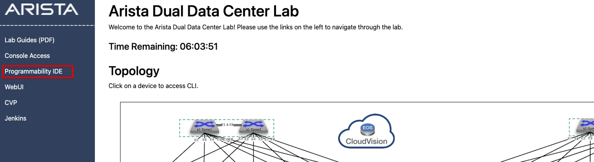
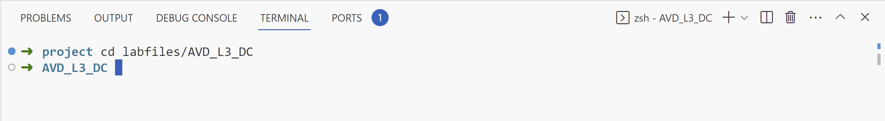

AVD EVPN VXLAN Labs
===================
The goal of these labs are to demonstrate how to use AVD to deploy and configure EVPN/VXLAN Datacenter networks

Connect to the Programmability IDE
~~~~~~~~~~~~~~~~~~~~~~~~~~~~~~~~~~
Connect to the **Programmability IDE** service. This IDE is running VS Code. If prompted for a password, enter in your
lab password: ``{REPLACE_PWD}`

Change directory to the AVD_L3_DC folder
~~~~~~~~~~~~~~~~~~~~~~~~~~~~~~~~~~~~~~~~

``cd labfiles/avd_l3_dc``

Set the Ansible password for DC1
~~~~~~~~~~~~~~~~~~~~~~~~~~~~~~~~
We are going to add your lab password: ``{REPLACE_PWD}`` to the ``dc1.yml`` file 

Open the ``sites/dc1/group_vars/dc1.yml`` file 
Edit the ``ansible_password:`` field with your lab password: ``{REPLACE_PWD}`` 

.. image:: images/avd_l3_dc/Setup_DC1_Password.png
   :align: center

