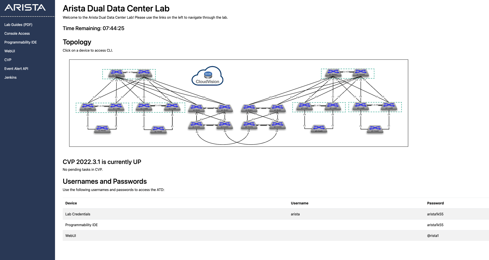
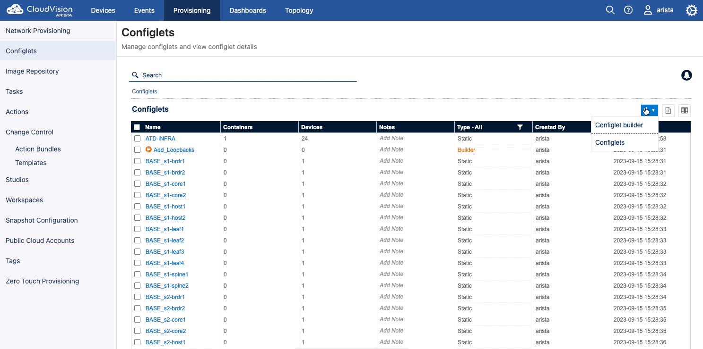
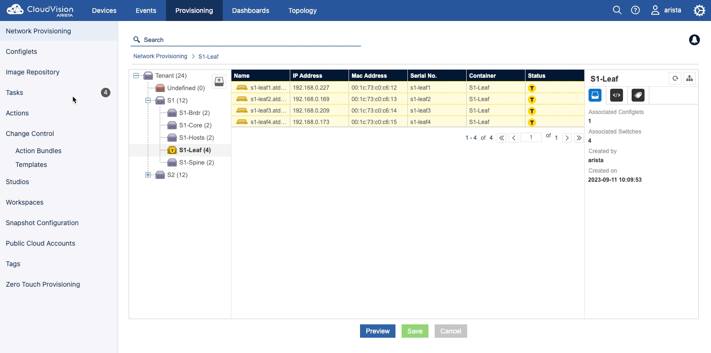

CVP Configlet, Change Control, and Rollback
===========================================

Let’s create a new CloudVision configlet. CloudVision configlets are
snippets of configuration that are used to create a switch
configuration.

All of the switches have a base Configlet. Additional Configlets have
been defined for AAA and VLANs.

1. Log into the Arista Test Drive portal with your assigned URL. If you
   don’t have one, please see your ATD staff.

.. image:: images/cvp_configlet/nested_cvp_overview_1.png
   :align: center

|

2. Click on the link "Click Here To Access Topology" and navigate to the below page. Click the **CVP** link on the left side of the screen.

|

|

3. You will come to a login screen for CloudVision Portal. Enter the username ``arista`` and the password ``{REPLACE_PWD}``

|

|

4. For this lab, select **Provisioning** -> **Configlets** from CloudVision.

5. Click the **+** in the top right and select **Configlets** to create a new configlet.

6. In the configuration section enter the command information as shown:

    .. code-block:: text

       alias snz show interface counter | nz

7. Name the Configlet **Alias**.

8. The Configlet can be validated against a device to ensure there isn’t a conflict and the configuration is validated. To validate, click the checkbox in the top right section.

9. Once the configuration is validated, Click the **Save** button to save the Configlet

|

.. image:: images/cvp_configlet/cvp_configlet_2.gif
   :align: center

|

10. To apply the Configlet, navigate to **Network Provisioning** expand the **S1** container, right click on the **S1-Leaf** container and select **Manage** -> **Configlet**.

11. Select the **Alias** Configlet and click **Update**. This activity is to simply add a new configlet to the existing configlets applied on the 'Leaf' container. **Do not Remove** existing configlets from the Proposed Configuration section.

    *\**Expert Tip - Use search bar to find Configlets faster*

12. On the 'Network Provisioning' page, Click the **Save** button to save the changes to the topology.

|

|

13. The screen will refresh and a 'T' for task will appear above each device, representing that tasks have been generated that need to run to push the configuration change.

14. Click **Tasks** in the left navigation column.

15. Check each Task in the 'Assignable Tasks' section, then click the **Create Change Control with 9 Tasks** button.

    *\**See the 'CVP Change Control, Telemetry & Rollback' lab guide for more information on Change Controls*

16. Select **Review and Approve** in the top right, then **Approve** in the bottom right to approve the Change Control.

17. Select **Execute Change Control** in the top right and then **Execute** to execute the Change Control tasks.

18. When the tasks are completed, navigate into the task by clicking on the task object.

19. Select **Show Details** icon on the rightpwd side of the screen to review the *Designed Configuration* vs. *Running Configuration*. The Designed Configuration is a combination of all configlets to build a full device configuration. The Running Configuration is the running-config prior to executing the task. Configuration differences are highlighted to show New Lines, Mismatch Lines, and To Reconcile.

|
Rollback
--------

|

Oh no! That Alias wasn't supposed to be deployed to production yet and now we need to return the leaf switches back to their original state. Not a problem, let's quickly do a Rollback.

1. If you're still on the Change Control screen, you should see a **Rollback** button on the upper right. If you already navigated away from this screen, you can choose Provisioning at the top of the page, click on Change Control, then select the name of the last run Change Control

|

.. image:: images/cvp_configlet/cvp_configlet_4.png
   :align: center

|

2. Once you select **Rollback**, the screen that pops up will have you select the switches you would like to rollback. Select all 4 switches, then click **Create Rollback Change Control**

|

.. image:: images/cvp_configlet/cvp_configlet_5.png
   :align: center

|

3. Click **Review and Approve**. You will be shown the specific lines that will be removed from the running configuration of the switches. This time, lets select the **Execute Immediately** switch, then select **Approve and Execute**. The changes are being rolled back. Whew!

**LAB COMPLETE**
