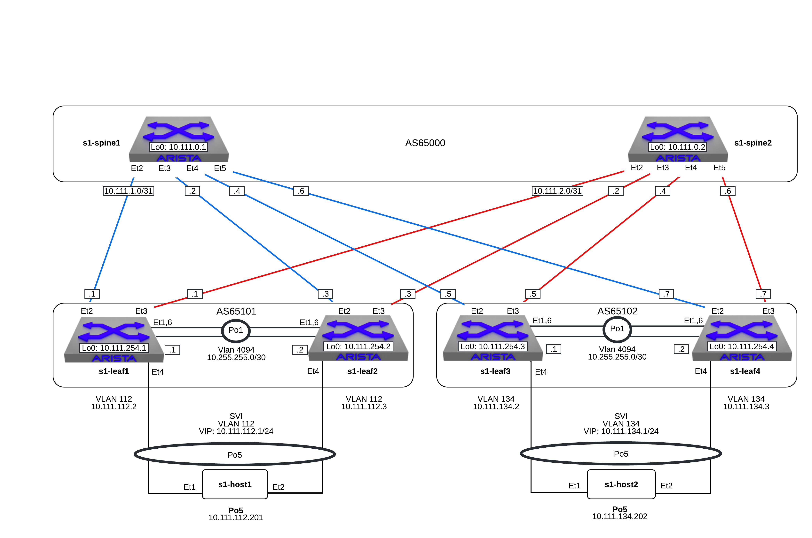

Layer 3 Leaf-Spine
==================

..
   NOTE TO THE EDITOR OF THIS LAB GUIDE FOR DUAL DC!!!! I REMOVED THE VLANs CONFIGLET SO YOU NEED TO ADD A STEP TO CREATE VLAN 34

.. note:: Did you know the “bgp” script is composed of Python code that
          uses the CloudVision Portal REST API to automate the provisioning of
          CVP Configlets. The configlets that are configured via the REST API
          are ``L3LS_s1-spine1``, ``L3LS_s1-spine2``, ``L3LS_s1-leaf1``,
          ``L3LS_s1-leaf2``, ``L3LS_s1-leaf3``, ``L3LS_s1-leaf4``.

.. note:: The manually-entered commands below that are part of this lab are
          equivalent to ``L3LS_s1-leaf4_complete``.

1. Log into the **LabAccess** jumpserver:

   a. Type ``bgp`` at the prompt. The script will configure the datacenter with the exception of **s1-leaf4**.
   
   |
#. Configure SVI and VARP Virtual IP on the **s1-leaf4** switch using the following criteria

   a. Create the vARP MAC Address in Global Configuration mode
   
      .. note::

         Arista EOS utilizes the Industry-Standard CLI. When entering configuration commands, be 
         sure to first type ``configure`` to enter configuration mode.

      .. code-block:: text

         ip virtual-router mac-address 00:1c:73:00:00:34

   #. Create the VLAN, SVI and the Virtual Router Address

      .. code-block:: text

         vlan 134
            name Host_Network_134
         !
         interface vlan 134
            ip address 10.111.134.3/24
            ip virtual-router address 10.111.134.1

   #. Validate the configuration issue the following commands

      .. code-block:: text

         show ip interface brief
         show ip virtual-router

#. Configure BGP on the **s1-leaf4** switch using the following criteria

   a. Based on the diagram, configure L3 interfaces to **s1-spine1/s1-spine2** and interface Loopback0

      .. code-block:: text

         interface Ethernet2
            description L3 Uplink - s1-spine1
            no switchport
            ip address 10.111.1.7/31
         !
         interface Ethernet3
            description L3 Uplink - s1-spine2
            no switchport
            ip address 10.111.2.7/31
         !
         interface Loopback0
            description Management and Router-id
            ip address 10.111.254.4/32

   #. Validate the configuration issue the following commands

      .. code-block:: text

         show ip interface brief

   #. Based on the diagram, turn on BGP and configure the neighbor
      relationships on **s1-leaf4**. eBGP to **s1-spine1/s1-spine2** and iBGP to **s1-leaf3**.
      
      .. note:: 
         We are using a peer group to configure the neighbor attributes for the spines. This allows
         us to apply all bgp attributes within a group to each neighbor that is a member in a scalable method.

      .. code-block:: text

         router bgp 65102
            router-id 10.111.254.4
            neighbor SPINE peer group
            neighbor SPINE remote-as 65100
            neighbor SPINE send-community standard extended
            neighbor 10.111.1.6 peer group SPINE
            neighbor 10.111.2.6 peer group SPINE
            neighbor 10.255.255.1 remote-as 65102
            neighbor 10.255.255.1 next-hop-self

      .. note::
         
         Since ``neighbor 10.255.255.1 remote-as 65102`` specifies an iBGP
         peering relationship (because the ASN is the same as this switch
         ``65102``), the receiving switch may not have a route to networks more
         than 1 hop away, hence the switches should each advertise that they are
         the next hop via the ``neighbor 10.255.255.1 next-hop-self`` statement. While
         this scenario is only 2 iBGP peers, in a network fabric with several iBGP
         peers, a switch inside an AS (and not on an edge) may not have a route
         to a switch in any external AS.

   #. Validate the configuration and neighbor establishment

      .. code-block:: text

         show active
         show ip bgp summary

#. Configure networks on **s1-leaf4** to advertise to **s1-spine1/s1-spine2**

   a. Add the following networks to BGP announcements on **s1-leaf4**:

      .. code-block:: text

         router bgp 65102
            network 10.111.134.0/24
            network 10.111.254.4/32

   #. Verify all of the **Spines** and **Leafs** see these new network announcements

      .. code-block:: text

         show ip route
         show ip bgp
         show ip route bgp

   #. Add in multiple paths by enabling ECMP, on **s1-leaf4**, jump into BGP configuration mode and add:

      .. code-block:: text

         router bgp 65102
            maximum-paths 2

   #. Check the BGP and IP route tables on each of the **Spines** and **Leafs**

      .. code-block:: text

         show ip bgp
         show ip route
         show ip route bgp

      .. note:: ECMP is now working - notice the new status code in the `show ip bgp` output

#. Validate connectivity from **s1-host1** to **s1-host2**. From **s1-host1** execute:

   .. code-block:: text

      ping 10.111.134.202
      traceroute 10.111.134.202

   a. Verify **s1-leaf4**'s IP address is in the traceroute path, either interface 10.111.1.7 via **s1-spine1** or interface 10.111.2.7 via **s1-spine2**.
      If traffic is hashing via **s1-leaf3**'s 10.111.1.5 or 10.111.2.5 interfaces perform the optional ``shutdown`` steps below on **s1-leaf3**

      .. code-block:: text

         router bgp 65102
            neighbor 10.111.1.4 shutdown
            neighbor 10.111.2.4 shutdown

   #. Rerun traceroute/verification from **s1-host1** to **s1-host2** then revert the ``shutdown`` changes on **s1-leaf3**

      .. code-block:: text

         router bgp 65102
            no neighbor 10.111.1.4 shutdown
            no neighbor 10.111.2.4 shutdown

#. Other BGP features to play with if you have time:

   a. Route Redistribution: For fun do a ``watch 1 diff show ip route | begin
      Gateway`` on **s1-leaf1** & **s1-leaf2** and let those run while you execute the
      command ``redistribute connected`` below on **s1-leaf3**. You will see new routes being
      injected into the route tables of **s1-leaf1** & **s1-leaf2**.

      .. code-block:: text

         router bgp 65102
            redistribute connected

   #. Route Maps and Prefix-Lists:

      .. code-block:: text
         
         <Example>

         ip prefix-list BOGON-Prefixes seq 10 permit 10.0.0.0/8
         ip prefix-list BOGON-Prefixes seq 20 permit 172.16.0.0/12
         ip prefix-list BOGON-Prefixes seq 30 permit 192.168.0.0/16
         !
         route-map BOGONS permit 10
         match ip address prefix-list BOGON-Prefixes
         !
         route-map BOGONS deny 20
         !
         route-map InboundSP1 deny 10
         sub-route-map BOGONS
         !
         route-map InboundSP1 permit 20
         set local-preference 200
         !
         router bgp 65000
            neighbor UpstreamSP1 route-map InboundSP1 in

   #. BFD: BFD is a low-overhead, protocol-independent mechanism which adjacent
      systems can use instead for faster detection of faults in the path between
      them. BFD is a simple mechanism which detects the liveness of a connection
      between adjacent systems, allowing it to quickly detect failure of any
      element in the connection.

      .. code-block:: text

         router bgp 65102
            neighbor <neighbor_ip> bfd

#. Troubleshooting BGP:

   .. code-block:: text

      show ip bgp summary
      show ip bgp
      show ip bgp neighbor <neighbor_ip>
      show run section bgp
      show log

**LAB COMPLETE!**
