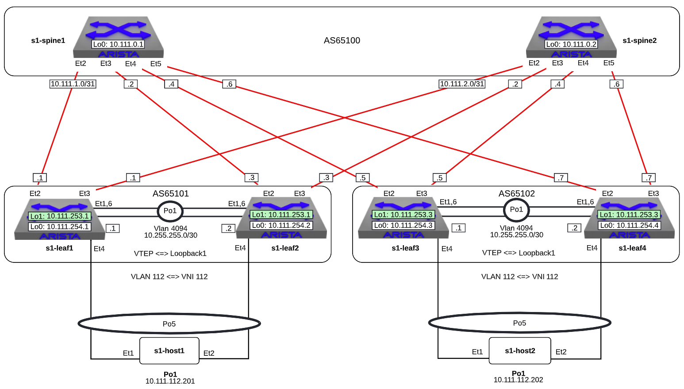

VxLAN
=====

.. note:: Did you know the ``vxlan`` script is composed of Python code that
          uses the CloudVision Portal REST API to automate the provisioning of
          CVP configlets. The configlets that are configured via the REST API
          are ``VXLAN_s1-spine1``, ``VXLAN_s1-spine2``, ``VXLAN_s1-leaf1``,
          ``VXLAN_s1-leaf2``, ``VXLAN_s1-leaf3``, ``VXLAN_s1-leaf4``. In
          addition each leaf also gets the ``VLANs`` configlet.

.. note:: The manually-entered commands below that are part of this lab are
          equivalent to ``VXLAN_s1-leaf4_complete``.

1. Log into the LabAccess jumpserver:

   1. Type ``vxlan`` at the prompt. The script will configure the datacenter with the exception of **s1-leaf4**.

2. On **s1-leaf4**, configure Port-channels connecting to **s1-host2**

    .. code-block:: text

        configure
        interface port-channel 5
            description MLAG - HOST2
            switchport access vlan 112
            mlag 5

        interface Ethernet4
            description HOST2
            channel-group 5 mode active
            lacp timer fast

3. Verify MLAG on **s1-leaf4**
      
    .. code-block:: text
       :emphasize-lines: 1, 25, 31, 50

       s1-leaf4(config)#show mlag
       MLAG Configuration:
       domain-id                          :                MLAG
       local-interface                    :            Vlan4094
       peer-address                       :        10.255.255.1
       peer-link                          :       Port-Channel1
       peer-config                        :        inconsistent
          
       MLAG Status:
       state                              :              Active
       negotiation status                 :           Connected
       peer-link status                   :                  Up
       local-int status                   :                  Up
       system-id                          :   02:1c:73:c0:c6:14
       dual-primary detection             :            Disabled
       dual-primary interface errdisabled :               False
       
       MLAG Ports:
       Disabled                           :                   0
       Configured                         :                   0
       Inactive                           :                   0
       Active-partial                     :                   0
       Active-full                        :                   1
         
       s1-leaf4(config)#show mlag interfaces
                                                                        local/remote
          mlag       desc             state       local       remote          status
       ---------- ---------- ----------------- ----------- ------------ ------------
             5       MLAG - HOST2        active-full         Po5          Po5           up/up
        
       s1-leaf4(config)#show port-channel dense

               Flags
       -------------------------- ----------------------------- -------------------------
          a - LACP Active            p - LACP Passive           * - static fallback
          F - Fallback enabled       f - Fallback configured    ^ - individual fallback
          U - In Use                 D - Down
          + - In-Sync                - - Out-of-Sync            i - incompatible with agg
          P - bundled in Po          s - suspended              G - Aggregable
          I - Individual             S - ShortTimeout           w - wait for agg
          E - Inactive. The number of configured port channels exceeds the config limit
          M - Exceeds maximum weight

       Number of channels in use: 2
       Number of aggregators: 2

          Port-Channel       Protocol    Ports
       ------------------ -------------- ------------------
          Po1(U)             LACP(a)     Et1(PG+) Et6(PG+)
          Po5(U)             LACP(a)     Et4(PSG+) PEt4(P)

4. Validate BGP operation **s1-leaf4**

    .. code-block:: text
       :emphasize-lines: 1, 16, 44, 56

       s1-leaf4(config)#sh run sec bgp
       router bgp 65102
          router-id 10.111.254.4
          maximum-paths 2
          neighbor SPINE peer group
          neighbor SPINE remote-as 65100
          neighbor SPINE send-community standard extended
          neighbor 10.111.1.6 peer group SPINE
          neighbor 10.111.2.6 peer group SPINE
          neighbor 10.255.255.1 remote-as 65102
          neighbor 10.255.255.1 next-hop-self
          network 10.111.112.0/24
          network 10.111.134.0/24
          network 10.111.254.4/32

       s1-leaf4(config)#show ip route bgp

       VRF: default
       Codes: C - connected, S - static, K - kernel,
              O - OSPF, IA - OSPF inter area, E1 - OSPF external type 1,
              E2 - OSPF external type 2, N1 - OSPF NSSA external type 1,
              N2 - OSPF NSSA external type2, B - Other BGP Routes,
              B I - iBGP, B E - eBGP, R - RIP, I L1 - IS-IS level 1,
              I L2 - IS-IS level 2, O3 - OSPFv3, A B - BGP Aggregate,
              A O - OSPF Summary, NG - Nexthop Group Static Route,
              V - VXLAN Control Service, M - Martian,
              DH - DHCP client installed default route,
              DP - Dynamic Policy Route, L - VRF Leaked,
              G  - gRIBI, RC - Route Cache Route

        B E      10.111.0.1/32 [200/0] via 10.111.1.6, Ethernet2
        B E      10.111.0.2/32 [200/0] via 10.111.2.6, Ethernet3
        B E      10.111.1.0/24 [200/0] via 10.111.1.6, Ethernet2
        B E      10.111.2.0/24 [200/0] via 10.111.2.6, Ethernet3
        B E      10.111.253.1/32 [200/0] via 10.111.1.6, Ethernet2
                                  via 10.111.2.6, Ethernet3
        B I      10.111.253.3/32 [200/0] via 10.255.255.1, Vlan4094
        B E      10.111.254.1/32 [200/0] via 10.111.1.6, Ethernet2
                                  via 10.111.2.6, Ethernet3
        B E      10.111.254.2/32 [200/0] via 10.111.1.6, Ethernet2
                                  via 10.111.2.6, Ethernet3
        B I      10.111.254.3/32 [200/0] via 10.255.255.1, Vlan4094        

       s1-leaf4(config)#show ip interface brief
                                                                                       Address
       Interface         IP Address            Status       Protocol            MTU    Owner
       ----------------- --------------------- ------------ -------------- ----------- -------
       Ethernet2         10.111.1.7/31         up           up                 1500
       Ethernet3         10.111.2.7/31         up           up                 1500
       Loopback0         10.111.254.4/32       up           up                65535
       Management0       192.168.0.15/24       up           up                 1500
       Vlan112           10.111.112.1/24       up           up                 1500
       Vlan134           10.111.134.1/24       up           up                 1500
       Vlan4094          10.255.255.2/30       up           up                 1500

       s1-leaf4(config)#show ip bgp summary
       BGP summary information for VRF default
       Router identifier 10.111.254.4, local AS number 65102
       Neighbor Status Codes: m - Under maintenance
         Neighbor     V AS           MsgRcvd   MsgSent  InQ OutQ  Up/Down State   PfxRcd PfxAcc
         10.111.1.6   4 65100            333       335    0    0 04:34:48 Estab   5      5
         10.111.2.6   4 65100            329       332    0    0 04:34:58 Estab   6      6
         10.255.255.1 4 65102            335       333    0    0 04:34:46 Estab   11     11

.. note:: ``show ip bgp summary`` will show that the BGP neighbors have moved to ``Estab`` state. Note the iBGP peering between Leaf3 & Leaf4. Also note the route to the shared loopback1 of Leaf1 & Leaf2. This is the remote VTEP on the other side of the leaf-spine network.

5. Create Loopback 1 and the VXLAN VTEP (VTI) interfaces on **s1-leaf4**

   1. Configuration

        .. code-block:: text

            configure
            interface Loopback1
              ip address 10.111.253.3/32

            interface vxlan 1
              vxlan source-interface loopback 1
              vxlan vlan 12 vni 112
              vxlan flood vtep 10.111.253.1 

      .. note:: ``vxlan flood vtep 10.111.253.1`` adds the shared loopback1 IP address on Leaf1 & Leaf2 to the HER list. Note that for autodiscovery of VTEPs, one must use BGP eVPN (see eVPN labs) or CVX (see CVX lab).

   2. Verification

    .. code-block:: text
       :emphasize-lines: 1, 8

       s1-leaf4(config)#show run int vxlan1
       interface Vxlan1
          vxlan source-interface Loopback1
          vxlan udp-port 4789
          vxlan vlan 112 vni 112
          vxlan flood vtep 10.111.253.1

       s1-leaf4(config-if-Vx1)#sh int vxlan 1
         Vxlan1 is up, line protocol is up (connected)
         Hardware is Vxlan
         Source interface is Loopback1 and is active with 10.111.253.3
         Replication/Flood Mode is headend with Flood List Source: CLI
         Remote MAC learning via Datapath
         VNI mapping to VLANs
         Static VLAN to VNI mapping is
            [12, 112]
         Note: All Dynamic VLANs used by VCS are internal VLANs.
               Use 'show vxlan vni' for details.
         Static VRF to VNI mapping is not configured
         Headend replication flood vtep list is:
            12 10.111.253.1
         MLAG Shared Router MAC is 0000.0000.0000

6. Log into **s1-host1** and **s1-host2**, ping the vARP VIP and the other host

   1. Host 1 ping tests. From **s1-host1**:

        .. code-block:: text

            ping 10.111.112.1
            ping 10.111.112.202

      .. note:: The TTL in the ping outputs above. Even though .202 is many
                switches away, it appears locally connected and has the same
                TTL as the ping to .1. It's also interesting to realize that
                due to MLAG hashing of both the ARP requests and ping packet
                flows that pings to the SVI addresses of .2 & .3 may or may not
                work. Do you know why?

   2. Host 1 MAC/ARP information

       .. code-block:: text
          :emphasize-lines: 1, 4

          s1-host1#show interfaces po1 | grep -i Hardware
            Hardware is Port-Channel, address is 001c.73c0.c616
            
          s1-host1#show arp
          Address         Age (sec)  Hardware Addr   Interface
          192.168.0.1       0:00:00  124e.b1e1.7180  Management0
          192.168.0.5       0:00:05  001c.73a0.c601  Management0
          10.111.112.1      0:38:05  001c.7300.0001  Port-Channel1
          10.111.112.202    0:14:05  001c.73c0.c617  Port-Channel1

      .. note:: Note the MAC addresses returned by the commands above.

   3. Host 2 ping tests. From **s1-host2**:

        .. code-block:: text

            ping 10.111.112.1
            ping 10.111.112.201

      .. note:: Note the TTL in the ping outputs above. Even though .201 is many
                switches away, it appears locally connected and has the same TTL
                as the ping to .1. Also note that the vARP VIP (10.111.112.1)
                address & and vARP MAC address (00:1c:73:00:00:ff) are the **same** for both leaf
                pairs - this IP address is known as an AnyCast IP address. If
                a VM was motioning from **s1-host1** to **s1-host2** for maintenance,
                the default GW address nor the ARP cache on that VM need to
                change.

   4. Host 2 MAC/ARP information

        .. code-block:: text

            show interface po1 | grep -i Hardware
            show arp

      .. note:: Note the MAC addresses returned by the commands above and
                compare to the prior ``grep`` and ``arp`` commands and see that
                both hosts appear to each other as though they are on the same
                L2 broadcast domain. **For a little extra fun**, as you are
                running the pings from **host1**, on another set of windows
                for **s1-leaf1** & **s1-leaf2** run ``clear counters`` then run
                ``watch 1 diff show int e4 counter`` and see how MLAG hashing
                across the different pings causes the packets to choose a
                particular member of the port-channel in both the outbound &
                inbound ping flows.

7. Verification – on **s1-leaf1/2** and **s1-leaf3/4**

   1. Verify the MAC addresses and the associated VTEP IP

        .. code-block:: text
           :emphasize-lines: 1, 10

           s1-leaf1#show vxlan vtep
           Remote VTEPS for Vxlan1:

           VTEP               Tunnel Type(s)
           ------------------ --------------
           10.111.253.3       unicast, flood

           Total number of remote VTEPS:  1

           s1-leaf1#show vxlan address-table
           Vxlan Mac Address Table
           ----------------------------------------------------------------------

           VLAN  Mac Address     Type      Prt  VTEP             Moves   Last Move
           ----  -----------     ----      ---  ----             -----   ---------
            112  001c.73c0.c617  DYNAMIC   Vx1  10.111.253.3     1       0:01:13 ago
           Total Remote Mac Addresses for this criterion: 1

        .. code-block:: text
           :emphasize-lines: 1,10

               s1-leaf4(config)#show vxlan vtep
               Remote VTEPS for Vxlan1:

               VTEP               Tunnel Type(s)
               ------------------ --------------
               10.111.253.1       unicast, flood

               Total number of remote VTEPS:  1

               s1-leaf4(config)#show vxlan address-table
                        Vxlan Mac Address Table
               ----------------------------------------------------------------------

               VLAN  Mac Address     Type      Prt  VTEP             Moves   Last Move
               ----  -----------     ----      ---  ----             -----   ---------
               112  001c.73c0.c616  DYNAMIC   Vx1  10.111.253.1     1       0:00:33 ago
               Total Remote Mac Addresses for this criterion: 1

      .. note:: For ``show vxlan vtep`` & ``show vxlan address-table`` to be
                populated, the above ``pings`` need to have been active very
                recently so that the MAC addresses don't age out, and you'll
                notice that at least 1 (but not necessarily both) of the MLAG
                pair switches (**s1-leaf1** or
                **s1-leaf2**) will have knowledge of the remote VTEP. This is
                because this is the direction the pings (inbound & outbound)
                last hashed.

   2. Verify the MAC address and the associated interface

        .. code-block:: text

            show mac address-table

8. Let’s run some other show commands and tests to poke around VxLAN. On **s1-leaf1** and **s1-leaf4** issue the following commands:

    .. code-block:: text

        show interface vxlan 1
        show mac address-table
        show log

**LAB COMPLETE!**
