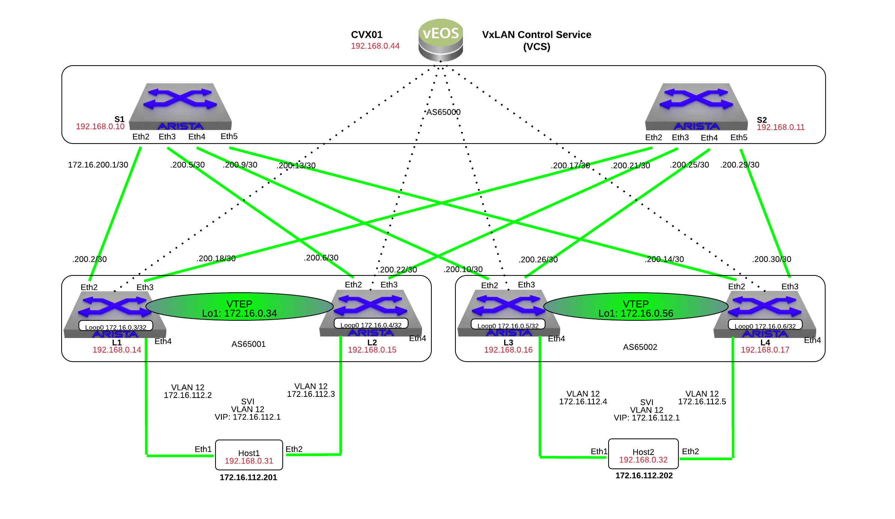

CVX
====

.. note:: Did you know the CVX stands for CloudVision Exchange? CVX is simply a virtual instance of Arista's EOS known as vEOS. CVX can be run in Standalone mode (Single VM) or Multi-node (up to 3 VMs) cluster.

1. Log into the **LabAccess** jumpserver:

   1. Type ``vxlan`` at the prompt. The script will configure the datacenter with the exception of Leaf3
   2. On **CVX01**, verify the following:

        .. code-block:: text

            show version
            show interface status
            show ip interface brief
            
2. Enable the VXLAN Control Service (VCS) on **CVX01**

   1. On **CVX01**:

        .. code-block:: text
            
            configure
            cvx
              no shutdown
              service vxlan
                no shutdown

   2. Verify CVX Service is running:

        .. code-block:: text

            show cvx

3. On each every Leaf in the topology, configure CVX controller client and the interface VXLAN1

   1. On **Leaf1**, **Leaf2**, **Leaf3**, and **Leaf4**:

        .. code-block:: text

            configure
            management cvx
              server host 192.168.0.44
              no shutdown

            interface Vxlan 1
              vxlan source-interface Loopback0
              vxlan udp-port 4789
              vxlan vlan 12 vni 1212
              vxlan controller-client

   2. Verify vxlan controller status on **Leaf1**, **Leaf2**, **Leaf3**, and **Leaf4**:

        .. code-block:: text

            show vxlan controller status
            show vxlan controller address-table advertised
            show vxlan controller address-table received
            
   3. Log onto **host1** and ping **host2**:

        .. code-block:: text 
    
            ping 172.16.112.202

4. Verify that **CVX01** has established connections and is recieving VXLAN advertisements

        .. code-block:: text

            show cvx connections
            show service vxlan address-table advertised
            show service vxlan address-table received

5. Verify that **CVX01** can view the network topology:

        .. code-block:: text

            show network physical-topology hosts
            show network physical-topology neighbors

**LAB COMPLETE!**
