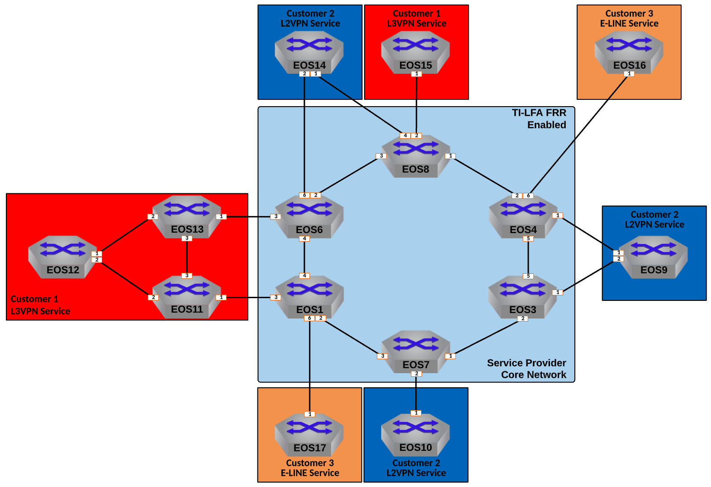

Enable TI-LFA Fast Reroute for ISIS-SR
==================================================================

  
|

#. Enable Topology Indepent Loop Free Alternate calculation on the Service Provider network for Fast Reroute.

   - Enable for the IPv4 Unicast AF only.

   - Enable Link Protection mode for TI-LFA

   - TI-LFA should be enabled for IS-IS Level 2.

#. Ensure the proper delay is respected so micro-loops do not occur.

**LAB COMPLETE!**
