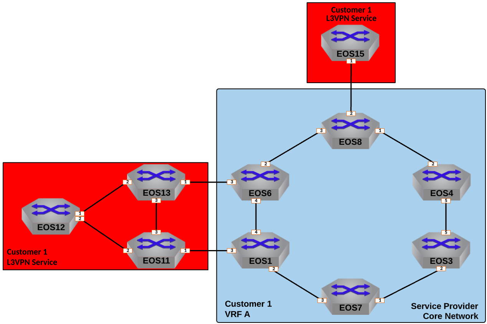

Deploy L3VPN Service for Customer-1
=====================================================

|

#. Log into the **LabAccess** jumpserver to prepare the lab environment.

   #. From the Main Menu, type ``labs`` or Option 97 for ``Additional Labs``.

   #. Type ``ring-topology-ipvpn-labs`` to access the LDP and IPVPN Labs.

   #. Type ``c1l3vpn`` at the Labs Selection Menu. The script will configure the topology with the necessary prerequisites.
   
#. Customer-1 is attached to three Service Provider nodes, **EOS1**, **EOS6** and **EOS8**. These will be our Provider 
   Edge, or **PE** nodes. Since this customer will require a Layer 3 VPN Service, create an isolated VRF for their traffic 
   and use IP-VPN to advertise the customer networks to other interested PEs.

   #. Create a VRF Instance called ``CUSTOMER-1`` on **EOS1**, **EOS6** and **EOS8**.

      .. note::

         Since we are using MPLS to create VPNs in the Service Provider network, the VRF only needs to be created on the 
         nodes attached to the customer the VRF is for; in this case Customer-1. Also, note that by default, ``ip routing`` 
         and ``ipv6 unicast-routing`` are disabled by default in any VRF, so must be enabled for routing functions.

      .. code-block:: text

         vrf instance CUSTOMER-1
         !
         ip routing vrf CUSTOMER-1
         !
         ipv6 unicast-routing vrf CUSTOMER-1

   #. Place the interface attached to the Customer Edge, or **CE**, node for Customer-1 into VRF ``CUSTOMER-1`` on 
      **EOS1** to ensure their traffic remains isolated.

      .. note::

         When an interface is moved from one VRF to another, in this case from the ``default`` VRF into our defined 
         ``CUSTOMER-1`` VRF, any IP settings, including addresses, will be removed and will need to be reapplied.

      .. code-block:: text

         interface Ethernet3
            vrf CUSTOMER-1
            ip address 10.1.11.1/24
            ipv6 address fd00:1:11::1/64

   #. Repeat the above step for the interfaces on **EOS6** and **EOS8** attached to Customer-1 CE devices.

      **EOS6**

      .. code-block:: text

         interface Ethernet3
            vrf CUSTOMER-1
            ip address 10.6.13.6/24
            ipv6 address fd00:6:13::6/64

      **EOS8**

      .. code-block:: text

         interface Ethernet2
            vrf CUSTOMER-1
            ip address 10.8.15.8/24
            ipv6 address fd00:8:15::8/64

   #. Now leverage IP-VPN to advertise reachability of any routes learned in VRF ``CUSTOMER-1`` from the customer by 
      setting a Route Distinguisher, or **RD**, and a Route Target, or **RT**, within BGP on **EOS1**. It should have a 
      unique **RD** following the format of **<Loopback0 IP>** ``:1`` and the **RT** on all routers in the VPN should match 
      as ``1:1`` for both v4 and v6.

      .. note::

         The **RD** can be used to determine the origination point of the VPN route and the **RT** is used by the routers 
         in the Service Provider network to determine if they should import the advertised route into their local routing 
         table(s). If they receive a VPN route, they check the **RT** value and see if they have a matching **RT** configured 
         in BGP. If they do, the import the route into the associated VRF. If they do not, they ignore the route.

      .. code-block:: text

         router bgp 100
            !
            vrf CUSTOMER-1
               rd 1.1.1.1:1
               route-target import vpn-ipv4 1:1
               route-target import vpn-ipv6 1:1
               route-target export vpn-ipv4 1:1
               route-target export vpn-ipv6 1:1

   #. Repeat the above step for **EOS6** and **EOS8**, adjusting the **RD** and using the same **RT**.

      **EOS6**

      .. code-block:: text

         router bgp 100
            !
            vrf CUSTOMER-1
               rd 6.6.6.6:1
               route-target import vpn-ipv4 1:1
               route-target import vpn-ipv6 1:1
               route-target export vpn-ipv4 1:1
               route-target export vpn-ipv6 1:1

      **EOS8**

      .. code-block:: text

         router bgp 100
            !
            vrf CUSTOMER-1
               rd 8.8.8.8:1
               route-target import vpn-ipv4 1:1
               route-target import vpn-ipv6 1:1
               route-target export vpn-ipv4 1:1
               route-target export vpn-ipv6 1:1

   #. Finally, define the BGP peers facing the CE devices for route exchange into the customer VRF on **EOS1**. The CE node 
      (**EOS11**) will use BGP ASN 123. Ensuring peering is configured for v4 and v6 unicast route exchange to the CE.

      .. note::

         Typically, CE-PE peerings will leverage eBGP as we do here. This allows for automatic route forwarding from the PE 
         to the Route Reflector. Also note that in the previous lab, we disabled the default activation of the IPv4 unicast 
         address-family for BGP peers, so we must explicitly enable for our PE-CE peering as well as the IPv6 unicast 
         address-family.

      .. code-block:: text

         router bgp 100
            !
            vrf CUSTOMER-1
               neighbor 10.1.11.11 remote-as 123
               neighbor 10.1.11.11 maximum-routes 12000 
               neighbor fd00:1:11::11 remote-as 123
               neighbor fd00:1:11::11 maximum-routes 12000 
               !
               address-family ipv4
                  neighbor 10.1.11.11 activate
               !
               address-family ipv6
                  neighbor fd00:1:11::11 activate

   #. Again, repeat the above step for **EOS6** and **EOS8**, adjusting the peer IPs and ASN to reflect the attached CE node.

      **EOS6**

      .. code-block:: text

         router bgp 100
            !
            vrf CUSTOMER-1
               neighbor 10.6.13.13 remote-as 123
               neighbor 10.6.13.13 maximum-routes 12000 
               neighbor fd00:6:13::13 remote-as 123
               neighbor fd00:6:13::13 maximum-routes 12000 
               !
               address-family ipv4
                  neighbor 10.6.13.13 activate
               !
               address-family ipv6
                  neighbor fd00:6:13::13 activate

      **EOS8**

      .. code-block:: text

         router bgp 100
            !
            vrf CUSTOMER-1
               neighbor 10.8.15.15 remote-as 15
               neighbor 10.8.15.15 maximum-routes 12000 
               neighbor fd00:8:15::15 remote-as 15
               neighbor fd00:8:15::15 maximum-routes 12000
               !
               address-family ipv4
                  neighbor 10.8.15.15 activate
               !
               address-family ipv6
                  neighbor fd00:8:15::15 activate

   #. Verify configurations and VRF status. There will be no routes or BGP peers in our VRF as of yet since we have not 
      peered with the CE devices.

      .. code-block:: text

         show running-config section CUSTOMER-1
         show vrf

#. Now that the PE nodes are configured, configure CE nodes **EOS11**, **EOS12**, **EOS13**, and **EOS15** for Layer 3 
   attachment to the Service Provider network.

   #. Since **EOS11**, **EOS12**, and **EOS13** represent a single customer site and LAN, configure OSPF to distribute 
      routes locally within the site.

      .. note::

         The scope of these labs is mainly around the Service Provider network functions so it does not cover the specifics 
         of the customer network configurations.
      
      **EOS11**

      .. code-block:: text

         interface Ethernet2
            ip ospf network point-to-point
         !
         router ospf 100
            network 0.0.0.0/0 area 0.0.0.0
            max-lsa 12000

      **EOS12**

      .. code-block:: text

         interface Ethernet1
            ip ospf network point-to-point
         !
         interface Ethernet2
            ip ospf network point-to-point
         !
         router ospf 100
            network 0.0.0.0/0 area 0.0.0.0
            max-lsa 12000

      **EOS13**

      .. code-block:: text

         interface Ethernet2
            ip ospf network point-to-point
         !
         router ospf 100
            network 0.0.0.0/0 area 0.0.0.0
            max-lsa 12000

   #. Configure the BGP peerings to the PE devices on **EOS11**, **EOS13** and **EOS15** ensuring that each router's
      Loopback0 address is advertised to the attached PE.

      **EOS11**

      .. code-block:: text

         router bgp 123
            router-id 11.11.11.11
            neighbor 10.1.11.1 remote-as 100
            neighbor 10.1.11.1 maximum-routes 12000
            neighbor fd00:1:11::1 remote-as 100
            neighbor fd00:1:11::1 maximum-routes 12000
            !
            address-family ipv4
               network 11.11.11.11/32
               network 12.12.12.12/32
               network 13.13.13.13/32
            !
            address-family ipv6
               neighbor fd00:1:11::1 activate
               network 11:11:11::11/128

      **EOS13**

      .. code-block:: text

         router bgp 123
            router-id 13.13.13.13
            neighbor 10.6.13.6 remote-as 100
            neighbor 10.6.13.6 maximum-routes 12000
            neighbor fd00:6:13::6 remote-as 100
            neighbor fd00:6:13::6 maximum-routes 12000
            !
            address-family ipv4
               network 11.11.11.11/32
               network 12.12.12.12/32
               network 13.13.13.13/32
            !
            address-family ipv6
               neighbor fd00:6:13::6 activate
               network 13:13:13::13/128

      **EOS15**

      .. code-block:: text

         router bgp 15
            router-id 15.15.15.15
            neighbor 10.8.15.8 remote-as 100
            neighbor 10.8.15.8 maximum-routes 12000
            neighbor fd00:8:15::8 remote-as 100
            neighbor fd00:8:15::8 maximum-routes 12000
            !
            address-family ipv4
               network 15.15.15.15/32
            !
            address-family ipv6
               neighbor fd00:8:15::8 activate
               network 15:15:15::15/128

#. With the peerings fully established, verify and test connectivity between the Customer-1 locations.

   #. Verify BGP status and route exchange with the Service Provider network on **EOS15**

      .. code-block:: text

         show ip bgp summary
         show ip bgp detail
         show ip route
         show ipv6 bgp summary
         show ipv6 bgp detail
         show ipv6 route

   #. Validate route advertisement to **EOS12** to ensure routes are coming in from the Service Provider network and 
      being redistributed by the CE nodes into the IGP.

      .. code-block:: text

         show ip ospf database
         show ip route

   #. Test IPv4 connectivity from **EOS12** to **EOS15** using Loopback0 IP addressing.

      .. note::

         In the ATD labs, only connectivty of IPv4 traffic can be validated in L3VPNs. There is a limitation in the 
         functionality of vEOS-lab, which the ATD labs are built on, in that it is unable to forward MPLS-decapsulated IPv6 
         traffic to CE nodes. The control-plane for IPv6 based VPNs can still be fully built and validated as it would in 
         a real environment with physical hardware.

      .. code-block:: text

         ping 15.15.15.15 source 12.12.12.12

#. From the Service Provider nodes, verify route exchange and MPLS control-plane status.

   #. Display the peering status and routes being advertised by **EOS11** on **EOS1**.

      .. code-block:: text

         show ip bgp summary vrf CUSTOMER-1
         show ip bgp neighbor 10.1.11.11 routes vrf CUSTOMER-1
         show ipv6 bgp summary vrf CUSTOMER-1
         show ipv6 bgp peers 10.1.11.11 routes vrf CUSTOMER-1
   
   #. Now validate the IP-VPN routes are exchanged between the PE nodes **EOS1**, **EOS6**, and **EOS8** via the Route 
      Relector.

      .. note::

         The key fields to notice in the following outputs are the **RD** which denotes the originator of the specified 
         VPN route, the **RT** which denotes the associated Customer VRF and the assigned **MPLS label**, which represents 
         the VPN or VRF label that EOS dynamically assigns via LDP.

      .. code-block:: text

         show bgp vpn-ipv4 summary
         show bgp vpn-ipv4 detail
         show bgp vpn-ipv6 summary
         show bgp vpn-ipv6 detail

   #. Finally, validate the forwarding path traffic will take for each destination in the customer VRF on the Service 
      Provider network PEs, **EOS1**, **EOS6**, and **EOS8**.

      .. code-block:: text

         show ip route vrf CUSTOMER-1
         show ipv6 route vrf CUSTOMER-1
         show mpls route

#. To show the ability for Equal Cost Multi-Pathing, or **ECMP**, to automatically occur where applicable on the Service 
   Provider network, adjust the configuration so that IS-IS calculates multiple equal paths for traffic between these PE 
   nodes.

   #. Adjust the IS-IS metric on the link between **EOS6** and **EOS8** so that multiple paths become available for 
      forwarding.

      .. note::

         Normally, this would be done in a scenario where you would like to de-preference a given path in the network.
      
      **EOS6**

      .. code-block:: text

         interface Ethernet2
            isis metric 40

      **EOS8**

      .. code-block:: text

         interface Ethernet3
            isis metric 40

   #. Re-verify the forwarding path for the Customer-1 VRF on **EOS1**, **EOS6**, and **EOS8** to see ECMP is now available.

      .. code-block:: text

         show ip route vrf CUSTOMER-1

**LAB COMPLETE!**