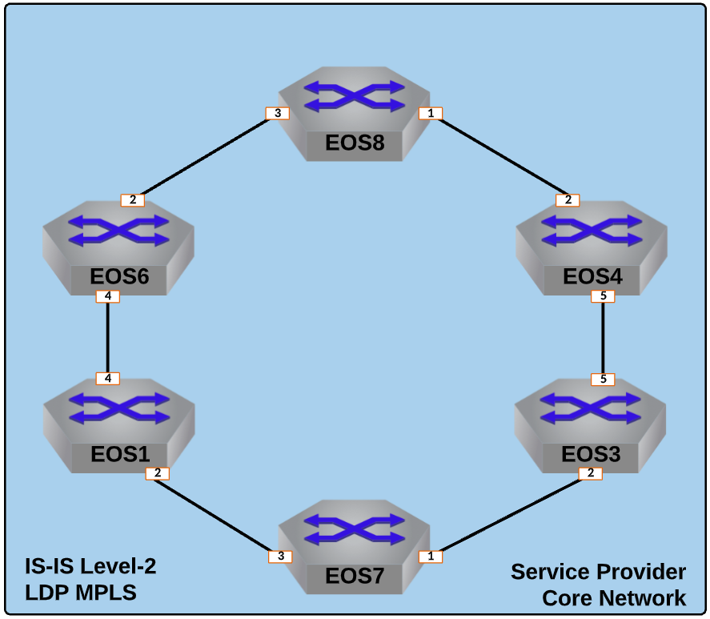

Establish MPLS Transport Label Distribution via LDP
==================================================================

  
|

#. Log into the **LabAccess** jumpserver to prepare the lab environment.

   #. From the Main Menu, type ``labs`` or Option 97 for ``Additional Labs``.

   #. Type ``ring-topology-ipvpn-labs`` to access the LDP and IPVPN Labs.

   #. Type ``ldp`` at the Labs Selection Menu. The script will configure the topology 
      with the necessary prerequisites.

#. With IS-IS in place as the IGP for Loopback reachability, enable LDP for MPLS Label Distribution on **EOS1**.

   #. First, we must enable MPLS forwarding on the router.

      .. code-block:: text

         mpls ip

   #. Enable the Label Distribution Protocol for MPLS.

      .. code-block:: text

         mpls ldp
            no shutdown

   #. Set Loopback0 as the interface for transport and Router-ID functions.

      .. code-block:: text

         mpls ldp
            router-id interface Loopback0
            transport-address interface Loopback0

   #. Disable LDP globally on the router interfaces then selectively enable on Service Provider facing interfaces and the 
      Loopback0 interface for transport.
   
      .. note::

         By default when LDP is enabled, EOS will attempt peering on all interfaces.

      .. code-block:: text

         interface Ethernet2
            mpls ldp interface
         !
         interface Ethernet4
            mpls ldp interface
         !
         interface Loopback0
            mpls ldp interface
         !
         mpls ldp
            interface disabled default

   #. Enable LDP Hello Redundancy to help maintain adjacencies in link-flap scenarios to cut down on session 
      reestablishment time.
   
      .. note::

         Devices with Hello Redundancy enabled will begin sending Targeted Hello messages to the Transport Address found 
         in the received LDP Link Hello message. The Targeted Hello adjacency can support the session established between 
         peers even when all Link Hello adjacencies have timed out. The FEC label bindings between two peers with no Link 
         Hello adjacency will not be active because the Interior Gateway Protocol will not use the other peer as the next 
         hop. Nevertheless, maintaining the FEC label bindings and the session between the two peers can save significant 
         time when the Link Hello adjacency is reestablished.

      .. code-block:: text

         mpls ldp
            neighbor hello-redundancy

   #. Enable Grace Restart capabilities for LDP to maintain forwarding when agent restarts occur.
   
      .. note::

        LDP Graceful Restart allows the device to preserve its entire MPLS LDP lable if the LDP agent restarts and can also 
        preserve the LFIB entries of the peer whose LDP agent has restarted.

      .. code-block:: text

         mpls ldp
            !
            graceful-restart role speaker
               timer state-holding 500
               timer reconnect 500

   #. Lastly, enable LDP synchronization with IS-IS to ensure MPLS LSPs are generated on valid underlay links.
   
      .. note::

         Sync timers can be adjusted in LDP as desired.

      .. code-block:: text

         router isis 100
            mpls ldp sync default

#. Verify local LDP configuration and MPLS label allocation on **EOS1**.

   #. Display the configured Node SID and other ISIS-SR information.

      .. code-block:: text

         show mpls ldp bindings detail
   
   #. Verify the MPLS label range assigned for use with LDP.
   
      .. note::

         EOS has a default allocation range for each type of MPLS label, which you can view. Of interest here is the 
         ``ldp (dynamic)`` label range. LDP label bindings are locally significant to the router whose LFIB they exist in.

      .. code-block:: text

         show mpls label ranges

#. Repeat the above configuration steps on the other Service Provider nodes (**EOS3, EOS4, EOS6, and EOS8**) while only 
   activating LDP on the necessary interfaces for each device.

#. Now that the LDP topology is deployed, verify MPLS label advertisement and reachability. These steps can 
   be performed on any of the Service Provider EOS nodes.

   #. Verify that all router adjacencies are succesfully established. You should see an entry for each connected router.

      .. code-block:: text

         show mpls ldp neighbor
         show mpls ldp discovery detail

   #. Now display the tunnel information LDP will use to inform the data-plane which MPLS labels and interfaces 
      to use to reach the other routers in the topology.

      .. note::
      
         An MPLS label value of the ``3`` represents the implicit-null label, which signfies the destination 
         or endpoint router is adjacent to this node.

      .. code-block:: text

         show mpls ldp tunnel

   #. Verify the Label Bindings dynamically allocted to local and remote interfaces attached to LDP enabled peers.

      .. note::
      
         As mentioned, these labels are dynamically allocted by EOS out of the ``ldp (dynamic)`` label range. Also 
         note these label values are only locally significant to the router, so they may overlap between the various nodes 
         in the topology.

      .. code-block:: text

         show mpls ldp bindings detail
   
   #. Test MPLS LSP reachability between routers by using MPLS ping and traceroute functions. This example is from **EOS1** 
      to **EOS8**.

      .. code-block:: text

         ping mpls ldp ip 8.8.8.8/32 source 1.1.1.1
         traceroute mpls ldp ip 8.8.8.8/32 source 1.1.1.1

**LAB COMPLETE!**
