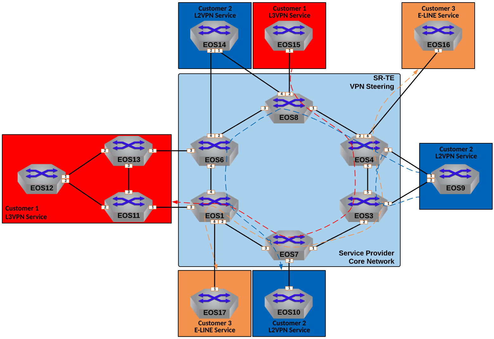

Leverage SR-TE to Steer VPN Traffic
==================================================================

  
|

#. Log into the **LabAccess** jumpserver to prepare the lab environment.

   #. From the Main Menu, type ``labs`` or Option 97 for ``Additional Labs``.

   #. Type ``ring-topology-supplemental-labs`` to access the Supplemental Labs.

   #. Type ``srte`` at the Labs Selection Menu. The script will configure the topology 
      with the necessary prerequisites.

#. In the first scenario, we will use Segment Routing Traffic Engineering, or **SR-TE** to manipulate L3VPN traffic for 
   Customer-1. Configure the Service Provider network so that traffic from **EOS15** to **EOS12** follows the path pictured 
   above.

   #. Before beginning the Service Provider configuration, verify connectivty and path to **EOS12** on **EOS15**.

      .. code-block:: text

         ping 12.12.12.12 source 15.15.15.15
         traceroute 12.12.12.12 source 15.15.15.15

   #. To start the configuration, first, create a Prefix-List and Route-Map **EOS1** and **EOS6** to set the BGP **Color** 
      community on the route for **EOS12** to a value of ``12``. Ensure that this is applied to the Customer-1 CE Peering 
      and that there is a open permit at the end to allow other routes that will not be colored.

      .. note::

         The BGP Color community is used to identify routes on the ingress PE that should be steered by the SR-TE policy, 
         which we will see in a later step. Since the route for **EOS12**, ``12.12.12.12/32`` is received by both PEs, we can 
         set the policy on both.

      **EOS1**

      .. code-block:: text

         ip prefix-list CUSTOMER-1_EOS12 seq 10 permit 12.12.12.12/32
         !
         route-map CUSTOMER-1_IN permit 10
            match ip address prefix-list CUSTOMER-1_EOS12
            set extcommunity color 12 additive
         !
         route-map CUSTOMER-1_IN permit 20
         !
         router bgp 100
            !
            vrf CUSTOMER-1
               neighbor 10.1.11.11 route-map CUSTOMER-1_IN in

      **EOS6**

      .. code-block:: text

         ip prefix-list CUSTOMER-1_EOS12 seq 10 permit 12.12.12.12/32
         !
         route-map CUSTOMER-1_IN permit 10
            match ip address prefix-list CUSTOMER-1_EOS12
            set extcommunity color 12 additive
         !
         route-map CUSTOMER-1_IN permit 20
         !
         router bgp 100
            !
            vrf CUSTOMER-1
               neighbor 10.6.13.13 route-map CUSTOMER-1_IN in

   #. Next, enable SR-TE on **EOS8** and apply the base settings to allow SR-TE tunnels to resolve and set a router-id.

      .. note::

         When enabling SR-TE, we must tell the router to look in ``system-colored-tunnel-rib`` in order to properly resolve 
         SR-TE tunnels as BGP next-hops.

      .. code-block:: text

         router traffic-engineering
            segment-routing
               rib system-colored-tunnel-rib
            router-id ipv4 8.8.8.8

   #. With SR-TE enabled, create two static policies on **EOS8** that will steer VPN traffic to **EOS12** along the desired 
      path to **EOS1** and **EOS6** for routes with the color value of ``12``.

      .. note::

         With a simple SR-TE static policy, the entire transport label stack is built and applied on ingress to the Service 
         Provider network by the PE. This policy will match the BGP color applied to the VPN route in the previous step. 
         SR-TE policies are defined by ``endpoint`` and ``color`` so we create one for each egress PE.

      .. code-block:: text

         router traffic-engineering
            segment-routing
               !
               policy endpoint 1.1.1.1 color 12
                  description STEER TRAFFIC TO EOS12
               !
               policy endpoint 6.6.6.6 color 12
                  description STEER TRAFFIC TO EOS12

   #. Define a Binding Segment-ID for each policy from the allowed range ().

      .. note::

         The ``binding-sid`` is a required value in order for a policy to be valid. However, it is most commonly used in 
         inter-domain or controller based SR-TE deployments. For this lab, the value isn't significant.

      .. code-block:: text

         router traffic-engineering
            segment-routing
               !
               policy endpoint 1.1.1.1 color 12
                  binding-sid 1000112
               !
               policy endpoint 6.6.6.6 color 12
                  binding-sid 1000612

   #. Define a Path-Group with a preference of 100 for the policies. Within the Path-Group, set the desired MPLS transport 
      label stack to define the path the traffic should take.

      .. note::

         In this case, we will explicity deifine the MPLS label for each EOS node in the desired path in order. Recall that 
         the MPLS label value is determined by taking the Node SID index value plus the base value of the IS-IS SR label 
         range, which by default is 900,000.

      .. code-block:: text

         router traffic-engineering
            segment-routing
               !
               policy endpoint 1.1.1.1 color 12
                  !
                  path-group preference 100
                     segment-list label-stack 900004 900003 900007 900001
               !
               policy endpoint 6.6.6.6 color 12
                  !
                  path-group preference 100
                     segment-list label-stack 900004 900003 900007 900001 900006

   #. With the policy fully in place, validate that the policies are active as well as the resolved path on **EOS8**.

      .. note::

         The command will show the policy as ``active`` if all attributes are configured correctly. Notice that the ``Label 
         Stack`` and the ``Resolved Label Stack`` differ slightly. This is due to the fact that EOS will intelligently 
         resolve the path and remove any unnecessary labels in the stack that will still acheive the same path. Also notice 
         that a ``Backup Resolved Label Stack`` is calculated because TI-LFA is enabled. In this case, the backup path is 
         somewhat ridiculous as it passes through or close to the egress PE before going back to the initial path. This would 
         be better addressed by creating a secondary path-group with a lower preference.

      .. code-block:: text

         show traffic-engineering segment-routing policy

   #. Verify the forwarding plane information for **EOS12** in the Customer-1 VRF.

      .. note::

         Note that the traffic is still ECMP load-balanced since ``12.12.12.12/32`` is originated from two PEs.

      .. code-block:: text

         show ip route vrf CUSTOMER-1 12.12.12.12
         show tunnel fib traffic-engineering segment-routing policy

   #. Finally, verify connectivty and path again to **EOS12** on **EOS15**.

      .. note::

         Note that the additional hops will show in the traceroute path but will not resolve as they are tunneled through on 
         the Service Provider network.

      .. code-block:: text

         ping 12.12.12.12 source 15.15.15.15
         traceroute 12.12.12.12 source 15.15.15.15

#. In the next scenario, we will use **SR-TE** to steer L2VPN traffic for Customer-2. Configure the Service Provider network 
   so that traffic from **EOS9** to **EOS10** follows the path pictured above.

   #. Similar to the L3VPN steering above, steering L2VPN traffic requires setting the BGP Color community. Create a 
      Community-List and Route-Map to match the necessary RT value for Customer-2 which sets the color value to ``10`` and 
      apply that to the BGP EVPN peering to the Route-Reflector on **EOS3** and **EOS4**.

      .. note::

          In this example, we will instead set the color on the ingress PEs attached to the source **EOS9**. Since this is a 
          EVPN A-A attached CE, we will set the policy on both. Also note that we are using a Community-List to match the RT 
          value instead of the specific CE endpoint.

      .. code-block:: text

         ip extcommunity-list CUSTOMER-2 permit rt 2:20
         !
         route-map EVPN-COLORING permit 10
            match extcommunity CUSTOMER-2
            set extcommunity color 10 additive
         !
         route-map EVPN-COLORING permit 20
         !
         router bgp 100
            !
            address-family evpn
               neighbor 8.8.8.8 route-map EVPN-COLORING in

   #. Next, enable SR-TE on **EOS3** and **EOS4** and apply the base settings to for SR-TE. In addtion, create the policy for 
      steering traffic to **EOS7** with a color of ``10`` that was set above and set the binding-sid to a value of 
      ``1000710``.

      .. note::

         The SR-TE policy config for all VPN types follows the same template.

      **EOS3**

      .. code-block:: text

         router traffic-engineering
            segment-routing
               rib system-colored-tunnel-rib
               !
               policy endpoint 7.7.7.7 color 10
                  binding-sid 1000710
                  description STEER TRAFFIC TO EOS10
            router-id ipv4 3.3.3.3

      **EOS4**

      .. code-block:: text

         router traffic-engineering
            segment-routing
               rib system-colored-tunnel-rib
               !
               policy endpoint 7.7.7.7 color 10
                  binding-sid 1000710
                  description STEER TRAFFIC TO EOS10
            router-id ipv4 4.4.4.4

   #. Finally, define the Path-Group and label stack for the pictured path on **EOS3** and **EOS4**.

      .. note::

         Here, we can more intelligently define the label stack necessary to steer traffic along the desired path. By 
         understanding that IS-IS SR will automatically take the shortest path to a given destinantion router based on the 
         label on the top of the stack, we can skip statically defining the labels for certain intermediate nodes.

      .. code-block:: text

         router traffic-engineering
            segment-routing
               !
               policy endpoint 7.7.7.7 color 10
                  !
                  path-group preference 100
                     segment-list label-stack 900008 900001 900007

   #. With the policy fully in place, validate that the policies are active as well as the resolved path on **EOS3** and 
      **EOS4**.

      .. code-block:: text

         show traffic-engineering segment-routing policy

   #. Verify the forwarding plane information for **EOS3** and **EOS4** in the Customer-2 L2VPN.

      .. note::

         The commands below reference the MAC of **EOS10**, which may differ in your lab. You can find the MAC of **EOS10** 
         with the output of ``show interface Ethernet1``.

      .. code-block:: text

         show l2rib output mac 1426.0c23.74e4
         show tunnel fib traffic-engineering segment-routing policy

   #. Finally, verify connectivty to **EOS10** on **EOS9**.

      .. note::

         Since the Service Provider is emulating a LAN service, ``traceroute`` would not provide additional path hints.

      .. code-block:: text

         ping 10.10.10.10 source 9.9.9.9

#. In the last scenario, we will use **SR-TE** to steer VPWS traffic for Customer-3. Configure the Service Provider network 
   so that traffic between **EOS16** and **EOS17** follows the path pictured above bidirectionally.

   #. Similar to the L2VPN steering above, steering VPWS traffic requires setting the BGP Color community. Create a 
      Community-List and Route-Map to match the necessary RT value for Customer-2 which sets the color value to ``1617`` and 
      apply that to the BGP EVPN peering to the Route-Reflector on **EOS1** and **EOS4**.

      .. note::

          Since we already created a Route-Map and applied it on **EOS4** we will simply add another sequence to that 
          existing Route-Map

      .. code-block:: text

         ip extcommunity-list CUSTOMER-3 permit rt 3:1617
         !
         route-map EVPN-COLORING permit 15
            match extcommunity CUSTOMER-3
            set extcommunity color 1617 additive
         !
         route-map EVPN-COLORING permit 20
         !
         router bgp 100
            !
            address-family evpn
               neighbor 8.8.8.8 route-map EVPN-COLORING in

   #. Next, enable SR-TE on **EOS1** and apply the base settings to for SR-TE. In addtion, create the policy on **EOS1** and 
      **EOS4** for steering traffic with a color of ``1617`` (which was set above) and set the binding-sid to a value of 
      ``1001617`` between **EOS1** and **EOS4**.

      .. note::

         Again, SR-TE was already enabled on **EOS4** so the base settings are already in place.

      **EOS1**

      .. code-block:: text

         router traffic-engineering
            segment-routing
               rib system-colored-tunnel-rib
               !
               policy endpoint 4.4.4.4 color 1617
                  binding-sid 1001617
                  description STEER TRAFFIC TO EOS16
            router-id ipv4 1.1.1.1

      **EOS4**

      .. code-block:: text

         router traffic-engineering
            segment-routing
               !
               policy endpoint 1.1.1.1 color 1617
                  binding-sid 1001617
                  description STEER TRAFFIC TO EOS17

   #. Finally, define the Path-Group and label stack for the pictured path on **EOS1** and **EOS4**.

      .. note::

         Note that the label stacks defined are providing a symmetrical path per the desired TE policy.

      **EOS1**

      .. code-block:: text

         router traffic-engineering
            segment-routing
               !
               policy endpoint 4.4.4.4 color 1617
                  !
                  path-group preference 100
                     segment-list label-stack 900007 900004

      **EOS4**

      .. code-block:: text

         router traffic-engineering
            segment-routing
               !
               policy endpoint 1.1.1.1 color 1617
                  !
                  path-group preference 100
                     segment-list label-stack 900007 900001

   #. With the policy fully in place, validate that the policies are active as well as the resolved path on **EOS1** and 
      **EOS4**.

      .. code-block:: text

         show traffic-engineering segment-routing policy | section 1617

   #. Verify the forwarding plane information for **EOS1** and **EOS4** in the Customer-3 E-LINE Service.

      .. note::

         Note that the patch panel configuration is now forwarding into the SR-TE Policy Tunnel.

      .. code-block:: text

         show patch panel forwarding
         show tunnel fib traffic-engineering segment-routing policy

   #. Finally, verify connectivty to **EOS17** on **EOS16**.

      .. note::

         Since the Service Provider is emulating a LINE service, ``traceroute`` would not provide additional path hints.

      .. code-block:: text

         ping 17.17.17.17 source 16.16.16.16

**LAB COMPLETE!**
