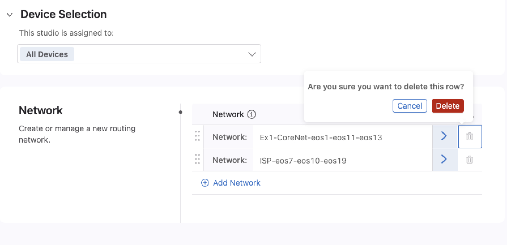

Setup for The Studios Labs
==========================
sanitizing
==========

.. image:: ../../images/studios_images/ratd-studios-0-1.png
   :align: center

|

Example Files and script
------------------------
The examples for these labs are contained in a GitHub repository and contain all of the configuration and the supporting script to successfully complete each example.

This repository is at: https://github.com/arista-netdevops-community/CloudVisionPortal-Examples

|

Cloning the repository to your machine
--------------------------------------
This step will require you to have git, pip, and Python 3 along with the requests package for Python installed on your local machine

1.  On your local computer, create a new directory where you'd like to save your lab files to

2.  Open a terminal and browse to the directory you created.  

3.  Run **git clone git@github.com:arista-netdevops-community/CloudVisionPortal-Examples.git** and the files from GitHub will be cloned to your machine

.. Note::
   - **CloudVisionPortal-Examples/CloudVision_Studios/InterOp_Examples_for_Studios/** - Contains the examples that we'll use for each lab
   - **CloudVisionPortal-Examples/CloudVision_Studios/InterOp_Examples_for_Studios/Studios_to_Use** - The Studio versions to be used are stored in this directory
   - **CloudVisionPortal-Examples/CloudVision_Studios/InterOp_Examples_for_Studios/Tags_Files** - The Tags files to import are in this directory. This directory also contains the **tagman.py** script.
   
|

Tagman script
-------------

The **tagman.py** script, located in the **CloudVisionPortal-Examples/CloudVision_Studios/InterOp_Examples_for_Studios/Tags_Files** directory is used to automate tag assignment for each Studios lab. You'll run this script to add or delete the tags for the examples. 

The **tagsfile.txt** file in this directory gives examples of how to use the tagman.py file.

The syntax of the script is:
``$ python3 tagman.py -u [ATD username] -p [ATD password] -c [ATD DNS without preceding “https://” and trailing “/”] -f [the example tagsfile.text] -a import``

.. Note::
   - You will need to gather your CVP password from the topology landing page in your browser, as well as your topology URL. This can be copied by clicking the "Copy Address" link on the CVP landing page as well.
   - Any open workspace in the ATD will be unaware of any changes to tags you make with tagman.py You will need to create a new workspace after running any of its commands.
   - You can use **-help** to see the command syntax 

|

Onboarding Devices
------------------

Devices need to be onboarded to the Studios environment in order for a configuration to be pushed to them. If you do not onboard the devices, any configuration created and subsequently executed in Change Control will not be applied to the devices.

1.  Open CVP, login using your lab credentials and then browse to **Provisioning > Studios**. Create a new Workspace (you may name it anything you like). Then click on **Inventory and Topology**

2.  Click the **Add Updates** tab and click **Add All New Updates** on the right

.. image:: ../../images/studios_images/ratd-studios-0-2.png
   :align: center 

3.  Click **Review Workspace**

4.  After Studios builds the config, you will be able to click **Submit Workspace** to submit the workspace.

All of the devices within CVP are now available to be provisioned by Studios and configuration can be pushed to them.

|

Adding Tags
-----------

To add tags for a given lab, you'll append **-o add** to the command, like the example below that adds the Example 1 tags for the first lab:

``$ python3 tagman.py -u arista -p YOUR_CVP_PASSWORD -c *unique-name*.topo.testdrive.arista.com -f tagsfile-example1.txt -a import -o add``

|

Deleting tags
-------------

Between each lab you do, you will have to remove the tags used by the previous lab. This can be done with the following command, which will remove the Example1 tags:

``$ python3 tagman.py -u arista -p YOUR_CVP_PASSWORD -c *unique-name*.topo.testdrive.arista.com -f tagsfile-example1.txt -a import -o delete``

|

Importing Studios and Inputs
----------------------------

The studios and inputs required to complete the labs are availabe for import in the CloudVision_Studios folder of the cloned repository.

Enable Import of Inputs:

1.  Browse to **Settings > General Settings**

2.  on Mac: Press **Control + Shift + A** to reveal the alpha settings

3.  Scroll to the bottom of Features and enable Studios Alpha Features

You'll now be able to import Studio inputs.

|

Import a Studio
---------------
1.  In CVP, Browse to **Provisioning > Studios**. Create a new Workspace and click the **Import** button on the top right.

2.  In the import dialog, navigate to the **Studios_to_Use** directory in the repository.

3.  Select each studio and import them all. Click **Upload**.

4.  You'll have to repeat these steps to import all 5 files as you can only do one at a time.

5.  You will now see the new Studios listed on your main Studios landing page under the heading **Custom-Built** and it should look like this:

|

Import Studio Inputs
--------------------

These Studio inputs are specific to each individual lab, so these will need to be imported for each lab you do.

1.  Open the **Campus Fabric** Studio and click the ellipsis in the upper right corner beside Edit

2. Select **Import** under the Inputs section, then navigate to the **InterOp_Examples_for_Studios/Example1_Campus_to_ISP_BGP** folder and import the file called **Inputs_Campus Fabric**

3. Repeat steps 1 and 2, but instead, click on the **Enterprise Routing** Studio, then import the **Inputs_Enterprise_Routing** file.

|

You are now ready to begin the first Studios lab

|

