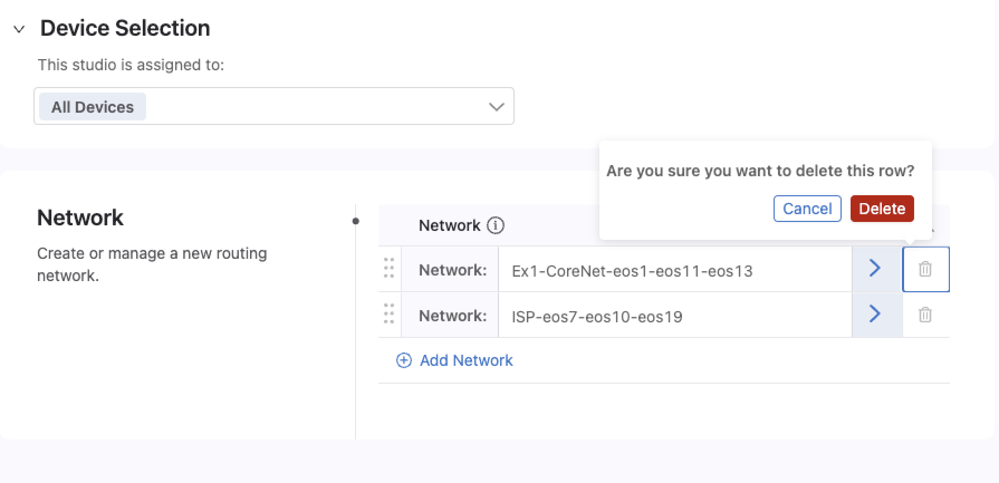

Sanitizing the topology 
=======================

|

Sanitizing must be done between each lab to ensure that remnants from the previous topology are removed. Failure to follow this process will cause problems when you try to create a new Workspace and push a different configuration. 

|

Sanitizing tasks within CVP
---------------------------

1.  Open CVP and browse to **Provisioning > Studios**. Create a new Workspace, name it **cleanup** or **sanitize**.

2.  Within this new Workspace, click on the Studios you previously configured and pushed to the devices. For example, on the first lab we use all 4 studios at the top of the page (which we imported during setup)

3.  In **EACH** studio, you will have to click and remove the configured lines as seen below.

4.  After you've done this for all 4 studios, Click on **Review Workspace** and then push the changes to return all devices to their default

|

Removing Tags using the tagman.py script
----------------------------------------

We already removed the configuration on the devices, but the tags still remain from the last exercise you worked on. For this we'll use our handy tagman.py script

1.  Lets open up our Terminal again and run the following (replacing the password, URL, and tagsfile name):

    ``$ python3 tagman.py -u arista -p YOUR_CVP_PASSWORD -c *unique-name*.topo.testdrive.arista.com -f tagsfile-example1.txt -a import -o delete``

2.  If you still have the terminal open from pushing the tags for the last exercise, you can just arrow up, then remove **-o add** and replace it with **-o delete**

|

.. Note::

    If you're fast, you can click back to CVP after running the tagman.py script, browse to **Provisioning > Tags** and watch the System Tags disappear from all devices.

After this completes, you're good to continue to the next lab