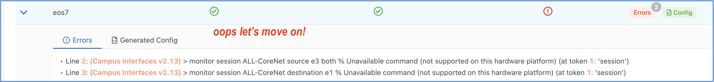

Lab 1 - Campus Network to ISP 
=============================

Lab Summary
-----------

In this example, you’ll deploy a campus network that is connected to an ISP. Between the Campus and the ISP is an Edge Router (ER) acting as a network core/WAN router that runs OSPF to the Campus Splines and eBGP to the ISP. The BGP policy on the WAN router sends an Aggregate route to the ISP and sends only a default route to the Campus. Be sure to have read through the prep section above and have completed any tasks there.

Please look over the diagrams to get a feel for what we are about to configure.

|

This lab features:

-   MLAG and virtual router address
-   Routed interface and eBGP to external peer
-   OSPF on Campus Splines
-   OSPF to BGP redistribution 
-   Prefix list and BGP policy towards ISP
-   OSPF default information originate

|

Configuring the lab
-------------------

You may have already completed some of the import steps during the lab setup, if so, you can skip to the deploy step. 

1. `Sanitize the Topology <sanitizing.html>`_ (only if you assigned other tags or did other Studios labs prior to this)

2. Run the tagman script for tagsfile-example1.txt

``$ python3 tagman.py -u arista -p YOUR_CVP_PASSWORD -c *unique-name*.topo.testdrive.arista.com -f tagsfile-example1.txt -a import -o add``

|

Import Studio Inputs
--------------------

1.  Open the **Campus Fabric** Studio and click the ellipsis in the upper right corner beside Edit

|

2. Select **Import** under the Inputs section, then navigate to the **InterOp_Examples_for_Studios/Example1_Campus_to_ISP_BGP** folder and import the file called **Inputs_Campus Fabric**

3. Repeat steps 1 and 2, but instead, click on the **Enterprise Routing** Studio, then import the **Inputs_Enterprise_Routing** file.

4. Under the **Device Selection** section of each Studio make sure **All Devices** is selected

|

|

Deploy
------

1.  We're now ready to deploy the configuration we imported into Studios. To do this, click on **Review Workspace**

2.  Studios will then begin building the configlets and validating them against the devices. When this completes, the **Submit Workspace** button will be available to click on.

3.  After we click on **Submit Workspace**, a popup box will show us that the Change Control is being created. After this is finished, the **Ciew CHange Control** option is blue and we can click on it.

4.  On the Change Control screen, we see a summary of the changes that will be pushed to each switch. We can click on a switch and select the **Show Details** button to see the exact lines that will be pushed to each switch.

|

|

.. Note:: 
    - you should see vlan 15 being created on the campus splines (EOS11 and EOS13)
    - VLAN 15 is a management VLAN in the campus studio. This makes it the native vlan and leaf switches will get a managment IP address and default route

|

5.  Use the **Review and Approve** button on the upper right, then the **Approve and Execute** button to push these changes to the switches

6.  Back on the ATD landing page, click on **EOS11** on the image to get to the terminal where you can run commands on the switch. 

|

|

7.  If our Studio was successful, you should now see routes for **10.10.10.10** and **19.19.19.19** when you run **show ip route**

Test
----

1.  Test reachability within your topology by accessing the CLI on eos12 and pinging **10.10.10.10** (EOS 10) and **19.19.19.19** (EOS 19)

Task
----

#1 Goal – Source a default route from eos1 block the specific routes coming from the ISP.

-   In the Enterprise Routing Studio find the Core Router **eos1** and enter the page for the **BGP Peer Group**.
-   Enable OSPF Default Information Originate “Always Send” and add a deny filter in the redistribute route map that prevents the Internet routing detail from entering the Campus. 

Test
----

Use the ATD's configuration screen to acccess a CLI for the below devices:

-   From eos12, ping **10.10.10.10** (eos10) and **19.19.19.19** (eos19)
-   Verify that eos11 and eos13 have a default route and no longer have 10.10.10.10 and 19.19.19.19 in their routing table.

Extra Task
----------

#1 Goal - Learning hiding and Showing UI fields in a Studio.

-   Go to the **Enterprise Routing** Studio and the ISP Network.
-   Notice there is a OSPF specific MAX LAA field at the bottom of the page even though ISIS is being used by the ISP, so this setting does not apply to ISIS
-   Edit this Studio to hide OSPF MAX LSA field and only show it when OSPF is selected

|

#2 Goal - Add a Port Mirror session to eos7. We will use the Campus Interfaces Studio for this task.

-   Add a Site and select tag **device:eos7**

-   Add a switch-group tag to eos7 called switch-group: **eos7**

-   Click the arrow and at the top of the next page add **eos7** to the Assigned Devices box.

-   Add at the bottom of the page configure your Port Mirror session and build the workspace  

-   Yikes! cEOS does not support the port mirroring feature 

|

Before moving on to lab 2, remember to `sanitize your topology first <sanitizing.html>`_